# Build Calculations — Iterative Verification Workflow

Iteratively build and verify LiveMathTeX calculations using expected values and git diff to catch errors early.

**Design intent:** Build documents iteratively until all calculations are correct. Use expected values and git diff to systematically identify and fix discrepancies.

**⚠️ WORKSPACE-AWARE COMMAND:** This command works across your entire workspace. Documents can be in any repository (mark-private, proviron, axabio-literature, etc.). The command detects which repository the document is in and works accordingly.

**Repository Relationship:**
- **livemathtex repo**: Contains LiveMathTeX tool and planning files. Detected automatically via git or workspace context.
- **Your document repo** (any repo in workspace): Contains the Markdown document you're processing
- **Command works workspace-wide:** Can process documents in any repository

**Detecting Repositories:**
```bash
# Detect livemathtex repository (where planning files are)
# Method 1: If command is in livemathtex repo, use git to find root
# Method 2: Search for .planning directory (livemathtex-specific)
# Method 3: Search workspace for livemathtex repository
LMT_REPO=$(git -C "$(dirname "$0")" rev-parse --show-toplevel 2>/dev/null || \
  find . -maxdepth 3 -name ".planning" -type d -exec dirname {} \; 2>/dev/null | head -1 || \
  find "$HOME" -maxdepth 4 -path "*/livemathtex/.planning" -type d -exec dirname {} \; 2>/dev/null | head -1 || \
  echo ".")

# Detect document repository
DOC_REPO=$(git -C $(dirname input.md) rev-parse --show-toplevel 2>/dev/null || echo ".")
```

---

## 🚨 MANDATORY: Create Todo List FIRST

**BEFORE doing ANYTHING else**, create this exact todo list using `todo_write` with `merge: false`:

```json
[
  {"id": "clean-1", "content": "CLEAN: Clean source document to remove error markup", "status": "in_progress"},
  {"id": "expect-1", "content": "EXPECT: Calculate expected values manually and add to output document", "status": "pending"},
  {"id": "process-1", "content": "PROCESS: Run livemathtex process to compute actual values", "status": "pending"},
  {"id": "diff-1", "content": "DIFF: Compare expected vs actual values to identify discrepancies", "status": "pending"},
  {"id": "investigate-1", "content": "INVESTIGATE: Analyze differences and identify root causes", "status": "pending"},
  {"id": "iterate-1", "content": "ITERATE: Fix issues and repeat until all calculations correct", "status": "pending"},
  {"id": "learn-1", "content": "LEARN: Document findings in lessons learned", "status": "pending"}
]
```

### 🛑 BLOCKING RULES

| Phase | Depends on | Explanation |
|-------|------------|-------------|
| `expect-1` | `clean-1` completed | Cannot add expected values without clean source |
| `process-1` | `expect-1` completed | Cannot process without expected values for comparison |
| `diff-1` | `process-1` completed | Cannot compare without actual values |
| `investigate-1` | `diff-1` completed | Cannot investigate without knowing differences |
| `iterate-1` | `investigate-1` completed | Cannot fix without understanding root cause |
| `learn-1` | `iterate-1` completed | Cannot document until issues resolved |

---

## Workflow Overview

```mermaid
graph TB
    INPUT[Source Document] --> CLEAN[Clean Source<br/>Remove error markup]
    CLEAN --> EXPECT[Calculate Expected<br/>Add to output doc]
    EXPECT --> PROCESS[Process with LiveMathTeX<br/>Compute actual values]
    PROCESS --> DIFF[Git Diff<br/>Compare expected vs actual]
    DIFF --> CHECK{All correct?}
    CHECK -->|No| INVESTIGATE[Investigate Differences<br/>Find root cause]
    INVESTIGATE --> FIX[Fix Issues<br/>Update source]
    FIX --> CLEAN
    CHECK -->|Yes| LEARN[Document in Lessons Learned]
    LEARN --> DONE[✅ Document Complete]

    style INPUT fill:#4a90e2,stroke:#2e5c8a,color:#fff
    style CLEAN fill:#f39c12,stroke:#c87f0a,color:#fff
    style EXPECT fill:#9b59b6,stroke:#7d3c98,color:#fff
    style PROCESS fill:#7cb342,stroke:#558b2f,color:#fff
    style DIFF fill:#f39c12,stroke:#c87f0a,color:#fff
    style INVESTIGATE fill:#ea4335,stroke:#c5221f,color:#fff
    style LEARN fill:#9b59b6,stroke:#7d3c98,color:#fff
    style DONE fill:#27ae60,stroke:#1e8449,color:#fff
```



---

## PHASE 1: Clean Source Document

### Step 1: Clean Source Document (clean-1)

**Goal:** Remove all error markup from source document to ensure clean baseline.

**Why:** Error markup from previous runs can hide new errors or cause confusion. Always start with a clean document.

**Action:**
```bash
# Detect which repository the document is in
DOC_REPO=$(git -C $(dirname input.md) rev-parse --show-toplevel 2>/dev/null || echo ".")
cd "$DOC_REPO"

# Clean source document (works from any repository)
livemathtex clear input.md -o input_clean.md
```

**Check:**
- ✅ No `\color{red}{...}` error markup in output
- ✅ No `<!-- livemathtex-meta -->` comments
- ✅ All `==` operators have no computed values (empty: `$x ==$`)

**Self-check:** Verify `input_clean.md` has no error markup before proceeding.

**Note:** The document can be in any repository (mark-private, proviron, etc.). The command works workspace-wide.

---

## PHASE 2: Calculate Expected Values

### Step 2: Calculate Expected Values (expect-1)

**Goal:** Manually calculate expected values and add them to output document.

**Why:** Expected values make discrepancies immediately visible. Without them, it's hard to spot calculation errors.

**Action:**

1. **Create output document with expected values (in document's repository):**
   ```bash
   # Ensure we're in the document's repository
   DOC_REPO=$(git -C $(dirname input_clean.md) rev-parse --show-toplevel 2>/dev/null || echo ".")
   cd "$DOC_REPO"

   cp input_clean.md output_expected.md
   ```

2. **Manually calculate expected values:**
   - For each calculation `$x ==$`, calculate the expected result
   - Add expected value to the document:
   ```latex
   $x == 42.5\ \text{kg}$ <!-- EXPECTED: 42.5 kg -->
   ```

3. **Document calculation method:**
   - Add comments explaining how you calculated the expected value
   - Include intermediate steps if complex
   - Note which repository the document is in (if not obvious from path)

**Example:**
```markdown
$P := 310.7\ \text{kW}$
$t := 8760\ \text{h}$
$E := P \cdot t == 2721.7\ \text{MWh}$ <!-- EXPECTED: 2721.7 MWh (310.7 × 8760 / 1000) -->
```

**Self-check:** All calculations have expected values documented before proceeding.

---

## PHASE 3: Process with LiveMathTeX

### Step 3: Process Document (process-1)

**Goal:** Run LiveMathTeX to compute actual values.

**Action:**
```bash
# Process clean source document (works from any repository)
# Ensure we're in the document's repository for output paths
DOC_REPO=$(git -C $(dirname input_clean.md) rev-parse --show-toplevel 2>/dev/null || echo ".")
cd "$DOC_REPO"

livemathtex process input_clean.md -o output_actual.md --verbose
```

**Check:**
- ✅ IR JSON generated (`input_clean.lmt.json` in document's directory)
- ✅ Output document created (`output_actual.md` in document's directory)
- ✅ Check for errors in output

**If errors reported:**
- Use `livemathtex inspect input_clean.lmt.json` to debug (from document's directory)
- Fix issues in source document
- Return to Step 1 (clean) and repeat

**Self-check:** Processing completed without errors before proceeding.

---

## PHASE 4: Compare Expected vs Actual

### Step 4: Git Diff Comparison (diff-1)

**Goal:** Compare expected values with actual computed values to identify discrepancies.

**Action:**
```bash
# Compare expected vs actual (in document's repository)
DOC_REPO=$(git -C $(dirname output_expected.md) rev-parse --show-toplevel 2>/dev/null || echo ".")
cd "$DOC_REPO"

git diff --no-index output_expected.md output_actual.md
```

**What to look for:**
- ✅ Values match → Calculation correct
- ❌ Values differ → Investigation needed
- ⚠️ Unit mismatches → Unit conversion issue
- ⚠️ Order of magnitude errors → Unit propagation bug (e.g., ISS-024)

**Document discrepancies:**
- List all calculations that differ
- Note the difference (value, unit, order of magnitude)
- Group by type (unit conversion, calculation error, etc.)
- Note which repository the document is in

**Self-check:** All discrepancies identified and documented before proceeding.

---

## PHASE 5: Investigate Differences

### Step 5: Investigate Root Causes (investigate-1)

**Goal:** Understand why calculations differ and identify root causes.

**Action:**

1. **For each discrepancy:**
   - Check if it's a known issue (see `$LMT_REPO/.planning/ISSUES.md` where `$LMT_REPO` is the livemathtex repository root)
   - Check if it's documented in `$LMT_REPO/.planning/LESSONS_LEARNED.md`
   - Investigate the calculation manually

2. **Common root causes:**
   - **Unit propagation bugs** (ISS-024) - Rate × time calculations wrong
   - **SymPy constants not handled** (ISS-025) - `\pi`, `e` cause errors
   - **Unit conversion failures** (ISS-014) - Recursive units like MWh, mol/day
   - **Error markup in input** (ISS-016) - Leftover errors from previous run
   - **Incorrect unit hints** - Unit hint doesn't match result type

3. **Check IR JSON for details:**
   ```bash
   livemathtex inspect input_clean.lmt.json
   ```
   - Check symbol values
   - Check unit conversions
   - Check error messages

**Self-check:** Root cause identified for each discrepancy before proceeding.

---

## PHASE 6: Fix and Iterate

### Step 6: Fix Issues and Iterate (iterate-1)

**Goal:** Fix identified issues and repeat workflow until all calculations are correct.

**Action:**

1. **Fix issues in source document:**
   - Update unit hints if needed
   - Fix calculation formulas
   - Add missing unit definitions
   - Fix variable definition order

2. **Repeat workflow:**
   - Return to Step 1 (clean)
   - Recalculate expected values if formulas changed
   - Process again
   - Compare again
   - Continue until all calculations match

3. **Git workflow (in document's repository):**
   ```bash
   # Detect which repository the document is in
   DOC_REPO=$(git -C $(dirname input.md) rev-parse --show-toplevel 2>/dev/null || echo ".")
   cd "$DOC_REPO"

   # Commit changes at each iteration
   git add input.md output_expected.md output_actual.md
   git commit -m "fix: correct calculation for X (iteration N)"
   ```

**Self-check:** All calculations match expected values before proceeding.

---

## PHASE 7: Document Lessons Learned

### Step 7: Document Findings (learn-1)

**Goal:** Document insights and patterns in lessons learned for future reference.

**Action:**

1. **Update `$LMT_REPO/.planning/LESSONS_LEARNED.md`:**
   - Add new patterns discovered
   - Document workarounds
   - Add examples of correct usage
   - Note which repository the document was in (if not livemathtex)

   Where `$LMT_REPO` is the livemathtex repository root (detected automatically).

2. **Document specific issues:**
   - If issue is a bug in LiveMathTeX → Use `/debug-calculations` to create issue
   - If issue is user error → Document in lessons learned as "common mistake"

**Self-check:** All findings documented before completing.

---

## Output Format

**After completing workflow, show:**

```markdown
## Build Calculations Complete

**Document:** `input.md`
**Status:** ✅ All calculations verified

**Summary:**
- Cleaned source document
- Calculated expected values for 15 calculations
- Processed with LiveMathTeX
- Compared expected vs actual: 12 matched, 3 differed
- Fixed 3 issues (unit hints, calculation formulas)
- All calculations now correct

**Issues Found:**
1. Unit hint mismatch: `C_{26}` had `[kg/year]` but result is total `[kg]` → Fixed
2. Calculation error: `PAR_{rct}` formula incorrect → Fixed
3. Unit propagation: Rate × time calculation (already fixed in v1.6)

**Lessons Learned:**
- Always clean source before processing
- Expected values make discrepancies immediately visible
- Git diff is essential for verification
```

---

## Common Issues and Solutions

### Issue: Expected values don't match actual

**Solution:**
1. Check if it's a known bug (ISS-024, ISS-025, etc.)
2. Verify manual calculation is correct
3. Check unit hints match result type
4. Check variable definition order

### Issue: Processing fails with errors

**Solution:**
1. Use `livemathtex inspect input.lmt.json` to debug
2. Check for undefined variables
3. Check for unit conversion failures
4. Fix issues in source document
5. Return to Step 1 (clean) and repeat

### Issue: Git diff shows no differences but values look wrong

**Solution:**
1. Check if expected values were added correctly
2. Verify actual values in output document
3. Recalculate expected values manually
4. Check for unit mismatches (same value, different unit)

---

## Workspace-Aware File Paths

**Important:** This command works across your entire workspace. Use absolute paths or detect repository context:

**For documents:**
- Documents can be in any repository: `mark-private/`, `proviron/`, `axabio-literature/`, etc.
- Use absolute paths or detect current repository: `cd $(git rev-parse --show-toplevel)`

**Example workflow:**
```bash
# Detect repositories
DOC_REPO=$(git -C $(dirname document.md) rev-parse --show-toplevel 2>/dev/null || echo ".")
LMT_REPO=$(git -C "$(dirname "$0")" rev-parse --show-toplevel 2>/dev/null || \
  find . -maxdepth 3 -name ".planning" -type d -exec dirname {} \; 2>/dev/null | head -1 || \
  find "$HOME" -maxdepth 4 -path "*/livemathtex/.planning" -type d -exec dirname {} \; 2>/dev/null | head -1 || \
  echo ".")

# Process document (works from any repository)
cd "$DOC_REPO"
livemathtex clear document.md -o document_clean.md
livemathtex process document_clean.md -o document_actual.md

# Git diff works in the document's repository
git diff --no-index document_expected.md document_actual.md
```

---

## Related Commands

- **`/livemathtex`** - Reference/overview of all commands
- **`/debug-calculations`** - Same workflow but detects issues and creates ISS entries
- **`/setup`** - Installation and setup guide

---

## See Also

- **[LESSONS_LEARNED.md](../../.planning/LESSONS_LEARNED.md)** - Patterns and solutions (in livemathtex repo)
- **[ISSUES.md](../../.planning/ISSUES.md)** - Known bugs and enhancements (in livemathtex repo)
- **[USAGE.md](../../docs/USAGE.md)** - Full syntax reference (in livemathtex repo)

---

**Key Principle:** Build iteratively with expected values and git diff to systematically catch and fix calculation errors.
