# Debug Calculations — Issue Detection Workflow

Same workflow as `/build-calculations`, but automatically detects issues and creates ISS entries for bugs and feature requests in LiveMathTeX.

**Usage:** `/debug-calculations <document.md>`

**Design intent:** Systematically debug calculation problems, distinguish user errors from LiveMathTeX bugs, document bugs as issues for future fixes, and identify feature requests that would improve LiveMathTeX based on real-world document usage.

**Interactive mode:** Workflow continues until user explicitly says "it's done" or "enough". Status is tracked in a status file for external monitoring.

**⚠️ WORKSPACE-AWARE COMMAND:** This command works across your entire workspace. Documents can be in any repository (mark-private, proviron, axabio-literature, etc.), but LiveMathTeX planning files (ISSUES.md, LESSONS_LEARNED.md) are in the `livemathtex` repository.

---

## 🚨 EXECUTION PLAN — START HERE

**⚠️ CRITICAL: This plan MUST be created FIRST using `todo_write`, before any other steps!**

**The AI assistant must create this todo list in "plan mode" - this allows all steps to be executed one by one. All workflow steps are included in this plan. Steps can be skipped if not needed, but the plan structure ensures nothing is forgotten.**

**Create this exact todo list using `todo_write` with `merge: false`:**

```json
[
  {"id": "plan-0", "content": "PLAN: Create execution plan showing all workflow steps and ask user if they want to proceed (Y/N)", "status": "in_progress"},
  {"id": "plan-approval-0", "content": "PLAN-APPROVAL: Wait for user response (Y/N) - if N, stop workflow", "status": "pending"},
  {"id": "context-0", "content": "CONTEXT: Detect livemathtex repository and read ISSUES.md to understand current state", "status": "pending"},
  {"id": "context-lessons-0", "content": "CONTEXT-LESSONS: Read LESSONS_LEARNED.md to understand patterns and workarounds", "status": "pending"},
  {"id": "clean-1", "content": "CLEAN: Clean source document to remove error markup (creates temp_input_clean.md)", "status": "pending"},
  {"id": "expect-1", "content": "EXPECT: Calculate expected values manually and add to output document (creates temp_output_expected.md)", "status": "pending"},
  {"id": "process-1", "content": "PROCESS: Run livemathtex process to compute actual values (creates temp_output_actual.md)", "status": "pending"},
  {"id": "diff-1", "content": "DIFF: Compare expected vs actual values using git diff to identify discrepancies", "status": "pending"},
  {"id": "classify-1", "content": "CLASSIFY: For each discrepancy, determine if it's a user error, LiveMathTeX bug, or feature request (check ISSUES.md first!)", "status": "pending"},
  {"id": "improve-0", "content": "IMPROVE: If CONTINUE mode, analyze document for improvements and potential feature requests", "status": "pending"},
  {"id": "issue-check-1", "content": "ISSUE-CHECK: For each bug/feature, check if issue already exists in ISSUES.md (avoid duplicates)", "status": "pending"},
  {"id": "issue-test-1", "content": "ISSUE-TEST: For each new bug/feature, create isolated test file in tests/test_iss_XXX_<description>.md", "status": "pending"},
  {"id": "issue-create-1", "content": "ISSUE-CREATE: Add issue/feature request to ISSUES.md with test file reference", "status": "pending"},
  {"id": "fix-user-1", "content": "FIX-USER: Fix all user errors in original input.md file (not temp files)", "status": "pending"},
  {"id": "fix-workaround-1", "content": "FIX-WORKAROUND: Document workarounds for bugs in original file and LESSONS_LEARNED.md", "status": "pending"},
  {"id": "fix-iterate-1", "content": "FIX-ITERATE: If user errors fixed, return to clean-1 and reprocess until all errors resolved", "status": "pending"},
  {"id": "learn-1", "content": "LEARN: Update LESSONS_LEARNED.md with new patterns, workarounds, and classification insights", "status": "pending"},
  {"id": "status-1", "content": "STATUS: Update .planning/.debug-calculations-status.json with current status", "status": "pending"},
  {"id": "review-0", "content": "REVIEW: Show summary and ask user for feedback (Y/N/ENOUGH/CONTINUE) - wait for answer", "status": "pending"},
  {"id": "review-handle-0", "content": "REVIEW-HANDLE: Process user response - if Y: commit, if N: collect fixes, if ENOUGH: stop, if CONTINUE: restart from clean-1", "status": "pending"},
  {"id": "final-1", "content": "FINAL: Update original input.md file with correct values (only if review-0 approved with Y)", "status": "pending"},
  {"id": "final-commit-1", "content": "FINAL-COMMIT: Commit original file with descriptive message (only if review-0 approved with Y)", "status": "pending"},
  {"id": "post-0", "content": "POST: Write retrospective summary (what was processed, issues found, what was tricky)", "status": "pending"},
  {"id": "post-improve-0", "content": "POST-IMPROVE: Propose concrete command improvements based on retrospective", "status": "pending"},
  {"id": "post-commit-0", "content": "POST-COMMIT: Ask user YES/NO to commit command changes, commit if YES", "status": "pending"}
]
```

**⚠️ CRITICAL RULES:**
- ✅ **ALWAYS create this plan FIRST** using `todo_write` before doing anything else
- ✅ **ALWAYS wait for user responses** at plan-approval-0 and review-0
- ✅ **Follow the plan step by step** - execute each todo item in order
- ✅ **NEVER proceed without explicit user approval** (Y/N answers)
- ✅ **ALWAYS check ISSUES.md** before creating new issues (issue-check-1)
- ✅ **ALWAYS create test files** before creating issues (issue-test-1)
- ✅ **ALWAYS fix in original file** not temp files (fix-user-1)

**How to use this plan:**
1. Create the todo list using `todo_write` with `merge: false` (this puts the AI in "plan mode")
2. Execute each step one by one, following the todo list
3. Mark each step as completed when done
4. Skip steps only if logic requires it (e.g., if setup-0 = N, skip setup-monitor-0)
5. All steps are in the plan - nothing should be forgotten

---

**Repository Relationship:**
- **livemathtex repo**: Contains LiveMathTeX tool, planning files (ISSUES.md, LESSONS_LEARNED.md), and this command. Detected automatically via git or workspace context.
- **Your document repo** (any repo in workspace): Contains the Markdown document you're processing
- **Command works workspace-wide:** Can process documents in any repository, but references planning files in livemathtex repo

**Detecting Repositories:**
```bash
# Detect livemathtex repository (where planning files are)
# Method 1: If command is in livemathtex repo, use git to find root
# Method 2: Search for .planning directory (livemathtex-specific)
# Method 3: Search workspace for livemathtex repository
LMT_REPO=$(git -C "$(dirname "$0")" rev-parse --show-toplevel 2>/dev/null || \
  find . -maxdepth 3 -name ".planning" -type d -exec dirname {} \; 2>/dev/null | head -1 || \
  find "$HOME" -maxdepth 4 -path "*/livemathtex/.planning" -type d -exec dirname {} \; 2>/dev/null | head -1 || \
  echo ".")

# Detect document repository
DOC_REPO=$(git -C $(dirname input.md) rev-parse --show-toplevel 2>/dev/null || echo ".")
```


## Detailed Implementation Steps

### STEP 0: Create Plan (plan-0)

**Action:**
1. Detect document repository and livemathtex repository
2. Create the todo list above using `todo_write` with `merge: false`
3. Show plan to user:
   ```
   📋 Debug Calculations Workflow Plan Created

   **Document:** [document path]
   **Repository:** [detected repository]

   **Workflow Steps:** [list all steps from plan]

   Do you want to proceed with debugging? (Y/N)
   ```
4. **⚠️ CRITICAL: WAIT for user response before proceeding!**

### STEP 0.5: Plan Approval (plan-approval-0)

**Action:**
- If user says **N**: Stop workflow, mark status as "cancelled"
- If user says **Y**: Continue to context-0
- **⚠️ CRITICAL: Do NOT proceed without explicit Y/N answer!**

---

### STEP 1: Read Context (context-0)
   ```bash
   # Detect livemathtex repository
   LMT_REPO=$(git -C "$(dirname "")" rev-parse --show-toplevel 2>/dev/null || \
     find . -maxdepth 3 -name ".planning" -type d -exec dirname {} \; 2>/dev/null | head -1 || \
     find "$HOME" -maxdepth 4 -path "*/livemathtex/.planning" -type d -exec dirname {} \; 2>/dev/null | head -1 || \
     echo ".")

   # Read ISSUES.md to understand current state
   cat "$LMT_REPO/.planning/ISSUES.md"
   ```

   **Purpose:**
   - Understand what issues already exist
   - See which issues are open vs resolved
   - Identify patterns and known problems
   - Avoid creating duplicate issues
   - Understand workarounds that are already documented

   **⚠️ BRANCH AWARENESS:**
   - Issues are in the **local branch** (not necessarily synced with remote)
   - Check current branch: `git branch --show-current`
   - If working in a feature branch, issues may be branch-specific
   - When creating issues, they are added to the **local** ISSUES.md file
   - Consider if issues should be merged to main branch later

**Note:** The plan above is the complete execution plan. All steps are detailed below.

### 🛑 BLOCKING RULES

| Phase | Depends on | Explanation |
|-------|------------|-------------|
| `plan-0` | None | **MUST create plan first and ask user if they want to proceed** |
| `context-0` | `plan-0` approved (Y) | Must read context after plan approval |
| `clean-1` | `context-0` completed | Must understand existing issues before starting |
| `expect-1` | `clean-1` completed | Cannot add expected values without clean source |
| `process-1` | `expect-1` completed | Cannot process without expected values for comparison |
| `diff-1` | `process-1` completed | Cannot compare without actual values |
| `classify-1` | `diff-1` completed | Cannot classify without knowing differences |
| `issue-1` | `classify-1` completed | Cannot create issue without classification |
| `fix-1` | `issue-1` completed | Cannot fix without understanding root cause |
| `learn-1` | `fix-1` completed | Cannot document until issues resolved |
| `status-1` | `learn-1` completed | Cannot update status until workflow complete |
| `review-0` | `status-1` completed | Cannot finalize without user review |
| `final-1` | `review-0` approved (Y) | Cannot commit without approval |
| `post-0` | `final-1` completed | Cannot improve command until workflow complete |

**⚠️ CRITICAL: Always wait for user responses before proceeding to next phase!**

### 🚨 WAITING RULES

**CRITICAL: The AI assistant MUST wait for explicit user responses before proceeding:**

| Step | Must Wait For | What to Do |
|------|---------------|------------|
| `plan-0` | User says "Y" or "N" to proceed | Show plan, ask "Do you want to proceed?", **STOP and wait** |
| `review-0` | User says "Y", "N", "ENOUGH", or "CONTINUE" | Show summary, ask for review, **STOP and wait** |
| Any question | User response | **NEVER proceed without explicit user approval** |

**Common mistakes to avoid:**
- ❌ **DON'T** continue after asking a question without waiting
- ❌ **DON'T** assume user wants to proceed
- ❌ **DON'T** skip steps because "it seems obvious"
- ✅ **DO** show plan first
- ✅ **DO** wait for explicit "Y" or "N" answers
- ✅ **DO** stop and wait after every question

---

## Workflow Overview

**Interactive workflow:**

```mermaid
graph TB
    START[Start Debug] --> PLAN[Create Plan<br/>Show all steps]
    PLAN -->|Wait for Y| ASK{User wants<br/>to proceed?}
    ASK -->|N| STOP[Stop Workflow]
    ASK -->|Y| CONTEXT[Read Context<br/>ISSUES.md]
    CONTEXT --> CLEAN[Clean Source<br/>Remove error markup]
    CLEAN --> EXPECT[Calculate Expected<br/>Add to output doc]
    EXPECT --> PROCESS[Process with LiveMathTeX<br/>Compute actual values]
    PROCESS --> DIFF[Git Diff<br/>Compare expected vs actual]
    DIFF --> CLASSIFY{Classify Issue}
    CLASSIFY -->|LiveMathTeX Bug| ISSUE[Create ISS Entry<br/>/gsd:create-issue]
    CLASSIFY -->|User Error| FIX[Fix in Source<br/>Update document]
    ISSUE --> WORKAROUND[Document Workaround<br/>In lessons learned]
    FIX --> ITERATE[Iterate Until Correct]
    WORKAROUND --> ITERATE
    ITERATE --> LEARN[Document in Lessons Learned]
    LEARN --> STATUS[Update Status File<br/>Mark as ready]
    STATUS --> REVIEW[Review Gate<br/>User feedback Y/N/ENOUGH/CONTINUE]
    REVIEW -->|N| FIX
    REVIEW -->|CONTINUE| CLEAN
    REVIEW -->|Y| COMMIT[Commit Original File]
    REVIEW -->|ENOUGH| OPTIONAL[Optional: Start<br/>Claude CLI Build]
    COMMIT --> POST[Post-Evaluation<br/>Improve command]
    OPTIONAL --> DONE[✅ Document Complete]
    POST --> DONE
    STOP --> DONE

    style START fill:#4a90e2,stroke:#2e5c8a,color:#fff
    style PLAN fill:#ff9800,stroke:#f57c00,color:#fff
    style ASK fill:#ff9800,stroke:#f57c00,color:#fff
    style SETUP fill:#ff9800,stroke:#f57c00,color:#fff
    style MONITOR fill:#9b59b6,stroke:#7d3c98,color:#fff
    style CLAUDE fill:#9b59b6,stroke:#7d3c98,color:#fff
    style CONTEXT fill:#4a90e2,stroke:#2e5c8a,color:#fff
    style CLEAN fill:#f39c12,stroke:#c87f0a,color:#fff
    style EXPECT fill:#9b59b6,stroke:#7d3c98,color:#fff
    style PROCESS fill:#7cb342,stroke:#558b2f,color:#fff
    style DIFF fill:#f39c12,stroke:#c87f0a,color:#fff
    style CLASSIFY fill:#ea4335,stroke:#c5221f,color:#fff
    style ISSUE fill:#9b59b6,stroke:#7d3c98,color:#fff
    style FIX fill:#f39c12,stroke:#c87f0a,color:#fff
    style LEARN fill:#9b59b6,stroke:#7d3c98,color:#fff
    style STATUS fill:#9b59b6,stroke:#7d3c98,color:#fff
    style REVIEW fill:#ff9800,stroke:#f57c00,color:#fff
    style COMMIT fill:#4a90e2,stroke:#2e5c8a,color:#fff
    style OPTIONAL fill:#9b59b6,stroke:#7d3c98,color:#fff
    style POST fill:#9b59b6,stroke:#7d3c98,color:#fff
    style DONE fill:#27ae60,stroke:#1e8449,color:#fff
    style STOP fill:#e74c3c,stroke:#c0392b,color:#fff
```



---

## 🚨 IMPORTANT: File Strategy

**This workflow uses temporary files for comparison, but ultimately updates the original file:**

- **Original file:** `input.md` - **NEVER modified during debug workflow**
- **Temp files (for diff comparison):**
  - `temp_input_clean.md` - Clean version without error markup
  - `temp_output_expected.md` - With manually calculated expected values
  - `temp_output_actual.md` - With LiveMathTeX computed values
- **Final step:** After all issues are fixed, the original `input.md` is updated with correct values

**Why temp files?**
- Allows git diff comparison between expected and actual
- Original file remains untouched during debugging
- Temp files are automatically ignored by git (via `temp_*` pattern in .gitignore)
- Final result: Original file is updated and fully working

---

## PHASE 1-4: Same as Build Workflow

**Steps 1-4 are identical to `/build-calculations`:**

1. **Clean source document** (clean-1) - Creates `temp_input_clean.md`
2. **Calculate expected values** (expect-1) - Creates `temp_output_expected.md`
3. **Process with LiveMathTeX** (process-1) - Creates `temp_output_actual.md`
4. **Git diff comparison** (diff-1) - Compares `temp_output_expected.md` vs `temp_output_actual.md`

**See:** `/build-calculations` for detailed steps.

---

## PHASE 5: Classify Issues

### Step 5: Classify Discrepancies (classify-1)

**Goal:** Determine if each discrepancy is a user error, a LiveMathTeX bug, or a feature request opportunity.

**Classification Criteria:**

| Type | Indicators | Action |
|------|------------|--------|
| **LiveMathTeX Bug** | - Known issue pattern (ISS-024, ISS-025, etc.)<br/>- Order of magnitude errors (86,400x, etc.)<br/>- SymPy constant errors (`\pi`, `e`)<br/>- Unit propagation failures<br/>- Error messages from LiveMathTeX | Create ISS entry (bug) |
| **User Error** | - Incorrect unit hints<br/>- Wrong calculation formula<br/>- Missing variable definitions<br/>- Incorrect unit definitions | Fix in source document |
| **Feature Request** | - Missing functionality that would improve usability<br/>- Formatting improvements (thousands separators, unit display)<br/>- Syntax improvements (cross-references, arrays)<br/>- Workarounds that could be automated | Create ISS entry (feature request) |
| **Ambiguous** | - Could be either<br/>- Need investigation | Investigate further, then classify |

**Investigation Steps:**

1. **🚨 CRITICAL: Check known issues FIRST (in livemathtex repo):**
   ```bash
   # Detect livemathtex repository
   LMT_REPO=$(git -C "$(dirname "$0")" rev-parse --show-toplevel 2>/dev/null || \
     find . -maxdepth 3 -name ".planning" -type d -exec dirname {} \; 2>/dev/null | head -1 || \
     find "$HOME" -maxdepth 4 -path "*/livemathtex/.planning" -type d -exec dirname {} \; 2>/dev/null | head -1 || \
     echo ".")

   # Search planning files for similar issues
   # Search by error message pattern
   grep -i "error message" "$LMT_REPO/.planning/ISSUES.md"
   grep -i "error message" "$LMT_REPO/.planning/LESSONS_LEARNED.md"

   # Search by calculation type
   grep -i "unit conversion" "$LMT_REPO/.planning/ISSUES.md"
   grep -i "SymPy constant" "$LMT_REPO/.planning/ISSUES.md"

   # Search by symptom
   grep -i "1,000,000x" "$LMT_REPO/.planning/ISSUES.md"
   grep -i "order of magnitude" "$LMT_REPO/.planning/ISSUES.md"
   ```

   **Note:** Planning files are in livemathtex repo. The command automatically detects the repository location.

   **⚠️ IMPORTANT:** If a similar issue is found (even if marked as resolved), reference it in the classification and do NOT create a duplicate issue. Instead, document the workaround referencing the existing issue.

2. **Check error messages:**
   - If LiveMathTeX reports error → Likely bug
   - If calculation completes but wrong → Could be either

3. **Verify manual calculation:**
   - If manual calculation matches expected → Likely bug
   - If manual calculation matches actual → User error

4. **Check unit hints:**
   - If unit hint doesn't match result type → User error
   - If unit hint correct but conversion fails → Bug

**Self-check:**
- ✅ Errors grouped by pattern
- ✅ Each pattern classified (not each individual error)
- ✅ Classification complete before proceeding

---

## PHASE 6: Create Issues for Bugs

### Step 6: Create ISS Entry (issue-1)

**Goal:** Document LiveMathTeX bugs as issues for future fixes, with isolated test cases for reproducibility.

**Action:**

**For each discrepancy classified as "LiveMathTeX Bug":**

1. **🚨 CRITICAL: Check if issue already exists** before creating a new one:

   **Note:** You should have already read ISSUES.md in Phase 0, but double-check here for the specific pattern.

   ```bash
   # Detect livemathtex repository
   LMT_REPO=$(git -C "$(dirname "")" rev-parse --show-toplevel 2>/dev/null || \
     find . -maxdepth 3 -name ".planning" -type d -exec dirname {} \; 2>/dev/null | head -1 || \
     find "$HOME" -maxdepth 4 -path "*/livemathtex/.planning" -type d -exec dirname {} \; 2>/dev/null | head -1 || \
     echo ".")

   # Check current branch (issues are branch-local)
   CURRENT_BRANCH=$(git -C "$LMT_REPO" branch --show-current 2>/dev/null || echo "unknown")
   echo "Checking issues in branch: $CURRENT_BRANCH"

   # Search for similar issues in ISSUES.md (local branch)
   grep -i "pattern" "$LMT_REPO/.planning/ISSUES.md"
   grep -i "pattern" "$LMT_REPO/.planning/LESSONS_LEARNED.md"
   ```

   **Search criteria:**
   - Search for error messages or patterns
   - Search for calculation types (e.g., "unit conversion", "π", "SymPy constant")
   - Search for similar symptoms (e.g., "1,000,000x too large", "order of magnitude error")
   - Check if issue is already documented (even if marked as resolved)

   **If issue already exists:**
   - Reference existing issue in the bug classification
   - Skip creating duplicate issue
   - Document workaround referencing existing issue
   - Continue to next discrepancy

2. **🚨 MANDATORY: Create isolated test file BEFORE creating issue:**

   **Goal:** Create a minimal, reproducible test case that isolates the bug. This file will be used by the debugger (GSD build-all) to verify the fix works.

   **Why this is required:**
   - The test file proves the bug exists
   - It provides a minimal reproduction case for debugging
   - GSD can use it to verify the fix works
   - It becomes part of the test suite after the fix

   **Step-by-step:**

   **Step 2a: Determine next ISS number**
   ```bash
   # Find highest ISS number in ISSUES.md
   grep -o 'ISS-[0-9]\+' "$LMT_REPO/.planning/ISSUES.md" | sed 's/ISS-//' | sort -n | tail -1
   # Add 1 to get next number (e.g., if highest is 035, use 036)
   ```

   **Step 2b: Create test file with naming convention**
   ```bash
   # Filename: tests/test_iss_XXX_<snake_case_description>.md
   # Example: tests/test_iss_036_currency_unit_conversion.md
   touch "$LMT_REPO/tests/test_iss_XXX_<description>.md"
   ```

   **Step 2c: Fill in the test file using this EXACT template:**

   ```markdown
   <!-- livemathtex: output=inplace, json=true, digits=4 -->

   # Test ISS-XXX: <Short Bug Description>

   This test reproduces the bug where <one sentence description>.

   ## Test Case

   **Setup:** <What conditions trigger the bug>

   **Expected:** <What SHOULD happen>

   **Actual:** <What ACTUALLY happens (the bug)>

   ### Minimal Reproduction

   <!-- ONLY the minimum code needed to reproduce the bug -->
   <!-- Include variable definitions that the failing calculation depends on -->

   $var1 := value1\ \text{unit}$
   $var2 := value2\ \text{unit}$

   <!-- The failing calculation -->
   $result := calculation ==$ <!-- [expected_unit] -->

   ### Expected vs Actual

   | | Value | Unit |
   |---|---|---|
   | **Expected** | X.XXX | unit |
   | **Actual** | Y.YYY | wrong_unit or error |

   ### Steps to Reproduce

   1. Clear: `livemathtex clear tests/test_iss_XXX_<description>.md`
   2. Process: `livemathtex process tests/test_iss_XXX_<description>.md`
   3. Observe: <what to look for>

   ### Root Cause Analysis

   <Brief analysis of WHY the bug occurs - which component fails>

   ### Impact

   <High/Medium/Low> - <Why this impact level>

   ---
   ```

   **Step 2d: Verify the test file reproduces the bug**
   ```bash
   cd "$LMT_REPO"
   livemathtex clear tests/test_iss_XXX_<description>.md
   livemathtex process tests/test_iss_XXX_<description>.md
   # Verify the error/wrong result appears
   ```

   **🚨 CRITICAL: Test file MUST FAIL when processed!**

   **If test file passes (0 errors) but original document fails:**
   1. The bug is likely **context-dependent**
   2. Expand test file with more context from original document:
      - Start with the exact failing section from original
      - Include variables defined earlier that might affect parsing
      - Use binary search: start with full document, remove sections until bug disappears, then add back minimal needed context
   3. Continue expanding until test file fails
   4. **DO NOT create issue until test file actually fails**

**⚠️ CRITICAL RULES for test files:**
  - ✅ Use SAME livemathtex settings as original document (output, json, digits)
  - ✅ Include ONLY minimal code to reproduce (no unrelated calculations)
  - ✅ **For bugs: Test file MUST FAIL when processed** - if it passes, expand with more context
  - ✅ **For feature requests: Test file demonstrates the desired behavior** (may pass or fail, depending on feature)
  - ✅ Filename MUST match pattern: `test_iss_XXX_<description>.md`
  - ✅ For context-dependent bugs, add note: "**Note:** This test requires significant context to reproduce. Simple test cases pass, but this expanded version fails."
  - ✅ **For feature requests: Include idempotence requirement** - settings must be preserved after `process` and `clear` cycles
  - ❌ DO NOT create test file if bug cannot be isolated (unless it's a feature request)
  - ❌ DO NOT create issue if test file passes (0 errors) for bugs (but OK for feature requests)
  - ❌ DO NOT include working calculations that aren't needed

3. **Add issue/feature request to ISSUES.md:**

   **⚠️ ONLY after test file is created and verified!**

   **For bugs:** Use `/gsd:create-issue` or add directly to ISSUES.md
   **For feature requests:** Add directly to ISSUES.md in "Open Enhancements" section

   **Add to ISSUES.md using this template:**

   ```markdown
   ### ISS-XXX: <Short Description>

   **Status:** Open [or "Open (Feature Request)" for features]
   **Created:** YYYY-MM-DD
   **Source:** `path/to/original/document.md`

   **Description:**
   <One paragraph description of the bug or feature request>

   **Test file:** `tests/test_iss_XXX_<description>.md`

   **Expected:** <What SHOULD happen>
   **Actual:** <What ACTUALLY happens (for bugs) or "Not implemented" (for features)>

   **Root cause:** <Brief analysis - which component fails or why feature is needed>

   **Impact:** <High/Medium/Low> - <Why this impact level>

   **⚠️ CRITICAL REQUIREMENT (for feature requests):** Settings must be preserved after `process` and `clear` cycles (idempotence requirement).

   ---
   ```

   **For feature requests, also include:**
   - **Feature Request:** section with options and preferred approach
   - **Example:** showing desired syntax/behavior
   - **Idempotence requirement:** explicitly stated

4. **Verify issue was created correctly:**
   ```bash
   # Check ISSUES.md for new entry
   grep "ISS-XXX" "$LMT_REPO/.planning/ISSUES.md"
   ```

   **Verify these fields are present:**
   - ✅ ISS number matches test file number
   - ✅ Test file is referenced: `**Test file:** tests/test_iss_XXX_...`
   - ✅ Description is clear and actionable
   - ✅ Impact and root cause are documented

**Example Issue in ISSUES.md:**
```markdown
### ISS-036: Unit propagation fails when multiplying unit by dimensionless value

**Status:** Open
**Created:** 2026-01-15
**Source:** `mark-private/.../astaxanthin_production_analysis.md`

**Description:**
When multiplying a unit (e.g., µmol/J) by a dimensionless value (e.g., 0.9143),
LiveMathTeX loses the unit and shows the result as "dimensionless" instead of
preserving the original unit.

**Test file:** `tests/test_iss_036_unit_propagation.md`

**Expected:** `4.29 µmol/J × 0.9143 = 3.922 µmol/J`
**Actual:** `3.922` (dimensionless) with warning

**Root cause:** Pint evaluator doesn't preserve units when multiplying by dimensionless.

**Impact:** High - breaks many engineering calculations that use factors.
```

**Self-check before proceeding:**
- ✅ Test file exists and reproduces the bug
- ✅ Issue created with test file reference
- ✅ Issue does not duplicate existing issue
- ✅ ISS number in issue matches test file name

---

## PHASE 7: Fix and Document Workarounds

### Step 7: Fix User Errors and Document Workarounds (fix-1)

**Goal:** Fix user errors in source document and document workarounds for bugs.

**Action:**

1. **Fix user errors:**
   - Update unit hints to match result types
   - Fix calculation formulas
   - Add missing definitions
   - Fix variable order

2. **Document workarounds for bugs:**
   - If bug has workaround → Document in source document
   - If bug blocks calculation → Note in document, reference issue
   - Update `$LMT_REPO/.planning/LESSONS_LEARNED.md` with workaround (where `$LMT_REPO` is the livemathtex repository root)

**Example workaround documentation:**
```markdown
$d_{tube} := \frac{2 \cdot d_{weld}}{\pi} ==$ <!-- [m] -->
<!-- WORKAROUND: ISS-025 - \pi not handled. Using manual calculation: 2 × 38 mm / π = 24.19 mm -->
```

3. **Fix issues in original file:**
   - **⚠️ CRITICAL:** Fix user errors in the **original** `input.md` file (not temp files)
   - Update unit hints to match result types
   - Fix calculation formulas
   - Add missing definitions
   - Fix variable order

4. **Iterate until all user errors fixed:**
   - Return to Step 1 (clean) - This recreates temp files from updated original
   - Recalculate expected values in `temp_output_expected.md`
   - Process again to `temp_output_actual.md`
   - Compare again
   - Continue until all user errors resolved

5. **After all issues fixed, update original file:**
   ```bash
   # Detect which repository the document is in
   DOC_REPO=$(git -C $(dirname input.md) rev-parse --show-toplevel 2>/dev/null || echo ".")
   cd "$DOC_REPO"

   # Copy the working version to original file
   # This ensures the original file is updated with correct values
   cp temp_output_actual.md input.md

   # Optional: Clean up temp files
   rm -f temp_input_clean.md temp_output_expected.md temp_output_actual.md temp_input_clean.lmt.json
   ```

**⚠️ CRITICAL: When processing, follow document's output format:**
- Check document's LiveMathTeX configuration (first comment block)
- Use the configured output format (inplace, file, timestamp, etc.)
- **DO NOT** create extra files or use different formats
- **DO NOT** assume a default format
- **Always fix issues in original `input.md`, then recreate temp files**

**Self-check:** All user errors fixed, all bugs documented with workarounds, original file updated.

---

## PHASE 7.5: Document Improvement Analysis (improve-0)

### Step 7.5: Analyze Document for Improvements (improve-0)

**Goal:** When user says "CONTINUE improve" or asks to improve the document, analyze it for potential feature requests and formatting improvements.

**When to run:**
- User says "CONTINUE improve" in review-0
- User explicitly asks to improve/analyze the document
- After all errors are fixed and document is working correctly

**Action:**

1. **Analyze document for improvement opportunities:**
   - **Formatting improvements:** Thousands separators, number formatting, unit display
   - **Missing features:** Cross-references, arrays, better syntax
   - **Usability issues:** Repetitive patterns, verbose syntax, manual workarounds
   - **Workarounds that could be automated:** Manual calculations that could be built-in

2. **Identify feature request opportunities:**
   - Look for patterns that would benefit from new features
   - Check if similar features exist in other tools (Mathcad, Jupyter, etc.)
   - Consider what would make LiveMathTeX better based on real document usage
   - Think about idempotence: how would this feature work with `process`/`clear` cycles?

3. **Create feature requests:**
   - For each improvement opportunity, create a feature request in ISSUES.md
   - Include test file demonstrating the desired behavior
   - Document idempotence requirement explicitly
   - Provide examples of how the feature would be used

**Example analysis questions:**
- Are there repetitive calculations that could use arrays?
- Are there hardcoded values in text that should reference calculations?
- Are there formatting issues (thousands separators, unit display)?
- Are there workarounds that could be built-in features?
- What would make this document easier to write/maintain?

**Feature request template:**
```markdown
### ISS-XXX: <Feature Name>

**Status:** Open (Feature Request)
**Created:** YYYY-MM-DD
**Source:** `path/to/original/document.md`

**Description:**
<What feature is needed and why>

**Test file:** `tests/test_iss_XXX_<description>.md`

**Expected:** <What SHOULD happen when feature is implemented>
**Actual:** <Current behavior or "Not implemented">

**Root cause:** <Why this feature would improve LiveMathTeX>

**Impact:** <High/Medium/Low> - <Why this impact level>

**Feature Request:**
<Options and preferred approach>

**⚠️ CRITICAL REQUIREMENT:** Settings must be preserved after `process` and `clear` cycles (idempotence requirement).

**Example:**
<Show desired syntax/behavior>

---
```

**Self-check:**
- ✅ Document analyzed for improvement opportunities
- ✅ Feature requests created with test files
- ✅ Idempotence requirement documented for each feature
- ✅ Examples provided showing desired behavior

---

## PHASE 8: Document Lessons Learned

### Step 8: Document Findings (learn-1)

**Goal:** Document insights, patterns, and workarounds for future reference.

**Action:**

1. **Update `$LMT_REPO/.planning/LESSONS_LEARNED.md`:**
   - Add new patterns discovered
   - Document workarounds for bugs
   - Add examples of correct usage
   - Document classification patterns (how to distinguish bugs from user errors)
   - Note which repository the document was in (if not livemathtex)

   Where `$LMT_REPO` is the livemathtex repository root (detected automatically).

2. **Update issue entries if needed:**
   - Add workaround information to issue in `$LMT_REPO/.planning/ISSUES.md`
   - Link to lessons learned entry

**Self-check:** All findings documented before completing.

---

## PHASE 9: Status Tracking

### Step 9: Update Status and Check Continuation (status-1)

**Goal:** Update status file for external monitoring and check if user wants to continue debugging.

**Status file location:** `.planning/.debug-calculations-status.json`

**Action:**

1. **Update status file:**
   ```bash
   # Detect livemathtex repository
   LMT_REPO=$(git -C "$(dirname "")" rev-parse --show-toplevel 2>/dev/null || \
     find . -maxdepth 3 -name ".planning" -type d -exec dirname {} \; 2>/dev/null | head -1 || \
     find "$HOME" -maxdepth 4 -path "*/livemathtex/.planning" -type d -exec dirname {} \; 2>/dev/null || \
     echo ".")

   # Create status file
   cat > "$LMT_REPO/.planning/.debug-calculations-status.json" <<EOF
   {
     "status": "ready",
     "phase": "review",
     "document": "$(realpath input.md)",
     "timestamp": "$(date -Iseconds)",
     "issues_created": [$(grep -E '^\*\*ISS-[0-9]+' "$LMT_REPO/.planning/ISSUES.md" | sed 's/^### //' | cut -d: -f1 | sed 's/^/"/;s/$/"/' | tr '\n' ',' | sed 's/,$//')],
     "user_errors_fixed": $(grep -c "User Error" temp_output_expected.md 2>/dev/null || echo 0),
     "workarounds_documented": $(grep -c "WORKAROUND" input.md 2>/dev/null || echo 0)
   }
   EOF
   ```

2. **Status values:**
   - `"status": "ready"` - Workflow complete, waiting for review
   - `"status": "waiting"` - Waiting for external process (GSD) to resolve issues
   - `"status": "active"` - Currently debugging
   - `"status": "done"` - User said "enough", workflow complete

**Self-check:** Status file updated before proceeding to review.

---

## REVIEW GATE

### review-0: Pause for User Review (Y/N/ENOUGH to proceed)

At this point, the workflow should be complete:
- ✅ All calculations verified (with workarounds for bugs)
- ✅ Original file updated (`input.md` with correct values or workarounds)
- ✅ Temp files cleaned up
- ✅ Issues created and documented
- ✅ Lessons learned documented
- ❌ Original file NOT yet committed — that is expected

**Action:** Show summary and ask user to review:

```markdown
## Debug Calculations Complete - Review

**Document:** `input.md`
**Status:** ✅ All calculations verified (with workarounds for bugs)

**Summary:**
- Cleaned source document
- Calculated expected values for 15 calculations
- Processed with LiveMathTeX
- Compared expected vs actual: 10 matched, 5 differed
- Classified: 2 bugs, 3 user errors
- Created 2 ISS entries (ISS-026, ISS-027)
- Fixed 3 user errors
- Documented workarounds for 2 bugs
- Original file updated with correct values and workarounds

**Issues Created:**
1. **ISS-026:** Calculation with \pi fails (SymPy constant not handled)
2. **ISS-027:** Unit propagation fails for rate × time (already ISS-024)

**User Errors Fixed:**
1. Unit hint mismatch: `C_{26}` had `[kg/year]` but result is total `[kg]` → Fixed
2. Calculation error: `PAR_{rct}` formula incorrect → Fixed
3. Missing definition: `V_{rct}` not defined → Fixed

**Workarounds Documented:**
1. ISS-025: Manual calculation for \pi expressions
2. ISS-024: Use explicit unit conversion in formulas

**Lessons Learned:**
- Always clean source before processing
- Expected values make discrepancies immediately visible
- Classification: Order of magnitude errors = bugs, unit mismatches = user errors

**Files ready to commit:**
- [input.md](/absolute/path/to/input.md) (updated with correct values and workarounds)

Please review and respond:
- **Y** = proceed to commit original file
- **N** = collect corrections, apply fixes, then repeat `review-0`
- **ENOUGH** = stop debugging, mark status as "done", workflow complete (no commit). Optionally start Claude CLI to build all issues.
- **CONTINUE debug** = continue debugging (restart from clean-1, check for resolved issues first)
- **CONTINUE improve** = analyze document for improvements and feature requests (proceed to improve-0)
```

**After user response:**

**If Y (proceed to commit):**
- Proceed to `final-1` (commit original file)
- Update status: `"status": "committing"`

**If N (collect corrections):**
- Apply fixes based on feedback
- Repeat `review-0` after fixes applied

**If ENOUGH (stop debugging):**
- Update status file: `"status": "done"`
- Show final summary
- **Do NOT commit** - user wants to stop
- **Optional: Ask if user wants to start Claude CLI to build all:**
  ```
  🔨 Start Claude CLI to build all issues?

  Would you like to start Claude CLI in a terminal to build all issues?
  Claude CLI will automatically run: /gsd:build-all livemathtex

  Start Claude CLI? (Y/N)
  ```

  **If Y:**
  ```bash
  # Start Claude CLI in terminal window
  LMT_REPO="$HOME/Repositories/livemathtex"

  if command -v gnome-terminal >/dev/null 2>&1; then
    gnome-terminal --title "🔨 Claude CLI - Build All" --geometry=120x40 -- bash -c "
      cd '$LMT_REPO'
      cc '/gsd:build-all livemathtex'
    "
  elif command -v xterm >/dev/null 2>&1; then
    xterm -title "Claude CLI - Build All" -geometry 120x40 -e "
      cd '$LMT_REPO'
      cc '/gsd:build-all livemathtex'
    " &
  else
    echo "Open a terminal and run:"
    echo "  cd $LMT_REPO"
    echo "  cc '/gsd:build-all livemathtex'"
  fi
  ```
- End workflow

**If CONTINUE (continue debugging or analyze for improvements):**
- Ask user what they want to continue with:
  - **"CONTINUE debug"** = Check if issues were resolved, restart from `clean-1`
  - **"CONTINUE improve"** = Analyze document for improvements and feature requests
- If "CONTINUE debug":
  - Check if issues were resolved (by external process like GSD)
  - Update status: `"status": "active"`
  - Restart from `clean-1` (recreate temp files from updated original)
  - Continue workflow until next `review-0`
- If "CONTINUE improve" or user asks to improve document:
  - Proceed to `improve-0` phase (document improvement analysis)
  - Analyze document for formatting improvements, missing features, usability issues
  - Create feature requests for improvements that would make LiveMathTeX better
  - Document improvements in ISSUES.md as feature requests (not bugs)

---

## FINAL PHASE

### final-1: Commit Original File (only after approval)

**IMPORTANT:** Only commit after user explicitly approves in `review-0` (Y).

```bash
# Detect which repository the document is in
DOC_REPO=$(git -C $(dirname input.md) rev-parse --show-toplevel 2>/dev/null || echo ".")
cd "$DOC_REPO"

# Commit the updated original file
git add input.md
git commit -m "fix(calculations): verify and correct calculations in input.md

- All calculations verified against expected values
- Fixed 3 user errors: unit hints, calculation formulas
- Documented workarounds for 2 LiveMathTeX bugs (ISS-026, ISS-027)
- Documented in LESSONS_LEARNED.md"
```

**Self-check:** Original file committed successfully.

---

## POST PHASE

### post-0: Retrospective + Improve This Command (ALWAYS DO THIS)

At the end of the run, do a quick retrospective to make the next run faster and avoid repeating the same mistakes.

**Write a short summary (5-10 lines):**
- What was processed (document path, number of calculations, issues found)
- Which issues were classified as bugs vs user errors
- Which Redmine/ISS issues were created
- What was unexpectedly tricky / slow
- User feedback received (if any)
- Status updates made

**Then propose concrete command improvements:**
- Which steps were unclear?
- Which missing instructions caused you to search/guess?
- Which recurring failure modes should be handled (temp files, workspace detection, issue classification, edge cases)?
- What user feedback suggests improvements?
- How can the status tracking be improved?

**Apply the improvements to this command file** (`.cursor/commands/debug-calculations.md`).

**Finally ask:**
- "**YES/NO**: may I commit these command-instruction changes?"

If **YES**, commit with a separate commit message:

```bash
cd /home/mark/Repositories/livemathtex
git add .cursor/commands/debug-calculations.md
git commit -m "chore(commands): improve debug-calculations workflow based on retrospective"
```

If **NO**, do not commit (leave changes unstaged or revert).

---

## Output Format

**After completing workflow, show:**

**Standard mode:**
```markdown
## Debug Calculations Complete

**Document:** `input.md`
**Status:** ✅ All calculations verified (with workarounds for bugs)

**Summary:**
- Cleaned source document
- Calculated expected values for 15 calculations
- Processed with LiveMathTeX
- Compared expected vs actual: 10 matched, 5 differed
- Classified: 2 bugs, 3 user errors
- Created 2 ISS entries (ISS-026, ISS-027)
- Fixed 3 user errors
- Documented workarounds for 2 bugs

**Issues Created:**
1. **ISS-026:** Calculation with \pi fails (SymPy constant not handled)
2. **ISS-027:** Unit propagation fails for rate × time (already ISS-024)

**User Errors Fixed:**
1. Unit hint mismatch: `C_{26}` had `[kg/year]` but result is total `[kg]` → Fixed
2. Calculation error: `PAR_{rct}` formula incorrect → Fixed
3. Missing definition: `V_{rct}` not defined → Fixed

**Workarounds Documented:**
1. ISS-025: Manual calculation for \pi expressions
2. ISS-024: Use explicit unit conversion in formulas

**Lessons Learned:**
- Always clean source before processing
- Expected values make discrepancies immediately visible
- Classification: Order of magnitude errors = bugs, unit mismatches = user errors
```

**Status tracking enabled:**
```markdown
## Debug Calculations Complete - Status Updated

**Document:** `input.md`
**Status:** ✅ Ready for review (status file updated)

**Status file:** `.planning/.debug-calculations-status.json`

**Summary:**
- Cleaned source document
- Calculated expected values for 15 calculations
- Processed with LiveMathTeX
- Compared expected vs actual: 10 matched, 5 differed
- Classified: 2 bugs, 3 user errors
- Created 2 ISS entries (ISS-026, ISS-027)
- Fixed 3 user errors
- Documented workarounds for 2 bugs
- Status file updated for external monitoring

**Next Action:**
- Waiting for user review (Y/N/ENOUGH/CONTINUE)
- External process (GSD) can check status file and resolve issues
- After issues resolved, user can say CONTINUE to restart workflow
```

---

## Classification Guide

### How to Distinguish Bugs from User Errors

**LiveMathTeX Bugs (create issue):**
- ✅ Order of magnitude errors (86,400x, 1000x, etc.)
- ✅ SymPy constant errors (`\pi`, `e`, `I`, etc.)
- ✅ Unit propagation failures (rate × time wrong)
- ✅ Error messages from LiveMathTeX
- ✅ Known issue patterns (check `$LMT_REPO/.planning/ISSUES.md`)

**User Errors (fix in source):**
- ✅ Unit hint doesn't match result type
- ✅ Incorrect calculation formula
- ✅ Missing variable definitions
- ✅ Wrong unit definitions
- ✅ Variable definition order issues

**Feature Requests (create enhancement issue):**
- ✅ Missing functionality that would improve usability
- ✅ Formatting improvements (thousands separators, unit display options)
- ✅ Syntax improvements (cross-references in text, array operations)
- ✅ Workarounds that could be automated
- ✅ Patterns that would benefit from new features

**When in doubt:**
- **🚨 FIRST: Check `$LMT_REPO/.planning/ISSUES.md` for similar issues** (where `$LMT_REPO` is the livemathtex repository root)
  - Search by error message, calculation type, or symptom
  - Check BOTH open and resolved issues (resolved issues may have workarounds)
  - If similar issue found → Reference it, do NOT create duplicate
- Check `$LMT_REPO/.planning/LESSONS_LEARNED.md` for patterns
- Investigate manually: if manual calculation matches expected → bug
- If manual calculation matches actual → user error

**Before creating issue:**
1. ✅ Check if issue already exists in `ISSUES.md`
2. ✅ Create isolated test file in `tests/test_iss_XXX_<description>.md`
3. ✅ Test file follows original document's output format
4. ✅ Test file reproduces the bug reliably
5. ✅ Reference test file in issue description

---

## Workspace-Aware File Paths

**Important:** This command works across your entire workspace. Use absolute paths or detect repository context:

**For documents:**
- Documents can be in any repository: `mark-private/`, `proviron/`, `axabio-literature/`, etc.
- Use absolute paths or detect current repository: `cd $(git rev-parse --show-toplevel)`

**For LiveMathTeX planning files:**
- Always in livemathtex repo: `$LMT_REPO/.planning/ISSUES.md` (detected automatically)
- Always in livemathtex repo: `$LMT_REPO/.planning/LESSONS_LEARNED.md` (detected automatically)

**Example workflow:**
```bash
# Detect repositories
DOC_REPO=$(git -C $(dirname document.md) rev-parse --show-toplevel 2>/dev/null || echo ".")
LMT_REPO=$(git -C "$(dirname "$0")" rev-parse --show-toplevel 2>/dev/null || \
  find . -maxdepth 3 -name ".planning" -type d -exec dirname {} \; 2>/dev/null | head -1 || \
  find "$HOME" -maxdepth 4 -path "*/livemathtex/.planning" -type d -exec dirname {} \; 2>/dev/null | head -1 || \
  echo ".")

# Process document (works from any repository)
cd "$DOC_REPO"
livemathtex process document.md -o document_actual.md

# Check issues in livemathtex repo
grep -i "pattern" "$LMT_REPO/.planning/ISSUES.md"
```

---

## Status Tracking for External Monitoring

**Status file location:** `.planning/.debug-calculations-status.json`

**Purpose:** Allow external processes (like GSD build-all) to monitor debug progress and coordinate issue resolution.

**⚠️ IMPORTANT: Launch monitoring script BEFORE starting workflow:**

Before running `/debug-calculations`, start the monitoring script in a separate terminal:

```bash
# In a separate terminal window
cd /home/mark/Repositories/livemathtex
python scripts/monitor_debug_build.py
```

The monitoring script will:
- Watch for status changes in both workflows
- Coordinate between debug-calculations and build-all
- Trigger workflows when the other is ready
- Continue until both workflows are "done"

**Alternative:** Run monitoring script in background:
```bash
cd /home/mark/Repositories/livemathtex
nohup python scripts/monitor_debug_build.py > monitor.log 2>&1 &
```

**Status values:**
- `"status": "active"` - Currently debugging (workflow in progress)
- `"status": "ready"` - Workflow complete, waiting for review
- `"status": "waiting"` - Waiting for external process to resolve issues
- `"status": "committing"` - User approved, committing changes
- `"status": "done"` - User said "enough", workflow complete

**Status file structure:**
```json
{
  "status": "ready",
  "phase": "review",
  "document": "/absolute/path/to/input.md",
  "timestamp": "2026-01-15T14:30:00+01:00",
  "issues_created": ["ISS-026", "ISS-027"],
  "user_errors_fixed": 3,
  "workarounds_documented": 2
}
```

**External monitoring:**
- Python script can read status file to check if debugging is ready
- When status is "ready", external process (GSD) can resolve issues
- After issues resolved, user can say "CONTINUE" to restart workflow
- Status updates automatically at each phase transition

**Checking for resolved issues (when CONTINUE is selected):**
```bash
# Detect livemathtex repository
LMT_REPO=$(git -C "$(dirname "$0")" rev-parse --show-toplevel 2>/dev/null || \
  find . -maxdepth 3 -name ".planning" -type d -exec dirname {} \; 2>/dev/null | head -1 || \
  find "$HOME" -maxdepth 4 -path "*/livemathtex/.planning" -type d -exec dirname {} \; 2>/dev/null | head -1 || \
  echo ".")

# Check for resolved issues
grep -E "^\*\*ISS-[0-9]+" "$LMT_REPO/.planning/ISSUES.md" | grep -E "RESOLVED|FIXED|DONE|CLOSED"
```

**Issue status markers to look for:**
- `RESOLVED` - Issue has been resolved
- `FIXED` - Issue has been fixed
- `DONE` - Issue is done
- `CLOSED` - Issue is closed

**If issues are resolved when CONTINUE is selected:**
- Restart workflow from Phase 1 (clean source)
- Continue testing (previously failing calculations may now work)
- Create new issues if new bugs discovered

---

## Related Commands

- **`/livemathtex`** - Reference/overview of all commands
- **`/build-calculations`** - Same workflow without issue creation
- **`/gsd:create-issue`** - Create issue entry (called automatically, creates in livemathtex repo)
- **`/setup`** - Installation and setup guide

---

## See Also

- **[LESSONS_LEARNED.md](../../.planning/LESSONS_LEARNED.md)** - Patterns and solutions (in livemathtex repo)
- **[ISSUES.md](../../.planning/ISSUES.md)** - Known bugs and enhancements (in livemathtex repo)
- **[USAGE.md](../../docs/USAGE.md)** - Full syntax reference (in livemathtex repo)

---

**Key Principle:** Systematically debug, classify issues, document bugs and feature requests, and fix user errors to build correct documents iteratively. Status tracking allows external processes to monitor progress and coordinate issue resolution. User controls when to continue debugging or analyze for improvements.

**Feature Requests:** When analyzing documents, identify improvements that would make LiveMathTeX better. All feature requests must include idempotence requirements (settings preserved after `process`/`clear` cycles).
