```mermaid
graph TB
    INPUT[Source Document] --> CLEAN[Clean Source<br/>Remove error markup]
    CLEAN --> EXPECT[Calculate Expected<br/>Add to output doc]
    EXPECT --> PROCESS[Process with LiveMathTeX<br/>Compute actual values]
    PROCESS --> DIFF[Git Diff<br/>Compare expected vs actual]
    DIFF --> CLASSIFY{Classify Issue}
    CLASSIFY -->|LiveMathTeX Bug| ISSUE[Create ISS Entry<br/>/gsd:create-issue]
    CLASSIFY -->|User Error| FIX[Fix in Source<br/>Update document]
    ISSUE --> WORKAROUND[Document Workaround<br/>In lessons learned]
    FIX --> ITERATE[Iterate Until Correct]
    WORKAROUND --> ITERATE
    ITERATE --> LEARN[Document in Lessons Learned]
    LEARN --> DONE[✅ Document Complete]

    style INPUT fill:#4a90e2,stroke:#2e5c8a,color:#fff
    style CLEAN fill:#f39c12,stroke:#c87f0a,color:#fff
    style EXPECT fill:#9b59b6,stroke:#7d3c98,color:#fff
    style PROCESS fill:#7cb342,stroke:#558b2f,color:#fff
    style DIFF fill:#f39c12,stroke:#c87f0a,color:#fff
    style CLASSIFY fill:#ea4335,stroke:#c5221f,color:#fff
    style ISSUE fill:#9b59b6,stroke:#7d3c98,color:#fff
    style FIX fill:#f39c12,stroke:#c87f0a,color:#fff
    style LEARN fill:#9b59b6,stroke:#7d3c98,color:#fff
    style DONE fill:#27ae60,stroke:#1e8449,color:#fff
```

# Debug Calculations — Issue Detection Workflow

Same workflow as `/build-calculations`, but automatically detects issues and creates ISS entries for bugs in LiveMathTeX.

**Design intent:** Systematically debug calculation problems, distinguish user errors from LiveMathTeX bugs, and document bugs as issues for future fixes.

**Loop mode (`--loop`):** When enabled, automatically monitors created issues and restarts the workflow when issues are resolved. Continues testing and creating issues until the document is fully correct or no new issues can be created.

**⚠️ WORKSPACE-AWARE COMMAND:** This command works across your entire workspace. Documents can be in any repository (mark-private, proviron, axabio-literature, etc.), but LiveMathTeX planning files (ISSUES.md, LESSONS_LEARNED.md) are in the `livemathtex` repository.

**Repository Relationship:**
- **livemathtex repo**: Contains LiveMathTeX tool, planning files (ISSUES.md, LESSONS_LEARNED.md), and this command. Detected automatically via git or workspace context.
- **Your document repo** (any repo in workspace): Contains the Markdown document you're processing
- **Command works workspace-wide:** Can process documents in any repository, but references planning files in livemathtex repo

**Detecting Repositories:**
```bash
# Detect livemathtex repository (where planning files are)
# Method 1: If command is in livemathtex repo, use git to find root
# Method 2: Search for .planning directory (livemathtex-specific)
# Method 3: Search workspace for livemathtex repository
LMT_REPO=$(git -C "$(dirname "$0")" rev-parse --show-toplevel 2>/dev/null || \
  find . -maxdepth 3 -name ".planning" -type d -exec dirname {} \; 2>/dev/null | head -1 || \
  find "$HOME" -maxdepth 4 -path "*/livemathtex/.planning" -type d -exec dirname {} \; 2>/dev/null | head -1 || \
  echo ".")

# Detect document repository
DOC_REPO=$(git -C $(dirname input.md) rev-parse --show-toplevel 2>/dev/null || echo ".")
```

---

## 🚨 MANDATORY: Create Todo List FIRST

**BEFORE doing ANYTHING else**, create this exact todo list using `todo_write` with `merge: false`:

**Standard mode (no loop):**
```json
[
  {"id": "clean-1", "content": "CLEAN: Clean source document to remove error markup", "status": "in_progress"},
  {"id": "expect-1", "content": "EXPECT: Calculate expected values manually and add to output document", "status": "pending"},
  {"id": "process-1", "content": "PROCESS: Run livemathtex process to compute actual values", "status": "pending"},
  {"id": "diff-1", "content": "DIFF: Compare expected vs actual values to identify discrepancies", "status": "pending"},
  {"id": "classify-1", "content": "CLASSIFY: Determine if discrepancy is user error or LiveMathTeX bug", "status": "pending"},
  {"id": "issue-1", "content": "ISSUE: Create ISS entry if bug detected", "status": "pending"},
  {"id": "fix-1", "content": "FIX: Fix user errors and document workarounds for bugs", "status": "pending"},
  {"id": "learn-1", "content": "LEARN: Document findings in lessons learned", "status": "pending"}
]
```

**Loop mode (`--loop` enabled):**
```json
[
  {"id": "clean-1", "content": "CLEAN: Clean source document to remove error markup", "status": "in_progress"},
  {"id": "expect-1", "content": "EXPECT: Calculate expected values manually and add to output document", "status": "pending"},
  {"id": "process-1", "content": "PROCESS: Run livemathtex process to compute actual values", "status": "pending"},
  {"id": "diff-1", "content": "DIFF: Compare expected vs actual values to identify discrepancies", "status": "pending"},
  {"id": "classify-1", "content": "CLASSIFY: Determine if discrepancy is user error or LiveMathTeX bug", "status": "pending"},
  {"id": "issue-1", "content": "ISSUE: Create ISS entry if bug detected", "status": "pending"},
  {"id": "fix-1", "content": "FIX: Fix user errors and document workarounds for bugs", "status": "pending"},
  {"id": "learn-1", "content": "LEARN: Document findings in lessons learned", "status": "pending"},
  {"id": "loop-1", "content": "LOOP: Check if issues are resolved and restart workflow if needed", "status": "pending"}
]
```

### 🛑 BLOCKING RULES

| Phase | Depends on | Explanation |
|-------|------------|-------------|
| `expect-1` | `clean-1` completed | Cannot add expected values without clean source |
| `process-1` | `expect-1` completed | Cannot process without expected values for comparison |
| `diff-1` | `process-1` completed | Cannot compare without actual values |
| `classify-1` | `diff-1` completed | Cannot classify without knowing differences |
| `issue-1` | `classify-1` completed | Cannot create issue without classification |
| `fix-1` | `issue-1` completed | Cannot fix without understanding root cause |
| `learn-1` | `fix-1` completed | Cannot document until issues resolved |
| `loop-1` | `learn-1` completed | Cannot loop until workflow complete (only if `--loop` enabled) |

---

## Workflow Overview

**Standard mode (no loop):**



**Loop mode (`--loop` enabled):**


---

## PHASE 1-4: Same as Build Workflow

**Steps 1-4 are identical to `/build-calculations`:**

1. **Clean source document** (clean-1)
2. **Calculate expected values** (expect-1)
3. **Process with LiveMathTeX** (process-1)
4. **Git diff comparison** (diff-1)

**See:** `/build-calculations` for detailed steps.

---

## PHASE 5: Classify Issues

### Step 5: Classify Discrepancies (classify-1)

**Goal:** Determine if each discrepancy is a user error or a LiveMathTeX bug.

**Classification Criteria:**

| Type | Indicators | Action |
|------|------------|--------|
| **LiveMathTeX Bug** | - Known issue pattern (ISS-024, ISS-025, etc.)<br/>- Order of magnitude errors (86,400x, etc.)<br/>- SymPy constant errors (`\pi`, `e`)<br/>- Unit propagation failures<br/>- Error messages from LiveMathTeX | Create ISS entry |
| **User Error** | - Incorrect unit hints<br/>- Wrong calculation formula<br/>- Missing variable definitions<br/>- Incorrect unit definitions | Fix in source document |
| **Ambiguous** | - Could be either<br/>- Need investigation | Investigate further, then classify |

**Investigation Steps:**

1. **Check known issues (in livemathtex repo):**
   ```bash
   # Detect livemathtex repository
   LMT_REPO=$(git -C "$(dirname "$0")" rev-parse --show-toplevel 2>/dev/null || \
     find . -maxdepth 3 -name ".planning" -type d -exec dirname {} \; 2>/dev/null | head -1 || \
     find "$HOME" -maxdepth 4 -path "*/livemathtex/.planning" -type d -exec dirname {} \; 2>/dev/null | head -1 || \
     echo ".")

   # Search planning files
   grep -i "pattern" "$LMT_REPO/.planning/ISSUES.md"
   grep -i "pattern" "$LMT_REPO/.planning/LESSONS_LEARNED.md"
   ```

   **Note:** Planning files are in livemathtex repo. The command automatically detects the repository location.

2. **Check error messages:**
   - If LiveMathTeX reports error → Likely bug
   - If calculation completes but wrong → Could be either

3. **Verify manual calculation:**
   - If manual calculation matches expected → Likely bug
   - If manual calculation matches actual → User error

4. **Check unit hints:**
   - If unit hint doesn't match result type → User error
   - If unit hint correct but conversion fails → Bug

**Self-check:** Each discrepancy classified before proceeding.

---

## PHASE 6: Create Issues for Bugs

### Step 6: Create ISS Entry (issue-1)

**Goal:** Document LiveMathTeX bugs as issues for future fixes.

**Action:**

**For each discrepancy classified as "LiveMathTeX Bug":**

1. **Run `/gsd:create-issue`** to document the bug:
   ```
   /gsd:create-issue
   ```

   **Important:** This creates the issue in the **livemathtex repository** (where you run the command from, or explicitly specify livemathtex repo).

2. **Provide context:**
   - Describe the calculation that fails
   - Show expected vs actual values
   - Show error message (if any)
   - Reference related issues if applicable
   - Note which repository the document is in (if not livemathtex)

3. **Verify issue created:**
   - Check `$LMT_REPO/.planning/ISSUES.md` for new entry (where `$LMT_REPO` is the livemathtex repository root)
   - Verify ISS number assigned
   - Verify issue description is clear

**Example Issue Description:**
```
Calculation with \pi fails:
- Expression: $d_{tube} := \frac{2 \cdot d_{weld}}{\pi} ==$
- Expected: 0.02419 m (with d_{weld} = 38 mm)
- Actual: Error: isinstance() arg 2 must be a type...
- Root cause: SymPy constant Pi not handled in Pint evaluator
- Related: ISS-025 (already documented)
```

**Self-check:** All bugs documented as issues before proceeding.

---

## PHASE 7: Fix and Document Workarounds

### Step 7: Fix User Errors and Document Workarounds (fix-1)

**Goal:** Fix user errors in source document and document workarounds for bugs.

**Action:**

1. **Fix user errors:**
   - Update unit hints to match result types
   - Fix calculation formulas
   - Add missing definitions
   - Fix variable order

2. **Document workarounds for bugs:**
   - If bug has workaround → Document in source document
   - If bug blocks calculation → Note in document, reference issue
   - Update `$LMT_REPO/.planning/LESSONS_LEARNED.md` with workaround (where `$LMT_REPO` is the livemathtex repository root)

**Example workaround documentation:**
```markdown
$d_{tube} := \frac{2 \cdot d_{weld}}{\pi} ==$ <!-- [m] -->
<!-- WORKAROUND: ISS-025 - \pi not handled. Using manual calculation: 2 × 38 mm / π = 24.19 mm -->
```

3. **Iterate until all user errors fixed:**
   - Return to Step 1 (clean)
   - Recalculate expected values
   - Process again
   - Compare again
   - Continue until all user errors resolved

**Self-check:** All user errors fixed, all bugs documented with workarounds.

---

## PHASE 8: Document Lessons Learned

### Step 8: Document Findings (learn-1)

**Goal:** Document insights, patterns, and workarounds for future reference.

**Action:**

1. **Update `$LMT_REPO/.planning/LESSONS_LEARNED.md`:**
   - Add new patterns discovered
   - Document workarounds for bugs
   - Add examples of correct usage
   - Document classification patterns (how to distinguish bugs from user errors)
   - Note which repository the document was in (if not livemathtex)

   Where `$LMT_REPO` is the livemathtex repository root (detected automatically).

2. **Update issue entries if needed:**
   - Add workaround information to issue in `$LMT_REPO/.planning/ISSUES.md`
   - Link to lessons learned entry

**Self-check:** All findings documented before completing.

---

## PHASE 9: Loop Mode (Optional)

### Step 9: Monitor Issues and Restart (loop-1)

**Goal:** When `--loop` is enabled, automatically monitor created issues and restart the workflow when issues are resolved. Continue testing until the document is fully correct.

**When to use loop mode:**
- ✅ When you expect issues to be fixed externally (by another developer, or by fixing the code yourself)
- ✅ When you want to continuously test and improve the document
- ✅ When you want to maximize test coverage and find all bugs

**Action (only if `--loop` enabled):**

1. **After completing workflow (phases 1-8), check if issues were created:**
   ```bash
   # Detect livemathtex repository
   LMT_REPO=$(git -C "$(dirname "$0")" rev-parse --show-toplevel 2>/dev/null || \
     find . -maxdepth 3 -name ".planning" -type d -exec dirname {} \; 2>/dev/null | head -1 || \
     find "$HOME" -maxdepth 4 -path "*/livemathtex/.planning" -type d -exec dirname {} \; 2>/dev/null | head -1 || \
     echo ".")

   # Count unresolved issues created in this session
   grep -c "^\*\*ISS-" "$LMT_REPO/.planning/ISSUES.md" | grep -v "RESOLVED\|FIXED\|DONE\|CLOSED"
   ```

2. **If issues were created:**
   - **Wait 10 minutes** (to allow time for fixes, avoid LLM overhead)
   - **Check issue status** in `$LMT_REPO/.planning/ISSUES.md`:
     - Look for status markers: `RESOLVED`, `FIXED`, `DONE`, `CLOSED`
     - Check if issues are marked as resolved

3. **If issues are resolved:**
   - **Restart workflow from beginning** (Phase 1: Clean source document)
   - **Continue testing** - process may now work correctly
   - **Create new issues** if new bugs are discovered
   - **Park blocking issues** - if certain issues block testing, work around them and continue

4. **If issues are NOT resolved:**
   - **Wait another 10 minutes** and check again
   - **Continue waiting** until issues are resolved or user stops the loop

5. **Continue looping until:**
   - ✅ All calculations work correctly (no discrepancies)
   - ✅ No new issues can be created (all bugs documented)
   - ✅ Document is fully correct

**Parking blocking issues:**
- If an issue blocks testing of other calculations:
  - Document the workaround in the source document
  - Note which calculations are blocked
  - Continue testing other calculations
  - Re-test blocked calculations when issue is resolved

**Example loop cycle:**
```
Cycle 1:
- Found 3 bugs → Created ISS-026, ISS-027, ISS-028
- Wait 10 minutes...

Cycle 2 (after 10 min):
- Checked ISSUES.md → ISS-026 marked FIXED, ISS-027 still open, ISS-028 still open
- Restart workflow from beginning
- ISS-026 now works! ✅
- Found 1 new bug → Created ISS-029
- Wait 10 minutes...

Cycle 3 (after 10 min):
- Checked ISSUES.md → ISS-027, ISS-028, ISS-029 all marked FIXED
- Restart workflow from beginning
- All calculations now work! ✅
- No new issues → Document complete
```

**Self-check:** Loop continues until document is fully correct or no new issues can be created.

---

## Output Format

**After completing workflow, show:**

**Standard mode:**
```markdown
## Debug Calculations Complete

**Document:** `input.md`
**Status:** ✅ All calculations verified (with workarounds for bugs)

**Summary:**
- Cleaned source document
- Calculated expected values for 15 calculations
- Processed with LiveMathTeX
- Compared expected vs actual: 10 matched, 5 differed
- Classified: 2 bugs, 3 user errors
- Created 2 ISS entries (ISS-026, ISS-027)
- Fixed 3 user errors
- Documented workarounds for 2 bugs

**Issues Created:**
1. **ISS-026:** Calculation with \pi fails (SymPy constant not handled)
2. **ISS-027:** Unit propagation fails for rate × time (already ISS-024)

**User Errors Fixed:**
1. Unit hint mismatch: `C_{26}` had `[kg/year]` but result is total `[kg]` → Fixed
2. Calculation error: `PAR_{rct}` formula incorrect → Fixed
3. Missing definition: `V_{rct}` not defined → Fixed

**Workarounds Documented:**
1. ISS-025: Manual calculation for \pi expressions
2. ISS-024: Use explicit unit conversion in formulas

**Lessons Learned:**
- Always clean source before processing
- Expected values make discrepancies immediately visible
- Classification: Order of magnitude errors = bugs, unit mismatches = user errors
```

**Loop mode (`--loop` enabled):**
```markdown
## Debug Calculations Complete (Loop Mode)

**Document:** `input.md`
**Status:** 🔄 Monitoring issues (loop mode active)

**Current Cycle:** 2/3
**Issues Created This Session:** ISS-026, ISS-027, ISS-028
**Issues Resolved:** ISS-026 (FIXED), ISS-027 (pending), ISS-028 (pending)

**Summary:**
- Cleaned source document
- Calculated expected values for 15 calculations
- Processed with LiveMathTeX
- Compared expected vs actual: 10 matched, 5 differed
- Classified: 3 bugs, 2 user errors
- Created 3 ISS entries (ISS-026, ISS-027, ISS-028)
- Fixed 2 user errors
- Documented workarounds for 3 bugs

**Next Action:**
- Waiting 10 minutes before checking issue status...
- Will restart workflow when ISS-027 and ISS-028 are resolved

**Issues Created:**
1. **ISS-026:** Calculation with \pi fails (SymPy constant not handled) → ✅ FIXED
2. **ISS-027:** Unit propagation fails for rate × time → ⏳ Pending
3. **ISS-028:** Division by zero error in edge case → ⏳ Pending

**User Errors Fixed:**
1. Unit hint mismatch: `C_{26}` had `[kg/year]` but result is total `[kg]` → Fixed
2. Calculation error: `PAR_{rct}` formula incorrect → Fixed

**Workarounds Documented:**
1. ISS-025: Manual calculation for \pi expressions
2. ISS-024: Use explicit unit conversion in formulas
3. ISS-028: Add validation check before division

**Lessons Learned:**
- Always clean source before processing
- Expected values make discrepancies immediately visible
- Classification: Order of magnitude errors = bugs, unit mismatches = user errors
- Loop mode allows continuous testing as issues are resolved
```

---

## Classification Guide

### How to Distinguish Bugs from User Errors

**LiveMathTeX Bugs (create issue):**
- ✅ Order of magnitude errors (86,400x, 1000x, etc.)
- ✅ SymPy constant errors (`\pi`, `e`, `I`, etc.)
- ✅ Unit propagation failures (rate × time wrong)
- ✅ Error messages from LiveMathTeX
- ✅ Known issue patterns (check `$LMT_REPO/.planning/ISSUES.md`)

**User Errors (fix in source):**
- ✅ Unit hint doesn't match result type
- ✅ Incorrect calculation formula
- ✅ Missing variable definitions
- ✅ Wrong unit definitions
- ✅ Variable definition order issues

**When in doubt:**
- Check `$LMT_REPO/.planning/ISSUES.md` for similar issues (where `$LMT_REPO` is the livemathtex repository root)
- Check `$LMT_REPO/.planning/LESSONS_LEARNED.md` for patterns
- Investigate manually: if manual calculation matches expected → bug
- If manual calculation matches actual → user error

---

## Workspace-Aware File Paths

**Important:** This command works across your entire workspace. Use absolute paths or detect repository context:

**For documents:**
- Documents can be in any repository: `mark-private/`, `proviron/`, `axabio-literature/`, etc.
- Use absolute paths or detect current repository: `cd $(git rev-parse --show-toplevel)`

**For LiveMathTeX planning files:**
- Always in livemathtex repo: `$LMT_REPO/.planning/ISSUES.md` (detected automatically)
- Always in livemathtex repo: `$LMT_REPO/.planning/LESSONS_LEARNED.md` (detected automatically)

**Example workflow:**
```bash
# Detect repositories
DOC_REPO=$(git -C $(dirname document.md) rev-parse --show-toplevel 2>/dev/null || echo ".")
LMT_REPO=$(git -C "$(dirname "$0")" rev-parse --show-toplevel 2>/dev/null || \
  find . -maxdepth 3 -name ".planning" -type d -exec dirname {} \; 2>/dev/null | head -1 || \
  find "$HOME" -maxdepth 4 -path "*/livemathtex/.planning" -type d -exec dirname {} \; 2>/dev/null | head -1 || \
  echo ".")

# Process document (works from any repository)
cd "$DOC_REPO"
livemathtex process document.md -o document_actual.md

# Check issues in livemathtex repo
grep -i "pattern" "$LMT_REPO/.planning/ISSUES.md"
```

---

## Loop Mode Usage

### Enabling Loop Mode

**To enable loop mode, specify `--loop` when calling the command:**

```
/debug-calculations --loop
```

**Or in conversation:**
- "Debug calculations with loop mode"
- "Run debug-calculations with --loop option"
- "Debug calculations and monitor issues"

### How Loop Mode Works

1. **Complete normal workflow** (phases 1-8)
2. **If issues were created:**
   - Wait 10 minutes (to allow time for fixes)
   - Check `$LMT_REPO/.planning/ISSUES.md` for resolved status
   - Look for status markers: `RESOLVED`, `FIXED`, `DONE`, `CLOSED`
3. **If issues resolved:**
   - Restart workflow from Phase 1 (clean source)
   - Continue testing (previously failing calculations may now work)
   - Create new issues if new bugs discovered
4. **Continue looping** until:
   - All calculations work correctly
   - No new issues can be created
   - Document is fully correct

### Checking Issue Status

**To check if issues are resolved, read `$LMT_REPO/.planning/ISSUES.md`:**

```bash
# Detect livemathtex repository
LMT_REPO=$(git -C "$(dirname "$0")" rev-parse --show-toplevel 2>/dev/null || \
  find . -maxdepth 3 -name ".planning" -type d -exec dirname {} \; 2>/dev/null | head -1 || \
  find "$HOME" -maxdepth 4 -path "*/livemathtex/.planning" -type d -exec dirname {} \; 2>/dev/null | head -1 || \
  echo ".")

# Check for resolved issues
grep -E "^\*\*ISS-[0-9]+" "$LMT_REPO/.planning/ISSUES.md" | grep -E "RESOLVED|FIXED|DONE|CLOSED"
```

**Issue status markers to look for:**
- `RESOLVED` - Issue has been resolved
- `FIXED` - Issue has been fixed
- `DONE` - Issue is done
- `CLOSED` - Issue is closed

**If issue contains any of these markers, consider it resolved and restart workflow.**

### Parking Blocking Issues

**If an issue blocks testing of other calculations:**

1. **Document the workaround** in the source document:
   ```markdown
   $calculation := ... ==$ <!-- [unit] -->
   <!-- BLOCKED: ISS-028 - Division by zero error. Workaround: Add validation check. -->
   ```

2. **Note which calculations are blocked** in lessons learned

3. **Continue testing other calculations** that are not blocked

4. **Re-test blocked calculations** when issue is resolved (in next loop cycle)

### Loop Termination

**Loop mode terminates when:**

- ✅ **All calculations work correctly** - No discrepancies found
- ✅ **No new issues can be created** - All bugs documented, document is as correct as possible
- ✅ **User stops the loop** - Manual intervention

**Loop does NOT terminate on:**
- ❌ Individual issues being resolved (continues until all work)
- ❌ User errors (these are fixed immediately)
- ❌ Temporary failures (retries in next cycle)

---

## Related Commands

- **`/livemathtex`** - Reference/overview of all commands
- **`/build-calculations`** - Same workflow without issue creation
- **`/gsd:create-issue`** - Create issue entry (called automatically, creates in livemathtex repo)
- **`/setup`** - Installation and setup guide

---

## See Also

- **[LESSONS_LEARNED.md](../../.planning/LESSONS_LEARNED.md)** - Patterns and solutions (in livemathtex repo)
- **[ISSUES.md](../../.planning/ISSUES.md)** - Known bugs and enhancements (in livemathtex repo)
- **[USAGE.md](../../docs/USAGE.md)** - Full syntax reference (in livemathtex repo)

---

**Key Principle:** Systematically debug, classify issues, document bugs, and fix user errors to build correct documents iteratively. With loop mode, continuously monitor and retest as issues are resolved, maximizing test coverage and ensuring the document is fully correct.
