```mermaid
graph TB
    INPUT[Source Document] --> CLEAN[Clean Source<br/>Remove error markup]
    CLEAN --> EXPECT[Calculate Expected<br/>Add to output doc]
    EXPECT --> PROCESS[Process with LiveMathTeX<br/>Compute actual values]
    PROCESS --> DIFF[Git Diff<br/>Compare expected vs actual]
    DIFF --> CLASSIFY{Classify Issue}
    CLASSIFY -->|LiveMathTeX Bug| ISSUE[Create ISS Entry<br/>/gsd:create-issue]
    CLASSIFY -->|User Error| FIX[Fix in Source<br/>Update document]
    ISSUE --> WORKAROUND[Document Workaround<br/>In lessons learned]
    FIX --> ITERATE[Iterate Until Correct]
    WORKAROUND --> ITERATE
    ITERATE --> LEARN[Document in Lessons Learned]
    LEARN --> DONE[✅ Document Complete]

    style INPUT fill:#4a90e2,stroke:#2e5c8a,color:#fff
    style CLEAN fill:#f39c12,stroke:#c87f0a,color:#fff
    style EXPECT fill:#9b59b6,stroke:#7d3c98,color:#fff
    style PROCESS fill:#7cb342,stroke:#558b2f,color:#fff
    style DIFF fill:#f39c12,stroke:#c87f0a,color:#fff
    style CLASSIFY fill:#ea4335,stroke:#c5221f,color:#fff
    style ISSUE fill:#9b59b6,stroke:#7d3c98,color:#fff
    style FIX fill:#f39c12,stroke:#c87f0a,color:#fff
    style LEARN fill:#9b59b6,stroke:#7d3c98,color:#fff
    style DONE fill:#27ae60,stroke:#1e8449,color:#fff
```

# Debug Calculations — Issue Detection Workflow

Same workflow as `/build-calculations`, but automatically detects issues and creates ISS entries for bugs in LiveMathTeX.

**Design intent:** Systematically debug calculation problems, distinguish user errors from LiveMathTeX bugs, and document bugs as issues for future fixes.

**Loop mode (default):** Automatically monitors created issues and restarts the workflow when issues are resolved. Continues testing and creating issues until the document is fully correct, no new issues can be created, or maximum cycles reached (6 cycles = 1 hour).

**⚠️ WORKSPACE-AWARE COMMAND:** This command works across your entire workspace. Documents can be in any repository (mark-private, proviron, axabio-literature, etc.), but LiveMathTeX planning files (ISSUES.md, LESSONS_LEARNED.md) are in the `livemathtex` repository.

**Repository Relationship:**
- **livemathtex repo**: Contains LiveMathTeX tool, planning files (ISSUES.md, LESSONS_LEARNED.md), and this command. Detected automatically via git or workspace context.
- **Your document repo** (any repo in workspace): Contains the Markdown document you're processing
- **Command works workspace-wide:** Can process documents in any repository, but references planning files in livemathtex repo

**Detecting Repositories:**
```bash
# Detect livemathtex repository (where planning files are)
# Method 1: If command is in livemathtex repo, use git to find root
# Method 2: Search for .planning directory (livemathtex-specific)
# Method 3: Search workspace for livemathtex repository
LMT_REPO=$(git -C "$(dirname "$0")" rev-parse --show-toplevel 2>/dev/null || \
  find . -maxdepth 3 -name ".planning" -type d -exec dirname {} \; 2>/dev/null | head -1 || \
  find "$HOME" -maxdepth 4 -path "*/livemathtex/.planning" -type d -exec dirname {} \; 2>/dev/null | head -1 || \
  echo ".")

# Detect document repository
DOC_REPO=$(git -C $(dirname input.md) rev-parse --show-toplevel 2>/dev/null || echo ".")
```

---

## 🚨 MANDATORY: Read Issues and Create Todo List FIRST

**BEFORE doing ANYTHING else:**

1. **Read existing issues for context:**
   ```bash
   # Detect livemathtex repository
   LMT_REPO=$(git -C "$(dirname "")" rev-parse --show-toplevel 2>/dev/null || \
     find . -maxdepth 3 -name ".planning" -type d -exec dirname {} \; 2>/dev/null | head -1 || \
     find "$HOME" -maxdepth 4 -path "*/livemathtex/.planning" -type d -exec dirname {} \; 2>/dev/null | head -1 || \
     echo ".")

   # Read ISSUES.md to understand current state
   cat "$LMT_REPO/.planning/ISSUES.md"
   ```

   **Purpose:**
   - Understand what issues already exist
   - See which issues are open vs resolved
   - Identify patterns and known problems
   - Avoid creating duplicate issues
   - Understand workarounds that are already documented

   **⚠️ BRANCH AWARENESS:**
   - Issues are in the **local branch** (not necessarily synced with remote)
   - Check current branch: `git branch --show-current`
   - If working in a feature branch, issues may be branch-specific
   - When creating issues, they are added to the **local** ISSUES.md file
   - Consider if issues should be merged to main branch later

2. **Create this exact todo list** using `todo_write` with `merge: false`:

**Standard mode (no loop):**
```json
[
  {"id": "context-0", "content": "CONTEXT: Read ISSUES.md and LESSONS_LEARNED.md to understand current state", "status": "in_progress"},
  {"id": "clean-1", "content": "CLEAN: Clean source document to remove error markup", "status": "pending"},
  {"id": "expect-1", "content": "EXPECT: Calculate expected values manually and add to output document", "status": "pending"},
  {"id": "process-1", "content": "PROCESS: Run livemathtex process to compute actual values", "status": "pending"},
  {"id": "diff-1", "content": "DIFF: Compare expected vs actual values to identify discrepancies", "status": "pending"},
  {"id": "classify-1", "content": "CLASSIFY: Determine if discrepancy is user error or LiveMathTeX bug", "status": "pending"},
  {"id": "issue-1", "content": "ISSUE: Create ISS entry if bug detected", "status": "pending"},
  {"id": "fix-1", "content": "FIX: Fix user errors and document workarounds for bugs", "status": "pending"},
  {"id": "learn-1", "content": "LEARN: Document findings in lessons learned", "status": "pending"}
]
```

**Standard workflow (always includes loop):**
```json
[
  {"id": "context-0", "content": "CONTEXT: Read ISSUES.md and LESSONS_LEARNED.md to understand current state", "status": "in_progress"},
  {"id": "clean-1", "content": "CLEAN: Clean source document to remove error markup", "status": "pending"},
  {"id": "expect-1", "content": "EXPECT: Calculate expected values manually and add to output document", "status": "pending"},
  {"id": "process-1", "content": "PROCESS: Run livemathtex process to compute actual values", "status": "pending"},
  {"id": "diff-1", "content": "DIFF: Compare expected vs actual values to identify discrepancies", "status": "pending"},
  {"id": "classify-1", "content": "CLASSIFY: Determine if discrepancy is user error or LiveMathTeX bug", "status": "pending"},
  {"id": "issue-1", "content": "ISSUE: Create ISS entry if bug detected", "status": "pending"},
  {"id": "fix-1", "content": "FIX: Fix user errors and document workarounds for bugs", "status": "pending"},
  {"id": "learn-1", "content": "LEARN: Document findings in lessons learned", "status": "pending"},
  {"id": "loop-1", "content": "LOOP: Wait and check if issues are resolved, restart workflow if needed (max 6 cycles = 1 hour)", "status": "pending"}
]
```

### 🛑 BLOCKING RULES

| Phase | Depends on | Explanation |
|-------|------------|-------------|
| `clean-1` | `context-0` completed | Must understand existing issues before starting |
| `expect-1` | `clean-1` completed | Cannot add expected values without clean source |
| `process-1` | `expect-1` completed | Cannot process without expected values for comparison |
| `diff-1` | `process-1` completed | Cannot compare without actual values |
| `classify-1` | `diff-1` completed | Cannot classify without knowing differences |
| `issue-1` | `classify-1` completed | Cannot create issue without classification |
| `fix-1` | `issue-1` completed | Cannot fix without understanding root cause |
| `learn-1` | `fix-1` completed | Cannot document until issues resolved |
| `loop-1` | `learn-1` completed | Cannot loop until workflow complete (only if `--loop` enabled) |

---

## Workflow Overview

**Standard mode (no loop):**



**Loop mode (`--loop` enabled):**


---

## PHASE 1-4: Same as Build Workflow

**Steps 1-4 are identical to `/build-calculations`:**

1. **Clean source document** (clean-1)
2. **Calculate expected values** (expect-1)
3. **Process with LiveMathTeX** (process-1)
4. **Git diff comparison** (diff-1)

**See:** `/build-calculations` for detailed steps.

---

## PHASE 5: Classify Issues

### Step 5: Classify Discrepancies (classify-1)

**Goal:** Determine if each discrepancy is a user error or a LiveMathTeX bug.

**Classification Criteria:**

| Type | Indicators | Action |
|------|------------|--------|
| **LiveMathTeX Bug** | - Known issue pattern (ISS-024, ISS-025, etc.)<br/>- Order of magnitude errors (86,400x, etc.)<br/>- SymPy constant errors (`\pi`, `e`)<br/>- Unit propagation failures<br/>- Error messages from LiveMathTeX | Create ISS entry |
| **User Error** | - Incorrect unit hints<br/>- Wrong calculation formula<br/>- Missing variable definitions<br/>- Incorrect unit definitions | Fix in source document |
| **Ambiguous** | - Could be either<br/>- Need investigation | Investigate further, then classify |

**Investigation Steps:**

1. **🚨 CRITICAL: Check known issues FIRST (in livemathtex repo):**
   ```bash
   # Detect livemathtex repository
   LMT_REPO=$(git -C "$(dirname "$0")" rev-parse --show-toplevel 2>/dev/null || \
     find . -maxdepth 3 -name ".planning" -type d -exec dirname {} \; 2>/dev/null | head -1 || \
     find "$HOME" -maxdepth 4 -path "*/livemathtex/.planning" -type d -exec dirname {} \; 2>/dev/null | head -1 || \
     echo ".")

   # Search planning files for similar issues
   # Search by error message pattern
   grep -i "error message" "$LMT_REPO/.planning/ISSUES.md"
   grep -i "error message" "$LMT_REPO/.planning/LESSONS_LEARNED.md"

   # Search by calculation type
   grep -i "unit conversion" "$LMT_REPO/.planning/ISSUES.md"
   grep -i "SymPy constant" "$LMT_REPO/.planning/ISSUES.md"

   # Search by symptom
   grep -i "1,000,000x" "$LMT_REPO/.planning/ISSUES.md"
   grep -i "order of magnitude" "$LMT_REPO/.planning/ISSUES.md"
   ```

   **Note:** Planning files are in livemathtex repo. The command automatically detects the repository location.

   **⚠️ IMPORTANT:** If a similar issue is found (even if marked as resolved), reference it in the classification and do NOT create a duplicate issue. Instead, document the workaround referencing the existing issue.

2. **Check error messages:**
   - If LiveMathTeX reports error → Likely bug
   - If calculation completes but wrong → Could be either

3. **Verify manual calculation:**
   - If manual calculation matches expected → Likely bug
   - If manual calculation matches actual → User error

4. **Check unit hints:**
   - If unit hint doesn't match result type → User error
   - If unit hint correct but conversion fails → Bug

**Self-check:** Each discrepancy classified before proceeding.

---

## PHASE 6: Create Issues for Bugs

### Step 6: Create ISS Entry (issue-1)

**Goal:** Document LiveMathTeX bugs as issues for future fixes, with isolated test cases for reproducibility.

**Action:**

**For each discrepancy classified as "LiveMathTeX Bug":**

1. **🚨 CRITICAL: Check if issue already exists** before creating a new one:

   **Note:** You should have already read ISSUES.md in Phase 0, but double-check here for the specific pattern.

   ```bash
   # Detect livemathtex repository
   LMT_REPO=$(git -C "$(dirname "")" rev-parse --show-toplevel 2>/dev/null || \
     find . -maxdepth 3 -name ".planning" -type d -exec dirname {} \; 2>/dev/null | head -1 || \
     find "$HOME" -maxdepth 4 -path "*/livemathtex/.planning" -type d -exec dirname {} \; 2>/dev/null | head -1 || \
     echo ".")

   # Check current branch (issues are branch-local)
   CURRENT_BRANCH=$(git -C "$LMT_REPO" branch --show-current 2>/dev/null || echo "unknown")
   echo "Checking issues in branch: $CURRENT_BRANCH"

   # Search for similar issues in ISSUES.md (local branch)
   grep -i "pattern" "$LMT_REPO/.planning/ISSUES.md"
   grep -i "pattern" "$LMT_REPO/.planning/LESSONS_LEARNED.md"
   ```

   **Search criteria:**
   - Search for error messages or patterns
   - Search for calculation types (e.g., "unit conversion", "π", "SymPy constant")
   - Search for similar symptoms (e.g., "1,000,000x too large", "order of magnitude error")
   - Check if issue is already documented (even if marked as resolved)

   **If issue already exists:**
   - Reference existing issue in the bug classification
   - Skip creating duplicate issue
   - Document workaround referencing existing issue
   - Continue to next discrepancy

2. **Isolate bug in test document** (REQUIRED before creating issue):

   **Goal:** Create a minimal, reproducible test case in a separate file that isolates the bug.

   **Action:**
   - Create test file in `$LMT_REPO/tests/test_iss_XXX_<description>.md` (where XXX is the next issue number)
   - Extract ONLY the failing calculation(s) and minimal dependencies
   - Include unit validation section if units are involved
   - Add SI base units in comments to help identify unit issues early
   - Follow the SAME output format as the original document (inline, output file, timestamp, etc.)
   - Test the isolated case to confirm it reproduces the bug

   **Test file structure:**
   ```markdown
   <!-- livemathtex: output=inplace, json=true, digits=4 -->
   <!-- NOTE: Use SAME settings as original document! -->

   # Test ISS-XXX: <Bug Description>

   This test reproduces the bug where <description>.

   ## Unit Validation (if units involved)

   <!-- Test all units used in this document -->
   $u_{unit1} := 1\ unit1$ <!-- [unit1] SI base: [dimension] -->
   ...

   ## Test Case

   **Setup:** <minimal setup>
   **Expected:** <expected behavior>
   **Actual:** <actual behavior>

   ### Calculation

   <!-- ONLY the failing calculation and minimal dependencies -->
   $var1 := value1$
   $var2 := value2$
   $result := calculation == expected_value$ <!-- [unit] -->

   **Expected result:** `expected_value unit`
   **Actual result:** `actual_value unit` (description of error)

   ### Steps to Reproduce

   1. Run: `livemathtex clear test_iss_XXX_<description>.md`
   2. Run: `livemathtex process test_iss_XXX_<description>.md`
   3. Check result - should show `<expected>` but shows `<actual>`

   ### Root Cause

   <Analysis of root cause>

   ---
   ```

   **⚠️ CRITICAL: Follow original document's output format:**
   - If original uses `output=inplace` → Use `output=inplace` in test file
   - If original uses `output=file` → Use `output=file` in test file
   - If original uses `json=true` → Use `json=true` in test file
   - If original uses `digits=4` → Use `digits=4` in test file
   - **DO NOT** create extra output files - follow the configured format exactly

3. **Run `/gsd:create-issue`** to document the bug:
   ```
   /gsd:create-issue
   ```

   **Important:** This creates the issue in the **livemathtex repository** (where you run the command from, or explicitly specify livemathtex repo).

4. **Provide context:**
   - Describe the calculation that fails
   - Show expected vs actual values
   - Show error message (if any)
   - **Reference the test file:** `tests/test_iss_XXX_<description>.md` (REQUIRED)
   - Reference related issues if applicable
   - Note which repository the original document is in (if not livemathtex)

5. **Verify issue created:**
   - Check `$LMT_REPO/.planning/ISSUES.md` for new entry (where `$LMT_REPO` is the livemathtex repository root)
   - Verify ISS number assigned
   - Verify issue description is clear
   - Verify test file reference is included

**Example Issue Description:**
```
Calculation with \pi fails:
- Expression: $d_{tube} := \frac{2 \cdot d_{weld}}{\pi} ==$
- Expected: 0.02419 m (with d_{weld} = 38 mm)
- Actual: Error: isinstance() arg 2 must be a type...
- Root cause: SymPy constant Pi not handled in Pint evaluator
- Test file: tests/test_iss_025_pi_constant.md (isolated test case)
- Related: None (new issue)
```

**Self-check:**
- ✅ All bugs documented as issues before proceeding
- ✅ Each bug has isolated test file in `tests/` directory
- ✅ Test file follows original document's output format
- ✅ Issue does not already exist (checked ISSUES.md)

---

## PHASE 7: Fix and Document Workarounds

### Step 7: Fix User Errors and Document Workarounds (fix-1)

**Goal:** Fix user errors in source document and document workarounds for bugs.

**Action:**

1. **Fix user errors:**
   - Update unit hints to match result types
   - Fix calculation formulas
   - Add missing definitions
   - Fix variable order

2. **Document workarounds for bugs:**
   - If bug has workaround → Document in source document
   - If bug blocks calculation → Note in document, reference issue
   - Update `$LMT_REPO/.planning/LESSONS_LEARNED.md` with workaround (where `$LMT_REPO` is the livemathtex repository root)

**Example workaround documentation:**
```markdown
$d_{tube} := \frac{2 \cdot d_{weld}}{\pi} ==$ <!-- [m] -->
<!-- WORKAROUND: ISS-025 - \pi not handled. Using manual calculation: 2 × 38 mm / π = 24.19 mm -->
```

3. **Iterate until all user errors fixed:**
   - Return to Step 1 (clean)
   - Recalculate expected values
   - Process again (using SAME output format as document configuration)
   - Compare again
   - Continue until all user errors resolved

**⚠️ CRITICAL: When processing, follow document's output format:**
- Check document's LiveMathTeX configuration (first comment block)
- Use the configured output format (inplace, file, timestamp, etc.)
- **DO NOT** create extra files or use different formats
- **DO NOT** assume a default format

**Self-check:** All user errors fixed, all bugs documented with workarounds.

---

## PHASE 8: Document Lessons Learned

### Step 8: Document Findings (learn-1)

**Goal:** Document insights, patterns, and workarounds for future reference.

**Action:**

1. **Update `$LMT_REPO/.planning/LESSONS_LEARNED.md`:**
   - Add new patterns discovered
   - Document workarounds for bugs
   - Add examples of correct usage
   - Document classification patterns (how to distinguish bugs from user errors)
   - Note which repository the document was in (if not livemathtex)

   Where `$LMT_REPO` is the livemathtex repository root (detected automatically).

2. **Update issue entries if needed:**
   - Add workaround information to issue in `$LMT_REPO/.planning/ISSUES.md`
   - Link to lessons learned entry

**Self-check:** All findings documented before completing.

---

## PHASE 9: Loop Mode (Default)

### Step 9: Monitor Issues and Restart (loop-1)

**Goal:** Automatically monitor created issues and restart the workflow when issues are resolved. Continue testing until the document is fully correct, no new issues can be created, or maximum cycles reached (6 cycles = 1 hour).

**Default behavior:** Loop mode is always enabled. The workflow will automatically wait and check for resolved issues, then restart from the beginning.

**Action (always executed - loop mode is default):**

1. **After completing workflow (phases 1-8), check if issues were created:**
   ```bash
   # Detect livemathtex repository
   LMT_REPO=$(git -C "$(dirname "")" rev-parse --show-toplevel 2>/dev/null || \
     find . -maxdepth 3 -name ".planning" -type d -exec dirname {} \; 2>/dev/null | head -1 || \
     find "$HOME" -maxdepth 4 -path "*/livemathtex/.planning" -type d -exec dirname {} \; 2>/dev/null | head -1 || \
     echo ".")

   # Get list of issues created in this session (store for tracking)
   grep -E "^\*\*ISS-[0-9]+" "$LMT_REPO/.planning/ISSUES.md" | sed 's/^### //' | cut -d: -f1 > /tmp/debug-calc-initial-issues.txt 2>/dev/null || true
   INITIAL_ISSUE_COUNT=$(wc -l < /tmp/debug-calc-initial-issues.txt 2>/dev/null || echo "0")
   ```

2. **If issues were created, start loop with actual terminal wait:**

   **⚠️ CRITICAL: Use `run_terminal_cmd` to execute the loop - this is a REAL terminal command that actually waits and restarts.**

   ```bash
   # Detect livemathtex repository
   LMT_REPO=$(git -C "$(dirname "")" rev-parse --show-toplevel 2>/dev/null || \
     find . -maxdepth 3 -name ".planning" -type d -exec dirname {} \; 2>/dev/null | head -1 || \
     find "$HOME" -maxdepth 4 -path "*/livemathtex/.planning" -type d -exec dirname {} \; 2>/dev/null | head -1 || \
     echo ".")

   CYCLE=1
   MAX_CYCLES=6  # 6 cycles × 10 min = 60 minutes (1 hour) max

   while [ $CYCLE -le $MAX_CYCLES ]; do
     echo "=== Loop Cycle $CYCLE/$MAX_CYCLES ==="
     echo "Waiting 10 minutes for issues to be resolved..."

     # ACTUAL TERMINAL WAIT - executes sleep 600 (10 minutes)
     sleep 600

     # Check issue status
     RESOLVED_ISSUES=$(grep -E "^\*\*ISS-[0-9]+" "$LMT_REPO/.planning/ISSUES.md" | \
       grep -E "RESOLVED|FIXED|DONE|CLOSED" | wc -l)
     TOTAL_ISSUES=$(grep -E "^\*\*ISS-[0-9]+" "$LMT_REPO/.planning/ISSUES.md" | wc -l)

     echo "Status: $RESOLVED_ISSUES/$TOTAL_ISSUES issues resolved"

     if [ "$RESOLVED_ISSUES" -eq "$TOTAL_ISSUES" ] && [ "$TOTAL_ISSUES" -gt 0 ]; then
       echo "✅ All issues resolved! Restarting workflow from beginning..."
       # Exit loop - workflow will restart from Phase 1
       break
     elif [ "$TOTAL_ISSUES" -eq 0 ]; then
       echo "✅ No issues found. Document complete."
       break
     else
       echo "⏳ Issues still pending ($RESOLVED_ISSUES/$TOTAL_ISSUES resolved). Continuing loop..."
       CYCLE=$((CYCLE + 1))
     fi
   done

   # If max cycles reached without resolution
   if [ $CYCLE -gt $MAX_CYCLES ]; then
     echo "⏰ Maximum cycles reached (6 cycles = 1 hour). Stopping loop."
     echo "Issues may still be pending. Document has workarounds documented."
   fi
   ```

   **Implementation in AI assistant:**
   - Use `run_terminal_cmd` with `is_background: false` to execute the loop
   - The `sleep 600` command will actually wait 10 minutes
   - After each wait, check issue status
   - If all resolved, break loop and **restart workflow from Phase 1** (clean source)
   - If not resolved and cycles remaining, continue loop
   - If max cycles (6) reached, stop loop and end command

3. **After loop completes (issues resolved or max cycles reached):**

   **If issues resolved:**
   - **Restart workflow from beginning** (Phase 1: Clean source document)
   - **Continue testing** - process may now work correctly
   - **Create new issues** if new bugs are discovered
   - After completing phases 1-8 again, check if new issues created → loop again

   **If max cycles reached:**
   - **End command** - document has workarounds documented
   - Report final status with pending issues

4. **Loop termination:**
   - ✅ All calculations work correctly (no discrepancies) → End command
   - ✅ No issues found → End command
   - ✅ Maximum cycles reached (6 cycles = 1 hour) → End command
   - ⚠️ Issues still pending after max cycles → End command (workarounds documented)

**Parking blocking issues:**
- If an issue blocks testing of other calculations:
  - Document the workaround in the source document
  - Note which calculations are blocked
  - Continue testing other calculations
  - Re-test blocked calculations when issue is resolved

**Example loop cycle:**
```
Cycle 1:
- Found 3 bugs → Created ISS-026, ISS-027, ISS-028
- Wait 10 minutes...

Cycle 2 (after 10 min):
- Checked ISSUES.md → ISS-026 marked FIXED, ISS-027 still open, ISS-028 still open
- Restart workflow from beginning
- ISS-026 now works! ✅
- Found 1 new bug → Created ISS-029
- Wait 10 minutes...

Cycle 3 (after 10 min):
- Checked ISSUES.md → ISS-027, ISS-028, ISS-029 all marked FIXED
- Restart workflow from beginning
- All calculations now work! ✅
- No new issues → Document complete
```

**Self-check:** Loop continues until document is fully correct or no new issues can be created.

---

## Output Format

**After completing workflow, show:**

**Standard mode:**
```markdown
## Debug Calculations Complete

**Document:** `input.md`
**Status:** ✅ All calculations verified (with workarounds for bugs)

**Summary:**
- Cleaned source document
- Calculated expected values for 15 calculations
- Processed with LiveMathTeX
- Compared expected vs actual: 10 matched, 5 differed
- Classified: 2 bugs, 3 user errors
- Created 2 ISS entries (ISS-026, ISS-027)
- Fixed 3 user errors
- Documented workarounds for 2 bugs

**Issues Created:**
1. **ISS-026:** Calculation with \pi fails (SymPy constant not handled)
2. **ISS-027:** Unit propagation fails for rate × time (already ISS-024)

**User Errors Fixed:**
1. Unit hint mismatch: `C_{26}` had `[kg/year]` but result is total `[kg]` → Fixed
2. Calculation error: `PAR_{rct}` formula incorrect → Fixed
3. Missing definition: `V_{rct}` not defined → Fixed

**Workarounds Documented:**
1. ISS-025: Manual calculation for \pi expressions
2. ISS-024: Use explicit unit conversion in formulas

**Lessons Learned:**
- Always clean source before processing
- Expected values make discrepancies immediately visible
- Classification: Order of magnitude errors = bugs, unit mismatches = user errors
```

**Loop mode (`--loop` enabled):**
```markdown
## Debug Calculations Complete (Loop Mode)

**Document:** `input.md`
**Status:** 🔄 Monitoring issues (loop mode active)

**Current Cycle:** 2/3
**Issues Created This Session:** ISS-026, ISS-027, ISS-028
**Issues Resolved:** ISS-026 (FIXED), ISS-027 (pending), ISS-028 (pending)

**Summary:**
- Cleaned source document
- Calculated expected values for 15 calculations
- Processed with LiveMathTeX
- Compared expected vs actual: 10 matched, 5 differed
- Classified: 3 bugs, 2 user errors
- Created 3 ISS entries (ISS-026, ISS-027, ISS-028)
- Fixed 2 user errors
- Documented workarounds for 3 bugs

**Next Action:**
- Waiting 10 minutes before checking issue status...
- Will restart workflow when ISS-027 and ISS-028 are resolved

**Issues Created:**
1. **ISS-026:** Calculation with \pi fails (SymPy constant not handled) → ✅ FIXED
2. **ISS-027:** Unit propagation fails for rate × time → ⏳ Pending
3. **ISS-028:** Division by zero error in edge case → ⏳ Pending

**User Errors Fixed:**
1. Unit hint mismatch: `C_{26}` had `[kg/year]` but result is total `[kg]` → Fixed
2. Calculation error: `PAR_{rct}` formula incorrect → Fixed

**Workarounds Documented:**
1. ISS-025: Manual calculation for \pi expressions
2. ISS-024: Use explicit unit conversion in formulas
3. ISS-028: Add validation check before division

**Lessons Learned:**
- Always clean source before processing
- Expected values make discrepancies immediately visible
- Classification: Order of magnitude errors = bugs, unit mismatches = user errors
- Loop mode allows continuous testing as issues are resolved
```

---

## Classification Guide

### How to Distinguish Bugs from User Errors

**LiveMathTeX Bugs (create issue):**
- ✅ Order of magnitude errors (86,400x, 1000x, etc.)
- ✅ SymPy constant errors (`\pi`, `e`, `I`, etc.)
- ✅ Unit propagation failures (rate × time wrong)
- ✅ Error messages from LiveMathTeX
- ✅ Known issue patterns (check `$LMT_REPO/.planning/ISSUES.md`)

**User Errors (fix in source):**
- ✅ Unit hint doesn't match result type
- ✅ Incorrect calculation formula
- ✅ Missing variable definitions
- ✅ Wrong unit definitions
- ✅ Variable definition order issues

**When in doubt:**
- **🚨 FIRST: Check `$LMT_REPO/.planning/ISSUES.md` for similar issues** (where `$LMT_REPO` is the livemathtex repository root)
  - Search by error message, calculation type, or symptom
  - Check BOTH open and resolved issues (resolved issues may have workarounds)
  - If similar issue found → Reference it, do NOT create duplicate
- Check `$LMT_REPO/.planning/LESSONS_LEARNED.md` for patterns
- Investigate manually: if manual calculation matches expected → bug
- If manual calculation matches actual → user error

**Before creating issue:**
1. ✅ Check if issue already exists in `ISSUES.md`
2. ✅ Create isolated test file in `tests/test_iss_XXX_<description>.md`
3. ✅ Test file follows original document's output format
4. ✅ Test file reproduces the bug reliably
5. ✅ Reference test file in issue description

---

## Workspace-Aware File Paths

**Important:** This command works across your entire workspace. Use absolute paths or detect repository context:

**For documents:**
- Documents can be in any repository: `mark-private/`, `proviron/`, `axabio-literature/`, etc.
- Use absolute paths or detect current repository: `cd $(git rev-parse --show-toplevel)`

**For LiveMathTeX planning files:**
- Always in livemathtex repo: `$LMT_REPO/.planning/ISSUES.md` (detected automatically)
- Always in livemathtex repo: `$LMT_REPO/.planning/LESSONS_LEARNED.md` (detected automatically)

**Example workflow:**
```bash
# Detect repositories
DOC_REPO=$(git -C $(dirname document.md) rev-parse --show-toplevel 2>/dev/null || echo ".")
LMT_REPO=$(git -C "$(dirname "$0")" rev-parse --show-toplevel 2>/dev/null || \
  find . -maxdepth 3 -name ".planning" -type d -exec dirname {} \; 2>/dev/null | head -1 || \
  find "$HOME" -maxdepth 4 -path "*/livemathtex/.planning" -type d -exec dirname {} \; 2>/dev/null | head -1 || \
  echo ".")

# Process document (works from any repository)
cd "$DOC_REPO"
livemathtex process document.md -o document_actual.md

# Check issues in livemathtex repo
grep -i "pattern" "$LMT_REPO/.planning/ISSUES.md"
```

---

## Loop Mode (Default Behavior)

**Loop mode is always enabled by default.** The command automatically monitors issues and restarts the workflow when issues are resolved.

**No special flags needed:**
```
/debug-calculations
```

**The command will:**
- Complete phases 1-8 (clean, expect, process, diff, classify, issue, fix, learn)
- If issues were created, wait 10 minutes and check if resolved
- If resolved, restart workflow from Phase 1 (clean source)
- Continue looping until all calculations work OR max cycles reached (6 cycles = 1 hour)
- End command after loop completes

### How Loop Mode Works

1. **Complete normal workflow** (phases 1-8)
2. **If issues were created:**
   - **Execute `sleep 600` terminal command** (waits 10 minutes = 600 seconds)
   - This is a **real terminal wait** - not just a description
   - Use `run_terminal_cmd` with `is_background: false` to execute the wait
3. **After wait completes:**
   - Check `$LMT_REPO/.planning/ISSUES.md` for resolved status
   - Look for status markers: `RESOLVED`, `FIXED`, `DONE`, `CLOSED`
   - Count resolved vs total issues
4. **If issues resolved:**
   - Restart workflow from Phase 1 (clean source)
   - Continue testing (previously failing calculations may now work)
   - Create new issues if new bugs discovered
5. **If issues NOT resolved:**
   - **Execute `sleep 600` again** (wait another 10 minutes)
   - Check again
   - Continue until all resolved or max cycles reached
6. **Continue looping** until:
   - All calculations work correctly
   - No new issues can be created
   - Document is fully correct
   - Maximum cycles reached (safety limit, default: 10 cycles = 100 minutes)

**⚠️ CRITICAL:** The loop uses **actual terminal commands** (`sleep 600`) to wait. This must be executed using `run_terminal_cmd` tool, not just described. The loop will continue running until issues are resolved or the maximum cycle limit is reached.

### Checking Issue Status

**To check if issues are resolved, read `$LMT_REPO/.planning/ISSUES.md`:**

```bash
# Detect livemathtex repository
LMT_REPO=$(git -C "$(dirname "$0")" rev-parse --show-toplevel 2>/dev/null || \
  find . -maxdepth 3 -name ".planning" -type d -exec dirname {} \; 2>/dev/null | head -1 || \
  find "$HOME" -maxdepth 4 -path "*/livemathtex/.planning" -type d -exec dirname {} \; 2>/dev/null | head -1 || \
  echo ".")

# Check for resolved issues
grep -E "^\*\*ISS-[0-9]+" "$LMT_REPO/.planning/ISSUES.md" | grep -E "RESOLVED|FIXED|DONE|CLOSED"
```

**Issue status markers to look for:**
- `RESOLVED` - Issue has been resolved
- `FIXED` - Issue has been fixed
- `DONE` - Issue is done
- `CLOSED` - Issue is closed

**If issue contains any of these markers, consider it resolved and restart workflow.**

### Parking Blocking Issues

**If an issue blocks testing of other calculations:**

1. **Document the workaround** in the source document:
   ```markdown
   $calculation := ... ==$ <!-- [unit] -->
   <!-- BLOCKED: ISS-028 - Division by zero error. Workaround: Add validation check. -->
   ```

2. **Note which calculations are blocked** in lessons learned

3. **Continue testing other calculations** that are not blocked

4. **Re-test blocked calculations** when issue is resolved (in next loop cycle)

### Loop Termination

**Loop mode terminates when:**

- ✅ **All calculations work correctly** - No discrepancies found
- ✅ **No new issues can be created** - All bugs documented, document is as correct as possible
- ✅ **User stops the loop** - Manual intervention

**Loop does NOT terminate on:**
- ❌ Individual issues being resolved (continues until all work)
- ❌ User errors (these are fixed immediately)
- ❌ Temporary failures (retries in next cycle)

---

## Related Commands

- **`/livemathtex`** - Reference/overview of all commands
- **`/build-calculations`** - Same workflow without issue creation
- **`/gsd:create-issue`** - Create issue entry (called automatically, creates in livemathtex repo)
- **`/setup`** - Installation and setup guide

---

## See Also

- **[LESSONS_LEARNED.md](../../.planning/LESSONS_LEARNED.md)** - Patterns and solutions (in livemathtex repo)
- **[ISSUES.md](../../.planning/ISSUES.md)** - Known bugs and enhancements (in livemathtex repo)
- **[USAGE.md](../../docs/USAGE.md)** - Full syntax reference (in livemathtex repo)

---

**Key Principle:** Systematically debug, classify issues, document bugs, and fix user errors to build correct documents iteratively. With loop mode, continuously monitor and retest as issues are resolved, maximizing test coverage and ensuring the document is fully correct.
