# Debug Calculations — Issue Detection Workflow

Same workflow as `/build-calculations`, but automatically detects issues and creates ISS entries for bugs in LiveMathTeX.

**Design intent:** Systematically debug calculation problems, distinguish user errors from LiveMathTeX bugs, and document bugs as issues for future fixes.

**Interactive mode:** Workflow continues until user explicitly says "it's done" or "enough". Status is tracked in a status file for external monitoring.

**⚠️ WORKSPACE-AWARE COMMAND:** This command works across your entire workspace. Documents can be in any repository (mark-private, proviron, axabio-literature, etc.), but LiveMathTeX planning files (ISSUES.md, LESSONS_LEARNED.md) are in the `livemathtex` repository.

**Repository Relationship:**
- **livemathtex repo**: Contains LiveMathTeX tool, planning files (ISSUES.md, LESSONS_LEARNED.md), and this command. Detected automatically via git or workspace context.
- **Your document repo** (any repo in workspace): Contains the Markdown document you're processing
- **Command works workspace-wide:** Can process documents in any repository, but references planning files in livemathtex repo

**Detecting Repositories:**
```bash
# Detect livemathtex repository (where planning files are)
# Method 1: If command is in livemathtex repo, use git to find root
# Method 2: Search for .planning directory (livemathtex-specific)
# Method 3: Search workspace for livemathtex repository
LMT_REPO=$(git -C "$(dirname "$0")" rev-parse --show-toplevel 2>/dev/null || \
  find . -maxdepth 3 -name ".planning" -type d -exec dirname {} \; 2>/dev/null | head -1 || \
  find "$HOME" -maxdepth 4 -path "*/livemathtex/.planning" -type d -exec dirname {} \; 2>/dev/null | head -1 || \
  echo ".")

# Detect document repository
DOC_REPO=$(git -C $(dirname input.md) rev-parse --show-toplevel 2>/dev/null || echo ".")
```

---

## 🚨 MANDATORY: Setup and Create Todo List FIRST

**BEFORE doing ANYTHING else:**

1. **Ask user about automatic synchronization:**
   ```
   🔄 Automatic Synchronization Setup

   Do you want to enable automatic synchronization with Claude Code (build-all)?

   This will:
   - Start monitoring script to coordinate workflows
   - Launch Claude Code with /gsd:build-all to resolve issues
   - Automatically coordinate between debug-calculations and build-all

   Enable automatic synchronization? (Y/N)
   ```

   **If Y (enable synchronization):**

   a. **Start monitoring script:**
      ```bash
      # Detect livemathtex repository
      LMT_REPO=$(git -C "$(dirname "")" rev-parse --show-toplevel 2>/dev/null || \
        find . -maxdepth 3 -name ".planning" -type d -exec dirname {} \; 2>/dev/null | head -1 || \
        find "$HOME" -maxdepth 4 -path "*/livemathtex/.planning" -type d -exec dirname {} \; 2>/dev/null | head -1 || \
        echo ".")

      # Start monitoring script in background
      cd "$LMT_REPO"
      nohup python scripts/monitor_debug_build.py > .planning/.monitor.log 2>&1 &
      MONITOR_PID=$!
      echo "$MONITOR_PID" > .planning/.monitor.pid

      # Wait a moment for script to start
      sleep 2

      # Verify it's running
      if ps -p $MONITOR_PID > /dev/null; then
        echo "✅ Monitoring script started (PID: $MONITOR_PID)"
      else
        echo "⚠️  Monitoring script may have failed to start. Check .planning/.monitor.log"
      fi
      ```

   b. **Launch Claude Code with build-all:**
      ```bash
      # Detect get-shit-done repository
      GSD_REPO=$(find "$HOME/Repositories" -maxdepth 2 -name "get-shit-done" -type d 2>/dev/null | head -1 || echo "")

      if [ -n "$GSD_REPO" ]; then
        echo "🚀 Launching Claude Code with /gsd:build-all..."

        # Check if cc command is available (alias from ~/.bashrc)
        # cc = 'cd ~/Repositories/mark-private && claude --dangerously-skip-permissions --system-prompt "$(cat CLAUDE.md)"'
        if command -v cc >/dev/null 2>&1 || command -v claude >/dev/null 2>&1; then
          # Launch Claude Code in background with prompt via stdin
          # The cc alias already handles context loading, but we need to change to GSD repo
          # Alternative: Use claude directly with GSD repo context

          # Method: Launch claude directly in GSD repo with prompt
          cd "$GSD_REPO"

          # Create prompt file for Claude Code
          cat > /tmp/claude_code_build_all_prompt.txt <<'PROMPT_EOF'
Please execute the following command:

/gsd:build-all

This will automatically plan and execute all phases to resolve issues created by debug-calculations.
PROMPT_EOF

          # Launch Claude Code with prompt via stdin (non-blocking)
          # Use claude directly (not cc alias, since we're in GSD repo)
          if command -v claude >/dev/null 2>&1; then
            nohup bash -c "cd '$GSD_REPO' && claude --dangerously-skip-permissions < /tmp/claude_code_build_all_prompt.txt" > /tmp/claude-code-build-all.log 2>&1 &
            CLAUDE_CODE_PID=$!
            echo "$CLAUDE_CODE_PID" > .planning/.claude-code.pid
            echo "✅ Claude Code launched (PID: $CLAUDE_CODE_PID)"
            echo "   Log: /tmp/claude-code-build-all.log"
          else
            echo "⚠️  claude command not found. Please start Claude Code manually:"
            echo "   cd $GSD_REPO"
            echo "   cc  # or: claude"
            echo "   Then run: /gsd:build-all"
          fi
        else
          # Fallback - inform user to start manually
          echo "⚠️  cc command not found (check ~/.bashrc for alias)."
          echo "   Please start Claude Code manually:"
          echo "   cd $GSD_REPO"
          echo "   cc  # or: claude"
          echo "   Then run: /gsd:build-all"
        fi
      else
        echo "⚠️  get-shit-done repository not found."
        echo "   Please start Claude Code manually with /gsd:build-all"
      fi
      ```

      **Note:** The `cc` alias from `~/.bashrc` is:
      ```bash
      alias cc='cd ~/Repositories/mark-private && claude --dangerously-skip-permissions --system-prompt "$(cat CLAUDE.md)"'
      ```

      For launching in GSD repo, we use `claude` directly (not the `cc` alias) since we need to be in the GSD directory context.

   c. **Store synchronization flag:**
      ```bash
      echo "true" > .planning/.sync-enabled
      ```

   **If N (no synchronization):**
   ```
   ℹ️  Automatic synchronization disabled.
   Debug workflow will run independently.
   ```
   - Store flag: `echo "false" > .planning/.sync-enabled`
   - Continue with normal debug workflow (no monitoring script)

2. **Read existing issues for context:**
   ```bash
   # Detect livemathtex repository
   LMT_REPO=$(git -C "$(dirname "")" rev-parse --show-toplevel 2>/dev/null || \
     find . -maxdepth 3 -name ".planning" -type d -exec dirname {} \; 2>/dev/null | head -1 || \
     find "$HOME" -maxdepth 4 -path "*/livemathtex/.planning" -type d -exec dirname {} \; 2>/dev/null | head -1 || \
     echo ".")

   # Read ISSUES.md to understand current state
   cat "$LMT_REPO/.planning/ISSUES.md"
   ```

   **Purpose:**
   - Understand what issues already exist
   - See which issues are open vs resolved
   - Identify patterns and known problems
   - Avoid creating duplicate issues
   - Understand workarounds that are already documented

   **⚠️ BRANCH AWARENESS:**
   - Issues are in the **local branch** (not necessarily synced with remote)
   - Check current branch: `git branch --show-current`
   - If working in a feature branch, issues may be branch-specific
   - When creating issues, they are added to the **local** ISSUES.md file
   - Consider if issues should be merged to main branch later

2. **Create this exact todo list** using `todo_write` with `merge: false`:

**Standard mode (no loop):**
```json
[
  {"id": "context-0", "content": "CONTEXT: Read ISSUES.md and LESSONS_LEARNED.md to understand current state", "status": "in_progress"},
  {"id": "clean-1", "content": "CLEAN: Clean source document to remove error markup", "status": "pending"},
  {"id": "expect-1", "content": "EXPECT: Calculate expected values manually and add to output document", "status": "pending"},
  {"id": "process-1", "content": "PROCESS: Run livemathtex process to compute actual values", "status": "pending"},
  {"id": "diff-1", "content": "DIFF: Compare expected vs actual values to identify discrepancies", "status": "pending"},
  {"id": "classify-1", "content": "CLASSIFY: Determine if discrepancy is user error or LiveMathTeX bug", "status": "pending"},
  {"id": "issue-1", "content": "ISSUE: Create ISS entry if bug detected", "status": "pending"},
  {"id": "fix-1", "content": "FIX: Fix user errors and document workarounds for bugs", "status": "pending"},
  {"id": "learn-1", "content": "LEARN: Document findings in lessons learned", "status": "pending"}
]
```

**Standard workflow (interactive):**
```json
[
  {"id": "setup-0", "content": "SETUP: Ask user about automatic synchronization and start monitor/Claude Code if enabled", "status": "in_progress"},
  {"id": "context-0", "content": "CONTEXT: Read ISSUES.md and LESSONS_LEARNED.md to understand current state", "status": "pending"},
  {"id": "clean-1", "content": "CLEAN: Clean source document to remove error markup", "status": "pending"},
  {"id": "expect-1", "content": "EXPECT: Calculate expected values manually and add to output document", "status": "pending"},
  {"id": "process-1", "content": "PROCESS: Run livemathtex process to compute actual values", "status": "pending"},
  {"id": "diff-1", "content": "DIFF: Compare expected vs actual values to identify discrepancies", "status": "pending"},
  {"id": "classify-1", "content": "CLASSIFY: Determine if discrepancy is user error or LiveMathTeX bug", "status": "pending"},
  {"id": "issue-1", "content": "ISSUE: Create ISS entry if bug detected", "status": "pending"},
  {"id": "fix-1", "content": "FIX: Fix user errors and document workarounds for bugs", "status": "pending"},
  {"id": "learn-1", "content": "LEARN: Document findings in lessons learned", "status": "pending"},
  {"id": "status-1", "content": "STATUS: Update status file and check if user wants to continue", "status": "pending"},
  {"id": "review-0", "content": "REVIEW GATE: User reviews results and provides feedback (Y/N/ENOUGH to proceed)", "status": "pending"},
  {"id": "final-1", "content": "FINAL: Update original file and commit (only after approval)", "status": "pending"},
  {"id": "post-0", "content": "POST: Retrospective + improve this command + ask YES/NO to commit command changes", "status": "pending"}
]
```

### 🛑 BLOCKING RULES

| Phase | Depends on | Explanation |
|-------|------------|-------------|
| `setup-0` | None | Must setup synchronization before starting workflow |
| `context-0` | `setup-0` completed | Must setup before reading context |
| `clean-1` | `context-0` completed | Must understand existing issues before starting |
| `expect-1` | `clean-1` completed | Cannot add expected values without clean source |
| `process-1` | `expect-1` completed | Cannot process without expected values for comparison |
| `diff-1` | `process-1` completed | Cannot compare without actual values |
| `classify-1` | `diff-1` completed | Cannot classify without knowing differences |
| `issue-1` | `classify-1` completed | Cannot create issue without classification |
| `fix-1` | `issue-1` completed | Cannot fix without understanding root cause |
| `learn-1` | `fix-1` completed | Cannot document until issues resolved |
| `status-1` | `learn-1` completed | Cannot update status until workflow complete |
| `review-0` | `status-1` completed | Cannot finalize without user review |
| `final-1` | `review-0` approved (Y) | Cannot commit without approval |
| `post-0` | `final-1` completed | Cannot improve command until workflow complete |

---

## Workflow Overview

**Interactive workflow (with optional synchronization):**

```mermaid
graph TB
    START[Start Debug] --> SETUP{Setup<br/>Sync with Claude Code?}
    SETUP -->|Yes| MONITOR[Start Monitor Script<br/>Launch Claude Code]
    SETUP -->|No| CONTEXT[Read Context<br/>ISSUES.md]
    MONITOR --> CONTEXT
    CONTEXT --> CLEAN[Clean Source<br/>Remove error markup]
    CLEAN --> EXPECT[Calculate Expected<br/>Add to output doc]
    EXPECT --> PROCESS[Process with LiveMathTeX<br/>Compute actual values]
    PROCESS --> DIFF[Git Diff<br/>Compare expected vs actual]
    DIFF --> CLASSIFY{Classify Issue}
    CLASSIFY -->|LiveMathTeX Bug| ISSUE[Create ISS Entry<br/>/gsd:create-issue]
    CLASSIFY -->|User Error| FIX[Fix in Source<br/>Update document]
    ISSUE --> WORKAROUND[Document Workaround<br/>In lessons learned]
    FIX --> ITERATE[Iterate Until Correct]
    WORKAROUND --> ITERATE
    ITERATE --> LEARN[Document in Lessons Learned]
    LEARN --> STATUS[Update Status File<br/>Mark as ready]
    STATUS --> REVIEW[Review Gate<br/>User feedback Y/N/ENOUGH/CONTINUE]
    REVIEW -->|N| FIX
    REVIEW -->|CONTINUE| CLEAN
    REVIEW -->|Y| COMMIT[Commit Original File]
    REVIEW -->|ENOUGH| CLEANUP[Stop Monitor<br/>Cleanup]
    COMMIT --> POST[Post-Evaluation<br/>Improve command]
    CLEANUP --> DONE[✅ Document Complete]
    POST --> DONE

    style START fill:#4a90e2,stroke:#2e5c8a,color:#fff
    style SETUP fill:#ff9800,stroke:#f57c00,color:#fff
    style MONITOR fill:#9b59b6,stroke:#7d3c98,color:#fff
    style CONTEXT fill:#4a90e2,stroke:#2e5c8a,color:#fff
    style CLEAN fill:#f39c12,stroke:#c87f0a,color:#fff
    style EXPECT fill:#9b59b6,stroke:#7d3c98,color:#fff
    style PROCESS fill:#7cb342,stroke:#558b2f,color:#fff
    style DIFF fill:#f39c12,stroke:#c87f0a,color:#fff
    style CLASSIFY fill:#ea4335,stroke:#c5221f,color:#fff
    style ISSUE fill:#9b59b6,stroke:#7d3c98,color:#fff
    style FIX fill:#f39c12,stroke:#c87f0a,color:#fff
    style LEARN fill:#9b59b6,stroke:#7d3c98,color:#fff
    style STATUS fill:#9b59b6,stroke:#7d3c98,color:#fff
    style REVIEW fill:#ff9800,stroke:#f57c00,color:#fff
    style COMMIT fill:#4a90e2,stroke:#2e5c8a,color:#fff
    style CLEANUP fill:#e74c3c,stroke:#c0392b,color:#fff
    style POST fill:#9b59b6,stroke:#7d3c98,color:#fff
    style DONE fill:#27ae60,stroke:#1e8449,color:#fff
```



---

## 🚨 IMPORTANT: File Strategy

**This workflow uses temporary files for comparison, but ultimately updates the original file:**

- **Original file:** `input.md` - **NEVER modified during debug workflow**
- **Temp files (for diff comparison):**
  - `temp_input_clean.md` - Clean version without error markup
  - `temp_output_expected.md` - With manually calculated expected values
  - `temp_output_actual.md` - With LiveMathTeX computed values
- **Final step:** After all issues are fixed, the original `input.md` is updated with correct values

**Why temp files?**
- Allows git diff comparison between expected and actual
- Original file remains untouched during debugging
- Temp files are automatically ignored by git (via `temp_*` pattern in .gitignore)
- Final result: Original file is updated and fully working

---

## PHASE 1-4: Same as Build Workflow

**Steps 1-4 are identical to `/build-calculations`:**

1. **Clean source document** (clean-1) - Creates `temp_input_clean.md`
2. **Calculate expected values** (expect-1) - Creates `temp_output_expected.md`
3. **Process with LiveMathTeX** (process-1) - Creates `temp_output_actual.md`
4. **Git diff comparison** (diff-1) - Compares `temp_output_expected.md` vs `temp_output_actual.md`

**See:** `/build-calculations` for detailed steps.

---

## PHASE 5: Classify Issues

### Step 5: Classify Discrepancies (classify-1)

**Goal:** Determine if each discrepancy is a user error or a LiveMathTeX bug.

**Classification Criteria:**

| Type | Indicators | Action |
|------|------------|--------|
| **LiveMathTeX Bug** | - Known issue pattern (ISS-024, ISS-025, etc.)<br/>- Order of magnitude errors (86,400x, etc.)<br/>- SymPy constant errors (`\pi`, `e`)<br/>- Unit propagation failures<br/>- Error messages from LiveMathTeX | Create ISS entry |
| **User Error** | - Incorrect unit hints<br/>- Wrong calculation formula<br/>- Missing variable definitions<br/>- Incorrect unit definitions | Fix in source document |
| **Ambiguous** | - Could be either<br/>- Need investigation | Investigate further, then classify |

**Investigation Steps:**

1. **🚨 CRITICAL: Check known issues FIRST (in livemathtex repo):**
   ```bash
   # Detect livemathtex repository
   LMT_REPO=$(git -C "$(dirname "$0")" rev-parse --show-toplevel 2>/dev/null || \
     find . -maxdepth 3 -name ".planning" -type d -exec dirname {} \; 2>/dev/null | head -1 || \
     find "$HOME" -maxdepth 4 -path "*/livemathtex/.planning" -type d -exec dirname {} \; 2>/dev/null | head -1 || \
     echo ".")

   # Search planning files for similar issues
   # Search by error message pattern
   grep -i "error message" "$LMT_REPO/.planning/ISSUES.md"
   grep -i "error message" "$LMT_REPO/.planning/LESSONS_LEARNED.md"

   # Search by calculation type
   grep -i "unit conversion" "$LMT_REPO/.planning/ISSUES.md"
   grep -i "SymPy constant" "$LMT_REPO/.planning/ISSUES.md"

   # Search by symptom
   grep -i "1,000,000x" "$LMT_REPO/.planning/ISSUES.md"
   grep -i "order of magnitude" "$LMT_REPO/.planning/ISSUES.md"
   ```

   **Note:** Planning files are in livemathtex repo. The command automatically detects the repository location.

   **⚠️ IMPORTANT:** If a similar issue is found (even if marked as resolved), reference it in the classification and do NOT create a duplicate issue. Instead, document the workaround referencing the existing issue.

2. **Check error messages:**
   - If LiveMathTeX reports error → Likely bug
   - If calculation completes but wrong → Could be either

3. **Verify manual calculation:**
   - If manual calculation matches expected → Likely bug
   - If manual calculation matches actual → User error

4. **Check unit hints:**
   - If unit hint doesn't match result type → User error
   - If unit hint correct but conversion fails → Bug

**Self-check:** Each discrepancy classified before proceeding.

---

## PHASE 6: Create Issues for Bugs

### Step 6: Create ISS Entry (issue-1)

**Goal:** Document LiveMathTeX bugs as issues for future fixes, with isolated test cases for reproducibility.

**Action:**

**For each discrepancy classified as "LiveMathTeX Bug":**

1. **🚨 CRITICAL: Check if issue already exists** before creating a new one:

   **Note:** You should have already read ISSUES.md in Phase 0, but double-check here for the specific pattern.

   ```bash
   # Detect livemathtex repository
   LMT_REPO=$(git -C "$(dirname "")" rev-parse --show-toplevel 2>/dev/null || \
     find . -maxdepth 3 -name ".planning" -type d -exec dirname {} \; 2>/dev/null | head -1 || \
     find "$HOME" -maxdepth 4 -path "*/livemathtex/.planning" -type d -exec dirname {} \; 2>/dev/null | head -1 || \
     echo ".")

   # Check current branch (issues are branch-local)
   CURRENT_BRANCH=$(git -C "$LMT_REPO" branch --show-current 2>/dev/null || echo "unknown")
   echo "Checking issues in branch: $CURRENT_BRANCH"

   # Search for similar issues in ISSUES.md (local branch)
   grep -i "pattern" "$LMT_REPO/.planning/ISSUES.md"
   grep -i "pattern" "$LMT_REPO/.planning/LESSONS_LEARNED.md"
   ```

   **Search criteria:**
   - Search for error messages or patterns
   - Search for calculation types (e.g., "unit conversion", "π", "SymPy constant")
   - Search for similar symptoms (e.g., "1,000,000x too large", "order of magnitude error")
   - Check if issue is already documented (even if marked as resolved)

   **If issue already exists:**
   - Reference existing issue in the bug classification
   - Skip creating duplicate issue
   - Document workaround referencing existing issue
   - Continue to next discrepancy

2. **Isolate bug in test document** (REQUIRED before creating issue):

   **Goal:** Create a minimal, reproducible test case in a separate file that isolates the bug.

   **Action:**
   - Create test file in `$LMT_REPO/tests/test_iss_XXX_<description>.md` (where XXX is the next issue number)
   - Extract ONLY the failing calculation(s) and minimal dependencies
   - Include unit validation section if units are involved
   - Add SI base units in comments to help identify unit issues early
   - Follow the SAME output format as the original document (inline, output file, timestamp, etc.)
   - Test the isolated case to confirm it reproduces the bug

   **Test file structure:**
   ```markdown
   <!-- livemathtex: output=inplace, json=true, digits=4 -->
   <!-- NOTE: Use SAME settings as original document! -->

   # Test ISS-XXX: <Bug Description>

   This test reproduces the bug where <description>.

   ## Unit Validation (if units involved)

   <!-- Test all units used in this document -->
   $u_{unit1} := 1\ unit1$ <!-- [unit1] SI base: [dimension] -->
   ...

   ## Test Case

   **Setup:** <minimal setup>
   **Expected:** <expected behavior>
   **Actual:** <actual behavior>

   ### Calculation

   <!-- ONLY the failing calculation and minimal dependencies -->
   $var1 := value1$
   $var2 := value2$
   $result := calculation == expected_value$ <!-- [unit] -->

   **Expected result:** `expected_value unit`
   **Actual result:** `actual_value unit` (description of error)

   ### Steps to Reproduce

   1. Run: `livemathtex clear test_iss_XXX_<description>.md`
   2. Run: `livemathtex process test_iss_XXX_<description>.md`
   3. Check result - should show `<expected>` but shows `<actual>`

   ### Root Cause

   <Analysis of root cause>

   ---
   ```

   **⚠️ CRITICAL: Follow original document's output format:**
   - If original uses `output=inplace` → Use `output=inplace` in test file
   - If original uses `output=file` → Use `output=file` in test file
   - If original uses `json=true` → Use `json=true` in test file
   - If original uses `digits=4` → Use `digits=4` in test file
   - **DO NOT** create extra output files - follow the configured format exactly

3. **Run `/gsd:create-issue`** to document the bug:
   ```
   /gsd:create-issue
   ```

   **Important:** This creates the issue in the **livemathtex repository** (where you run the command from, or explicitly specify livemathtex repo).

4. **Provide context:**
   - Describe the calculation that fails
   - Show expected vs actual values
   - Show error message (if any)
   - **Reference the test file:** `tests/test_iss_XXX_<description>.md` (REQUIRED)
   - Reference related issues if applicable
   - Note which repository the original document is in (if not livemathtex)

5. **Verify issue created:**
   - Check `$LMT_REPO/.planning/ISSUES.md` for new entry (where `$LMT_REPO` is the livemathtex repository root)
   - Verify ISS number assigned
   - Verify issue description is clear
   - Verify test file reference is included

**Example Issue Description:**
```
Calculation with \pi fails:
- Expression: $d_{tube} := \frac{2 \cdot d_{weld}}{\pi} ==$
- Expected: 0.02419 m (with d_{weld} = 38 mm)
- Actual: Error: isinstance() arg 2 must be a type...
- Root cause: SymPy constant Pi not handled in Pint evaluator
- Test file: tests/test_iss_025_pi_constant.md (isolated test case)
- Related: None (new issue)
```

**Self-check:**
- ✅ All bugs documented as issues before proceeding
- ✅ Each bug has isolated test file in `tests/` directory
- ✅ Test file follows original document's output format
- ✅ Issue does not already exist (checked ISSUES.md)

---

## PHASE 7: Fix and Document Workarounds

### Step 7: Fix User Errors and Document Workarounds (fix-1)

**Goal:** Fix user errors in source document and document workarounds for bugs.

**Action:**

1. **Fix user errors:**
   - Update unit hints to match result types
   - Fix calculation formulas
   - Add missing definitions
   - Fix variable order

2. **Document workarounds for bugs:**
   - If bug has workaround → Document in source document
   - If bug blocks calculation → Note in document, reference issue
   - Update `$LMT_REPO/.planning/LESSONS_LEARNED.md` with workaround (where `$LMT_REPO` is the livemathtex repository root)

**Example workaround documentation:**
```markdown
$d_{tube} := \frac{2 \cdot d_{weld}}{\pi} ==$ <!-- [m] -->
<!-- WORKAROUND: ISS-025 - \pi not handled. Using manual calculation: 2 × 38 mm / π = 24.19 mm -->
```

3. **Fix issues in original file:**
   - **⚠️ CRITICAL:** Fix user errors in the **original** `input.md` file (not temp files)
   - Update unit hints to match result types
   - Fix calculation formulas
   - Add missing definitions
   - Fix variable order

4. **Iterate until all user errors fixed:**
   - Return to Step 1 (clean) - This recreates temp files from updated original
   - Recalculate expected values in `temp_output_expected.md`
   - Process again to `temp_output_actual.md`
   - Compare again
   - Continue until all user errors resolved

5. **After all issues fixed, update original file:**
   ```bash
   # Detect which repository the document is in
   DOC_REPO=$(git -C $(dirname input.md) rev-parse --show-toplevel 2>/dev/null || echo ".")
   cd "$DOC_REPO"

   # Copy the working version to original file
   # This ensures the original file is updated with correct values
   cp temp_output_actual.md input.md

   # Optional: Clean up temp files
   rm -f temp_input_clean.md temp_output_expected.md temp_output_actual.md temp_input_clean.lmt.json
   ```

**⚠️ CRITICAL: When processing, follow document's output format:**
- Check document's LiveMathTeX configuration (first comment block)
- Use the configured output format (inplace, file, timestamp, etc.)
- **DO NOT** create extra files or use different formats
- **DO NOT** assume a default format
- **Always fix issues in original `input.md`, then recreate temp files**

**Self-check:** All user errors fixed, all bugs documented with workarounds, original file updated.

---

## PHASE 8: Document Lessons Learned

### Step 8: Document Findings (learn-1)

**Goal:** Document insights, patterns, and workarounds for future reference.

**Action:**

1. **Update `$LMT_REPO/.planning/LESSONS_LEARNED.md`:**
   - Add new patterns discovered
   - Document workarounds for bugs
   - Add examples of correct usage
   - Document classification patterns (how to distinguish bugs from user errors)
   - Note which repository the document was in (if not livemathtex)

   Where `$LMT_REPO` is the livemathtex repository root (detected automatically).

2. **Update issue entries if needed:**
   - Add workaround information to issue in `$LMT_REPO/.planning/ISSUES.md`
   - Link to lessons learned entry

**Self-check:** All findings documented before completing.

---

## PHASE 9: Status Tracking

### Step 9: Update Status and Check Continuation (status-1)

**Goal:** Update status file for external monitoring and check if user wants to continue debugging.

**Status file location:** `.planning/.debug-calculations-status.json`

**Action:**

1. **Update status file:**
   ```bash
   # Detect livemathtex repository
   LMT_REPO=$(git -C "$(dirname "")" rev-parse --show-toplevel 2>/dev/null || \
     find . -maxdepth 3 -name ".planning" -type d -exec dirname {} \; 2>/dev/null | head -1 || \
     find "$HOME" -maxdepth 4 -path "*/livemathtex/.planning" -type d -exec dirname {} \; 2>/dev/null || \
     echo ".")

   # Create status file
   cat > "$LMT_REPO/.planning/.debug-calculations-status.json" <<EOF
   {
     "status": "ready",
     "phase": "review",
     "document": "$(realpath input.md)",
     "timestamp": "$(date -Iseconds)",
     "issues_created": [$(grep -E '^\*\*ISS-[0-9]+' "$LMT_REPO/.planning/ISSUES.md" | sed 's/^### //' | cut -d: -f1 | sed 's/^/"/;s/$/"/' | tr '\n' ',' | sed 's/,$//')],
     "user_errors_fixed": $(grep -c "User Error" temp_output_expected.md 2>/dev/null || echo 0),
     "workarounds_documented": $(grep -c "WORKAROUND" input.md 2>/dev/null || echo 0)
   }
   EOF
   ```

2. **Status values:**
   - `"status": "ready"` - Workflow complete, waiting for review
   - `"status": "waiting"` - Waiting for external process (GSD) to resolve issues
   - `"status": "active"` - Currently debugging
   - `"status": "done"` - User said "enough", workflow complete

**Self-check:** Status file updated before proceeding to review.

---

## REVIEW GATE

### review-0: Pause for User Review (Y/N/ENOUGH to proceed)

At this point, the workflow should be complete:
- ✅ All calculations verified (with workarounds for bugs)
- ✅ Original file updated (`input.md` with correct values or workarounds)
- ✅ Temp files cleaned up
- ✅ Issues created and documented
- ✅ Lessons learned documented
- ❌ Original file NOT yet committed — that is expected

**Action:** Show summary and ask user to review:

```markdown
## Debug Calculations Complete - Review

**Document:** `input.md`
**Status:** ✅ All calculations verified (with workarounds for bugs)

**Summary:**
- Cleaned source document
- Calculated expected values for 15 calculations
- Processed with LiveMathTeX
- Compared expected vs actual: 10 matched, 5 differed
- Classified: 2 bugs, 3 user errors
- Created 2 ISS entries (ISS-026, ISS-027)
- Fixed 3 user errors
- Documented workarounds for 2 bugs
- Original file updated with correct values and workarounds

**Issues Created:**
1. **ISS-026:** Calculation with \pi fails (SymPy constant not handled)
2. **ISS-027:** Unit propagation fails for rate × time (already ISS-024)

**User Errors Fixed:**
1. Unit hint mismatch: `C_{26}` had `[kg/year]` but result is total `[kg]` → Fixed
2. Calculation error: `PAR_{rct}` formula incorrect → Fixed
3. Missing definition: `V_{rct}` not defined → Fixed

**Workarounds Documented:**
1. ISS-025: Manual calculation for \pi expressions
2. ISS-024: Use explicit unit conversion in formulas

**Lessons Learned:**
- Always clean source before processing
- Expected values make discrepancies immediately visible
- Classification: Order of magnitude errors = bugs, unit mismatches = user errors

**Files ready to commit:**
- [input.md](/absolute/path/to/input.md) (updated with correct values and workarounds)

Please review and respond:
- **Y** = proceed to commit original file
- **N** = collect corrections, apply fixes, then repeat `review-0`
- **ENOUGH** = stop debugging, mark status as "done", workflow complete (no commit)
- **CONTINUE** = continue debugging (restart from clean-1, check for resolved issues first)
```

**After user response:**

**If Y (proceed to commit):**
- Proceed to `final-1` (commit original file)
- Update status: `"status": "committing"`

**If N (collect corrections):**
- Apply fixes based on feedback
- Repeat `review-0` after fixes applied

**If ENOUGH (stop debugging):**
- Update status file: `"status": "done"`
- Show final summary
- **Do NOT commit** - user wants to stop
- **Stop monitoring script and cleanup (if synchronization was enabled):**
  ```bash
  # Check if sync was enabled
  LMT_REPO=$(git -C "$(dirname "")" rev-parse --show-toplevel 2>/dev/null || \
    find . -maxdepth 3 -name ".planning" -type d -exec dirname {} \; 2>/dev/null | head -1 || \
    find "$HOME" -maxdepth 4 -path "*/livemathtex/.planning" -type d -exec dirname {} \; 2>/dev/null | head -1 || \
    echo ".")

  if [ -f "$LMT_REPO/.planning/.sync-enabled" ] && [ "$(cat "$LMT_REPO/.planning/.sync-enabled")" = "true" ]; then
    # Stop monitoring script if still running
    if [ -f "$LMT_REPO/.planning/.monitor.pid" ]; then
      MONITOR_PID=$(cat "$LMT_REPO/.planning/.monitor.pid")
      if ps -p $MONITOR_PID > /dev/null 2>&1; then
        echo "🛑 Stopping monitoring script (PID: $MONITOR_PID)..."
        kill $MONITOR_PID 2>/dev/null || true
        rm -f "$LMT_REPO/.planning/.monitor.pid"
      fi
    fi
    # Cleanup sync flag
    rm -f "$LMT_REPO/.planning/.sync-enabled"
  fi
  ```
- End workflow

**If CONTINUE (continue debugging):**
- Check if issues were resolved (by external process like GSD)
- Update status: `"status": "active"`
- Restart from `clean-1` (recreate temp files from updated original)
- Continue workflow until next `review-0`

---

## FINAL PHASE

### final-1: Commit Original File (only after approval)

**IMPORTANT:** Only commit after user explicitly approves in `review-0` (Y).

```bash
# Detect which repository the document is in
DOC_REPO=$(git -C $(dirname input.md) rev-parse --show-toplevel 2>/dev/null || echo ".")
cd "$DOC_REPO"

# Commit the updated original file
git add input.md
git commit -m "fix(calculations): verify and correct calculations in input.md

- All calculations verified against expected values
- Fixed 3 user errors: unit hints, calculation formulas
- Documented workarounds for 2 LiveMathTeX bugs (ISS-026, ISS-027)
- Documented in LESSONS_LEARNED.md"
```

**Self-check:** Original file committed successfully.

---

## POST PHASE

### post-0: Retrospective + Improve This Command (ALWAYS DO THIS)

At the end of the run, do a quick retrospective to make the next run faster and avoid repeating the same mistakes.

**Write a short summary (5-10 lines):**
- What was processed (document path, number of calculations, issues found)
- Which issues were classified as bugs vs user errors
- Which Redmine/ISS issues were created
- What was unexpectedly tricky / slow
- User feedback received (if any)
- Status updates made

**Then propose concrete command improvements:**
- Which steps were unclear?
- Which missing instructions caused you to search/guess?
- Which recurring failure modes should be handled (temp files, workspace detection, issue classification, edge cases)?
- What user feedback suggests improvements?
- How can the status tracking be improved?

**Apply the improvements to this command file** (`.cursor/commands/debug-calculations.md`).

**Finally ask:**
- "**YES/NO**: may I commit these command-instruction changes?"

If **YES**, commit with a separate commit message:

```bash
cd /home/mark/Repositories/livemathtex
git add .cursor/commands/debug-calculations.md
git commit -m "chore(commands): improve debug-calculations workflow based on retrospective"
```

If **NO**, do not commit (leave changes unstaged or revert).

---

## Output Format

**After completing workflow, show:**

**Standard mode:**
```markdown
## Debug Calculations Complete

**Document:** `input.md`
**Status:** ✅ All calculations verified (with workarounds for bugs)

**Summary:**
- Cleaned source document
- Calculated expected values for 15 calculations
- Processed with LiveMathTeX
- Compared expected vs actual: 10 matched, 5 differed
- Classified: 2 bugs, 3 user errors
- Created 2 ISS entries (ISS-026, ISS-027)
- Fixed 3 user errors
- Documented workarounds for 2 bugs

**Issues Created:**
1. **ISS-026:** Calculation with \pi fails (SymPy constant not handled)
2. **ISS-027:** Unit propagation fails for rate × time (already ISS-024)

**User Errors Fixed:**
1. Unit hint mismatch: `C_{26}` had `[kg/year]` but result is total `[kg]` → Fixed
2. Calculation error: `PAR_{rct}` formula incorrect → Fixed
3. Missing definition: `V_{rct}` not defined → Fixed

**Workarounds Documented:**
1. ISS-025: Manual calculation for \pi expressions
2. ISS-024: Use explicit unit conversion in formulas

**Lessons Learned:**
- Always clean source before processing
- Expected values make discrepancies immediately visible
- Classification: Order of magnitude errors = bugs, unit mismatches = user errors
```

**Status tracking enabled:**
```markdown
## Debug Calculations Complete - Status Updated

**Document:** `input.md`
**Status:** ✅ Ready for review (status file updated)

**Status file:** `.planning/.debug-calculations-status.json`

**Summary:**
- Cleaned source document
- Calculated expected values for 15 calculations
- Processed with LiveMathTeX
- Compared expected vs actual: 10 matched, 5 differed
- Classified: 2 bugs, 3 user errors
- Created 2 ISS entries (ISS-026, ISS-027)
- Fixed 3 user errors
- Documented workarounds for 2 bugs
- Status file updated for external monitoring

**Next Action:**
- Waiting for user review (Y/N/ENOUGH/CONTINUE)
- External process (GSD) can check status file and resolve issues
- After issues resolved, user can say CONTINUE to restart workflow
```

---

## Classification Guide

### How to Distinguish Bugs from User Errors

**LiveMathTeX Bugs (create issue):**
- ✅ Order of magnitude errors (86,400x, 1000x, etc.)
- ✅ SymPy constant errors (`\pi`, `e`, `I`, etc.)
- ✅ Unit propagation failures (rate × time wrong)
- ✅ Error messages from LiveMathTeX
- ✅ Known issue patterns (check `$LMT_REPO/.planning/ISSUES.md`)

**User Errors (fix in source):**
- ✅ Unit hint doesn't match result type
- ✅ Incorrect calculation formula
- ✅ Missing variable definitions
- ✅ Wrong unit definitions
- ✅ Variable definition order issues

**When in doubt:**
- **🚨 FIRST: Check `$LMT_REPO/.planning/ISSUES.md` for similar issues** (where `$LMT_REPO` is the livemathtex repository root)
  - Search by error message, calculation type, or symptom
  - Check BOTH open and resolved issues (resolved issues may have workarounds)
  - If similar issue found → Reference it, do NOT create duplicate
- Check `$LMT_REPO/.planning/LESSONS_LEARNED.md` for patterns
- Investigate manually: if manual calculation matches expected → bug
- If manual calculation matches actual → user error

**Before creating issue:**
1. ✅ Check if issue already exists in `ISSUES.md`
2. ✅ Create isolated test file in `tests/test_iss_XXX_<description>.md`
3. ✅ Test file follows original document's output format
4. ✅ Test file reproduces the bug reliably
5. ✅ Reference test file in issue description

---

## Workspace-Aware File Paths

**Important:** This command works across your entire workspace. Use absolute paths or detect repository context:

**For documents:**
- Documents can be in any repository: `mark-private/`, `proviron/`, `axabio-literature/`, etc.
- Use absolute paths or detect current repository: `cd $(git rev-parse --show-toplevel)`

**For LiveMathTeX planning files:**
- Always in livemathtex repo: `$LMT_REPO/.planning/ISSUES.md` (detected automatically)
- Always in livemathtex repo: `$LMT_REPO/.planning/LESSONS_LEARNED.md` (detected automatically)

**Example workflow:**
```bash
# Detect repositories
DOC_REPO=$(git -C $(dirname document.md) rev-parse --show-toplevel 2>/dev/null || echo ".")
LMT_REPO=$(git -C "$(dirname "$0")" rev-parse --show-toplevel 2>/dev/null || \
  find . -maxdepth 3 -name ".planning" -type d -exec dirname {} \; 2>/dev/null | head -1 || \
  find "$HOME" -maxdepth 4 -path "*/livemathtex/.planning" -type d -exec dirname {} \; 2>/dev/null | head -1 || \
  echo ".")

# Process document (works from any repository)
cd "$DOC_REPO"
livemathtex process document.md -o document_actual.md

# Check issues in livemathtex repo
grep -i "pattern" "$LMT_REPO/.planning/ISSUES.md"
```

---

## Status Tracking for External Monitoring

**Status file location:** `.planning/.debug-calculations-status.json`

**Purpose:** Allow external processes (like GSD build-all) to monitor debug progress and coordinate issue resolution.

**⚠️ IMPORTANT: Launch monitoring script BEFORE starting workflow:**

Before running `/debug-calculations`, start the monitoring script in a separate terminal:

```bash
# In a separate terminal window
cd /home/mark/Repositories/livemathtex
python scripts/monitor_debug_build.py
```

The monitoring script will:
- Watch for status changes in both workflows
- Coordinate between debug-calculations and build-all
- Trigger workflows when the other is ready
- Continue until both workflows are "done"

**Alternative:** Run monitoring script in background:
```bash
cd /home/mark/Repositories/livemathtex
nohup python scripts/monitor_debug_build.py > monitor.log 2>&1 &
```

**Status values:**
- `"status": "active"` - Currently debugging (workflow in progress)
- `"status": "ready"` - Workflow complete, waiting for review
- `"status": "waiting"` - Waiting for external process to resolve issues
- `"status": "committing"` - User approved, committing changes
- `"status": "done"` - User said "enough", workflow complete

**Status file structure:**
```json
{
  "status": "ready",
  "phase": "review",
  "document": "/absolute/path/to/input.md",
  "timestamp": "2026-01-15T14:30:00+01:00",
  "issues_created": ["ISS-026", "ISS-027"],
  "user_errors_fixed": 3,
  "workarounds_documented": 2
}
```

**External monitoring:**
- Python script can read status file to check if debugging is ready
- When status is "ready", external process (GSD) can resolve issues
- After issues resolved, user can say "CONTINUE" to restart workflow
- Status updates automatically at each phase transition

**Checking for resolved issues (when CONTINUE is selected):**
```bash
# Detect livemathtex repository
LMT_REPO=$(git -C "$(dirname "$0")" rev-parse --show-toplevel 2>/dev/null || \
  find . -maxdepth 3 -name ".planning" -type d -exec dirname {} \; 2>/dev/null | head -1 || \
  find "$HOME" -maxdepth 4 -path "*/livemathtex/.planning" -type d -exec dirname {} \; 2>/dev/null | head -1 || \
  echo ".")

# Check for resolved issues
grep -E "^\*\*ISS-[0-9]+" "$LMT_REPO/.planning/ISSUES.md" | grep -E "RESOLVED|FIXED|DONE|CLOSED"
```

**Issue status markers to look for:**
- `RESOLVED` - Issue has been resolved
- `FIXED` - Issue has been fixed
- `DONE` - Issue is done
- `CLOSED` - Issue is closed

**If issues are resolved when CONTINUE is selected:**
- Restart workflow from Phase 1 (clean source)
- Continue testing (previously failing calculations may now work)
- Create new issues if new bugs discovered

---

## Related Commands

- **`/livemathtex`** - Reference/overview of all commands
- **`/build-calculations`** - Same workflow without issue creation
- **`/gsd:create-issue`** - Create issue entry (called automatically, creates in livemathtex repo)
- **`/setup`** - Installation and setup guide

---

## See Also

- **[LESSONS_LEARNED.md](../../.planning/LESSONS_LEARNED.md)** - Patterns and solutions (in livemathtex repo)
- **[ISSUES.md](../../.planning/ISSUES.md)** - Known bugs and enhancements (in livemathtex repo)
- **[USAGE.md](../../docs/USAGE.md)** - Full syntax reference (in livemathtex repo)

---

**Key Principle:** Systematically debug, classify issues, document bugs, and fix user errors to build correct documents iteratively. Status tracking allows external processes to monitor progress and coordinate issue resolution. User controls when to continue or stop debugging.
