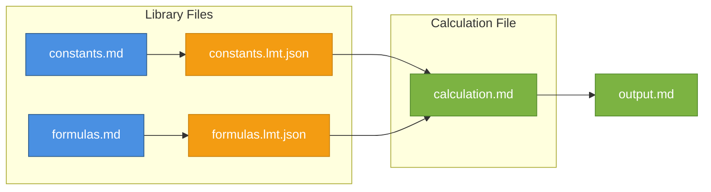
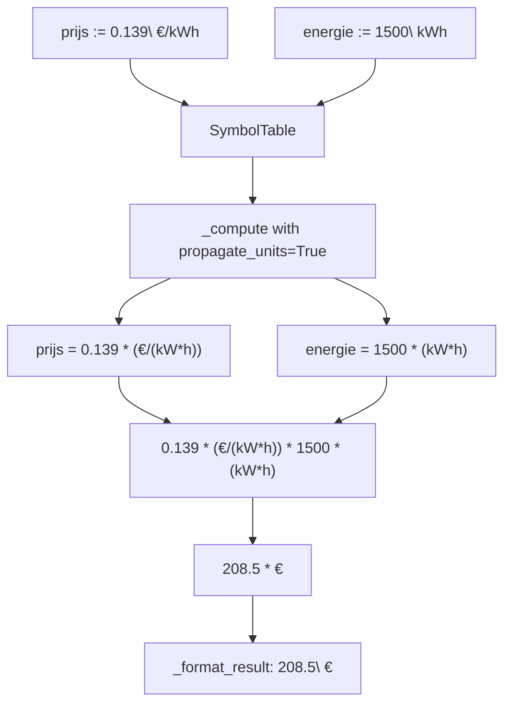

# LiveMathTeX - Architecture

## Overview

LiveMathTeX follows a modular pipeline architecture with an **Intermediate Representation (IR)** layer for clean symbol management and debugging:

```
┌─────────────┐    ┌─────────────┐    ┌─────────────┐    ┌─────────────┐    ┌─────────────┐
│   Parser    │───▶│ IR Builder  │───▶│   Engine    │───▶│  Renderer   │───▶│   Output    │
│  (Lexer)    │    │ (Normalize) │    │ (Evaluator) │    │ (Markdown)  │    │    (MD)     │
└─────────────┘    └─────────────┘    └─────────────┘    └─────────────┘    └─────────────┘
                         │
                         ▼
                   ┌─────────────┐
                   │  IR JSON    │  (--verbose)
                   │  (Debug)    │
                   └─────────────┘
```

### Intermediate Representation (IR)

The IR layer provides:

1. **Symbol Normalization** - Simple `v_{n}` / `f_{n}` naming for reliable parsing
2. **Debugging** - Write IR to JSON with `--verbose` flag
3. **Traceability** - Track all calculations and their results
4. **Import System** - Load symbols from other Markdown files via their IR JSON

#### Symbol Normalization Architecture

LiveMathTeX uses a simple, robust naming scheme for internal symbol representation:

| Type | Pattern | Example LaTeX | Internal Name |
|------|---------|---------------|---------------|
| **Variables** | `v_{n}` | `P_{LED,out}` | `v_{0}` |
| **Functions** | `f_{n}` | `\eta_{PSU}(x)` | `f_{0}` |

**Why this approach:**

The `latex2sympy2` library has strict parsing requirements. Complex LaTeX like `P_{LED,out}` or `N_{headers/MPC}` fails to parse. Instead of complex preprocessing rules, LiveMathTeX:

1. **Assigns unique IDs** - Each variable gets `v_{0}`, `v_{1}`, etc.
2. **Stores mapping** - The `SymbolTable` tracks: `v_{0}` → `P_{LED,out}` (LaTeX) → 123.45 (value)
3. **Rewrites expressions** - Before parsing: `P_{LED,out} \cdot 2` → `v_{0} \cdot 2`
4. **Renders back** - After calculation: `v_{0}` → `P_{LED,out}` for display

**Benefits:**

- ✅ **100% parsing success** - `v_{0}` always parses correctly
- ✅ **Simple implementation** - No complex regex rules
- ✅ **Handles any LaTeX** - Greek, subscripts, commas, slashes all work
- ✅ **Debugging** - IR JSON shows the mapping

```json
{
  "symbols": {
    "v_{0}": {
      "latex_name": "P_{LED,out}",
      "value": 123.45,
      "unit": "W"
    },
    "v_{1}": {
      "latex_name": "\\eta_{PSU}",
      "value": 0.92,
      "unit": null
    }
  }
}
```

**What's NOT normalized (handled by SymPy/latex2sympy2):**

- Constants: `\pi`, `e` → SymPy built-ins
- Units: `kg`, `m`, `W` → SymPy units / Pint
- Operators: `+`, `\cdot`, `\frac` → latex2sympy2

### Import System (Future)

The IR JSON enables importing symbols from other Markdown files without modifying them:



**Workflow:**

1. **Create library Markdown** - Define reusable constants/functions:
   ```markdown
   <!-- constants.md -->
   $g := 9.81$
   $c := 299792458$
   $\pi := 3.14159265359$
   ```

2. **Process library** - Generate IR JSON:
   ```bash
   livemathtex process constants.md --verbose
   # Creates: constants.lmt.json with all symbol values
   ```

3. **Import in calculation** - Use directive to load symbols:
   ```markdown
   <!-- calculation.md -->
   <!-- livemathtex: import constants.lmt.json -->

   $h := 100$
   $t := \sqrt{\frac{2h}{g}} ==$   <!-- g comes from constants -->
   ```

4. **Process calculation** - Symbols are pre-loaded:
   ```bash
   livemathtex process calculation.md -o output.md
   # g, c, π are available from imported JSON
   ```

**Key Benefits:**

| Benefit | Description |
|---------|-------------|
| **Source = Markdown** | Library files are readable, editable Markdown |
| **No modification needed** | Import uses IR output, original stays unchanged |
| **Composable** | Chain multiple imports, build complex calculations |
| **Cacheable** | Re-process library only when source changes |
| **Intermediate files** | Create helper Markdown files just for their IR |

**Example: Engineering Library**

```
libs/
├── physical_constants.md    → physical_constants.lmt.json
├── material_properties.md   → material_properties.lmt.json
└── common_formulas.md       → common_formulas.lmt.json

projects/
└── heat_exchanger.md        # Imports all three libraries
```

```markdown
<!-- heat_exchanger.md -->
<!-- livemathtex: import ../libs/physical_constants.lmt.json -->
<!-- livemathtex: import ../libs/material_properties.lmt.json -->

## Heat Exchanger Design
$Q := m \cdot c_p \cdot \Delta T ==$   <!-- c_p from material_properties -->
```

---

## Components

### 1. Parser / Frontend

**Responsibility:** Analyze Markdown files and recognize formulas, variables, units.

#### Detection Strategy

- Scan for `:=`, `==`, `=>` patterns
- Error on bare `=` (safety: prevents accidental overwrites)
- Recognize `livemathtex` code fences
- Distinguish static LaTeX (`$...$`) from calculable expressions

#### Grammar Elements

| Element | Example | Description |
|---------|---------|-------------|
| Variables | `m_{rock}`, `α`, `x_1` | LaTeX subscript/superscript, Greek |
| Assignment | `x := 5` | Definition, stored in symbol table |
| Evaluation | `x ==` | Show value of defined variable |
| Combined | `y := x + 1 ==` | Define AND show result |
| Symbolic | `f'(x) =>` | Symbolic evaluation (differentiation, etc.) |
| Units | `9.81 m/s^2` | Recognized after numbers/variables |
| Functions | `sin`, `cos`, `log`, `sqrt` | Built-in mathematical functions |
| Matrices | `[[1,2];[3,4]]` | Row-separated by `;` |

#### Markdown Preservation

The parser preserves non-calculation content (headings, paragraphs, lists) unchanged. Only calculation nodes are transformed.

---

### 2. Engine / Interpreter

**Responsibility:** Execute calculations, manage symbols, handle units.

#### Symbol Table

```python
symbols = {
    "m": Value(5, unit="kg"),
    "g": Value(9.81, unit="m/s^2"),
    "F": Expression("m * g"),  # lazy evaluation
}
```

#### Evaluation Order

1. Build dependency graph from definitions
2. Topological sort for evaluation order
3. Detect circular references → error
4. Evaluate in order, cache results

#### Unit Calculation

Each quantity stored as: `(base_value_SI, dimensions)`

| Operation | Rule |
|-----------|------|
| Add/Subtract | Dimensions must match |
| Multiply | Dimensions combine |
| Divide | Dimensions subtract |
| Output | Convert to requested unit |

**Example:**
```
F = m * a
  = 5 kg * 2 m/s²
  = 10 kg·m/s²
  = 10 N
```

#### Custom Unit Definitions (`===` Syntax)

LiveMathTeX supports custom unit definitions using the `===` operator:

```markdown
$$ € === € $$                    <!-- Base unit: euro is a new unit -->
$$ mbar === bar / 1000 $$        <!-- Derived unit -->
$$ kWh === kW \cdot h $$         <!-- Compound unit -->
$$ dag === day $$                <!-- Alias for existing unit -->
```

| Pattern | Meaning | SymPy Implementation |
|---------|---------|---------------------|
| `X === X` | New base unit | `Quantity('X')` |
| `X === Y / n` | Derived from Y | `set_global_relative_scale_factor(1/n, Y)` |
| `X === Y * Z` | Compound unit | `set_global_relative_scale_factor(1, Y*Z)` |
| `X === Y` | Alias | `X = Y` |

**Built-in unit abbreviations:**

| Abbreviation | SymPy Unit | Example |
|--------------|------------|---------|
| `L` | `liter` | `197\ \text{L}` |
| `h` | `hour` | `24\ \text{h}` |
| `W` | `watt` | `100\ \text{W}` |
| `kg` | `kilogram` | `5\ \text{kg}` |
| `dag` | `day` | Dutch for "day" |

**Note:** SymPy supports most SI and common units. Custom units are for:
- Currency (euro, dollar)
- Non-standard abbreviations (dag → day)
- Domain-specific units

#### Unit-Aware Calculations

Units attached to values are automatically parsed, stored, and propagated through calculations:

```markdown
$$ prijs := 0.139\ €/kWh $$      <!-- Unit stripped and stored with value -->
$$ energie := 1500\ kWh $$       <!-- Unit stored separately -->
$$ kosten := prijs \cdot energie == 208.5\ € $$  <!-- Units propagate! -->
```

**Unit parsing patterns:**

| Pattern | Example | Value | Unit |
|---------|---------|-------|------|
| `number\ unit` | `0.139\ €/kWh` | `0.139` | `€/kWh` |
| `number \text{unit}` | `100\ \text{kg}` | `100` | `kg` |
| `number unit` | `5 kg` | `5` | `kg` |

**Unit propagation flow:**



**Key components:**

| Component | Role |
|-----------|------|
| `strip_unit_from_value()` | Parse unit from RHS of assignment |
| `SymbolValue.unit` | Store SymPy unit expression |
| `SymbolValue.unit_latex` | Original unit string for display |
| `SymbolValue.value_with_unit` | Property returning `value * unit` |
| `_compute(propagate_units=True)` | Substitute values WITH units |
| `_format_unit_part()` | Format unit for output display |

#### Error Handling

Errors never crash the system. Each evaluation returns `Result<Value, Error>`:

| Error Type | Example |
|------------|---------|
| `UndefinedVariable` | Variable not defined |
| `UnitMismatch` | Adding kg + m |
| `DivisionByZero` | 1/0 |
| `Timeout` | Computation > 5s |
| `CircularDependency` | a := b, b := a |

#### Sandboxing

- No filesystem access from expressions
- No network access
- Whitelisted math functions only
- Timeout per expression (configurable, default 5s)
- Memory limits for matrix operations

---

### 3. Renderer / Output Generator

**Responsibility:** Transform calculated AST to output format.

#### Markdown Output Mode

Input:
```markdown
$d := v \cdot t ==$
```

Output:
```markdown
$d := v \cdot t == 200\ \text{km}$
```

**Note:** PDF/HTML export is out of scope. Use `pandoc output.md -o output.pdf` on the result.

#### Error Display

```markdown
$F ==$                    → ⚠️ Error: Undefined variable 'F'
$x = 5$                   → ⚠️ Error: Invalid operator '='. Use ':=' or '=='
$wrong := m + L ==$       → ⚠️ Error: Cannot add kg + m (if units mismatch)
```

#### Symbolic Results (`=>`)

The `=>` operator triggers symbolic evaluation:

```markdown
$f(x) := x^2 + 2x + 1$
$f'(x) =>$
```

Output: `$f'(x) => 2x + 2$`

---

### 4. CLI Interface

**Responsibility:** Orchestrate pipeline, handle file I/O, debugging output.

#### Commands

```bash
# Process a file
livemathtex process <input> [options]

Options:
  -o, --output FILE    Output Markdown file
  -v, --verbose        Write IR to JSON file for debugging
  --ir-output FILE     Custom path for IR JSON (default: input.lmt.json)

# Inspect an IR JSON file
livemathtex inspect <ir_file>

# Examples
livemathtex process input.md                      # In-place processing
livemathtex process input.md -o output.md         # Separate output
livemathtex process input.md --verbose            # Write debug IR
livemathtex inspect input.lmt.json                # View symbols and results

# For PDF: use external tools on the output
pandoc output.md -o output.pdf
```

#### IR Debug Output (`--verbose`)

When using `--verbose`, livemathtex writes a JSON file containing:

- **symbols**: All defined variables with their values and LaTeX mappings
- **blocks**: Each calculation block with input/output LaTeX
- **errors**: List of any errors encountered
- **stats**: Timing and operation counts

```bash
$ livemathtex process engineering.md --verbose
✓ Processed engineering.md
  Definitions (:=): 26
  Evaluations (==): 16
  Symbolic (=>):    0
  Errors: 0
  Duration: 0.50s
  IR written to: engineering.lmt.json
```

#### Configuration

LiveMathTeX uses a hierarchical configuration system inspired by Mathcad. The key design principle is that **documents are self-contained**: the same input produces the same output regardless of who processes it or where.

**Precedence (highest to lowest):**

```
1. CLI -o flag               (output path only - operational override)
2. Expression-level override <!-- digits:6 -->           (per calculation)
3. Document directives       <!-- livemathtex: ... -->   (top of document)
4. Local config              .livemathtex.toml           (document directory)
5. Project config            pyproject.toml              ([tool.livemathtex])
6. User config               ~/.config/livemathtex/      (personal defaults)
7. Defaults                  (hardcoded in code)
```

**Important:** CLI does NOT include formatting options (`--digits`, `--format`). Settings belong in the document or config files, ensuring reproducibility.

##### Settings Reference

| Setting | Type | Default | Description |
|---------|------|---------|-------------|
| `digits` | int | 4 | Significant figures (1-15) |
| `format` | enum | "general" | general/decimal/scientific/engineering |
| `exponential_threshold` | int | 3 | Magnitude for scientific notation |
| `trailing_zeros` | bool | false | Show zeros to fill precision |
| `unit_system` | enum | "SI" | SI/imperial/CGS |
| `timeout` | int | 5 | Seconds per expression |
| `output` | string | "timestamped" | Output mode (see below) |

##### Output Modes

| Value | Behavior | Use Case |
|-------|----------|----------|
| `"timestamped"` | `input_20260106_2045.md` | **Default** - safe, preserves history |
| `"inplace"` | Overwrite input file | Iterative editing (explicit opt-in) |
| `"output.md"` | Write to specific file | Examples, CI/CD |

**Safety rationale:** Timestamped default prevents accidental data loss. Users must explicitly opt-in to overwrite.

##### Expression-Level Overrides

Override formatting for individual calculations using colon syntax:

```markdown
$P := 123456.789 ==$ <!-- digits:6 -->
$E := 0.00001234 ==$ <!-- format:sci -->
$Q := 50.123 ==$ <!-- digits:6 [m³/h] -->
```

Shortcuts: `sci` → `scientific`, `eng` → `engineering`

##### Document Directives

Set document-wide defaults at the top:

```markdown
<!-- livemathtex: digits=6, format=engineering, output=inplace -->

# My Calculations
$x := 5 ==$
```

##### Config Files (TOML)

**.livemathtex.toml** (in document directory):

```toml
# Project-specific settings
digits = 6
format = "engineering"
output = "output.md"

[units]
system = "SI"
simplify = true
```

**pyproject.toml** section:

```toml
[tool.livemathtex]
digits = 4
format = "general"
timeout = 10
```

**User config** (~/.config/livemathtex/config.toml):

```toml
# Personal defaults
digits = 4
output = "inplace"  # Power user preference
```

##### Excluded Settings (with rationale)

| Setting | Reason for Exclusion |
|---------|---------------------|
| `decimal_separator` | LaTeX math universally uses "." |
| `thousands_separator` | Nice-to-have, LaTeX uses `\,` if needed |
| `fraction_display` | Complex, deferred to future version |

**Why TOML:**
- Standard for Python tools (pyproject.toml, ruff, black, pytest)
- Human-readable, easy to edit
- Supports comments
- Type-safe (numbers vs strings)

#### Watch Mode

1. Monitor input file for changes (inotify/fswatch)
2. On change: parse → evaluate → render
3. Report timing and errors to console
4. Support incremental recalculation (future optimization)

---

## Technology Choices

### Recommended: Python

| Component | Library |
|-----------|---------|
| Operators | `regex` (`:=`, `==`, `=>` detection) |
| Units | `sympy.physics.units` |
| Numeric | `numpy` |
| Symbolic | `sympy` |
| LaTeX parsing | `latex2sympy2` (our fork) |
| Math detection | `regex` (built-in) |

**Pros:** Rich ecosystem, rapid development, SymPy for CAS
**Cons:** Distribution (requires Python), slightly slower

**Why Python:** Rich math ecosystem (SymPy), rapid development, easy distribution via pip.

**Why SymPy units:** Simpler integration than Pint - units are SymPy expressions, already using SymPy for symbolic math.

---

## Module Structure

```
livemathtex/
├── src/
│   └── livemathtex/
│       ├── __init__.py
│       ├── cli.py           # CLI entry point
│       ├── core.py          # Main pipeline orchestration
│       ├── parser/
│       │   ├── __init__.py
│       │   ├── lexer.py     # Markdown/LaTeX tokenization
│       │   └── models.py    # AST node types (Document, MathBlock, etc.)
│       ├── ir/              # Intermediate Representation
│       │   ├── __init__.py
│       │   ├── schema.py    # IR dataclasses (LivemathIR, SymbolEntry, etc.)
│       │   └── builder.py   # Build IR from parsed AST
│       ├── engine/
│       │   ├── __init__.py
│       │   ├── evaluator.py # Main evaluation logic + IR integration
│       │   └── symbols.py   # Symbol table
│       ├── render/
│       │   ├── __init__.py
│       │   └── markdown.py  # MD output (only output format)
│       └── utils/
│           ├── __init__.py
│           └── errors.py    # Error types
├── tests/
│   ├── test_parser.py
│   ├── test_engine.py
│   └── test_integration.py
├── docs/
│   ├── BACKGROUND.md
│   ├── ARCHITECTURE.md
│   ├── USAGE.md
│   ├── ROADMAP.md
│   └── DEPENDENCIES.md
└── examples/
    ├── simple/
    │   ├── input.md
    │   └── output.md
    ├── physics/
    │   ├── input.md
    │   └── output.md
    └── engineering/
        ├── input.md
        ├── output.md
        └── images/
```

---

## Security Considerations

### Sandboxing Strategy

1. **No `eval()` on user input** - Parse to AST, evaluate AST
2. **Whitelist approach** - Only allow known functions
3. **Resource limits** - Timeout, memory caps
4. **No side effects** - Calculations are pure functions

### Safe Functions Whitelist

```python
SAFE_FUNCTIONS = {
    # Basic math
    "sin", "cos", "tan", "asin", "acos", "atan",
    "sinh", "cosh", "tanh",
    "log", "log10", "log2", "exp",
    "sqrt", "abs", "floor", "ceil", "round",
    "min", "max", "sum", "prod",

    # Linear algebra
    "inv", "det", "transpose", "dot", "cross",

    # Symbolic (optional)
    "diff", "integrate", "solve", "simplify",

    # Statistics
    "mean", "std", "var",
}
```

---

## Performance Considerations

### Caching Strategy

- Cache parsed AST per file
- Cache evaluation results per expression
- Invalidate on dependency change
- Full recalculation is acceptable for typical document sizes

### Benchmarks (Target)

| Operation | Target Time |
|-----------|-------------|
| Parse 100-line doc | < 50ms |
| Evaluate 50 expressions | < 200ms |
| Full rebuild with plots | < 2s |
| Watch mode latency | < 500ms |

---

## Future Extensions

**In scope (this repo):**

| Feature | Status | Description |
|---------|--------|-------------|
| **Import System** | Planned | Import symbols from other Markdown via IR JSON (see above) |
| **CLI `--import` flag** | Planned | `livemathtex process calc.md --import lib.lmt.json` |
| **Watch Mode** | Planned | Auto-rebuild on file changes |
| **Tables with Calculations** | Future | Spreadsheet-like tables in Markdown |
| **Conditional Logic** | Future | If/else in expressions |

**Import System Implementation (next priority):**
```bash
# Option 1: CLI flag
livemathtex process calculation.md --import constants.lmt.json

# Option 2: Document directive
<!-- livemathtex: import constants.lmt.json -->

# Option 3: Both (directive overrides CLI)
```

**Separate projects (build on top of LiveMathTeX):**
- VS Code Extension (`livemathtex-vscode`)
- Web Playground (`livemathtex-web`)
- GUI with PDF export (`livemathtex-desktop`)

---

## References

- [SymPy Documentation](https://docs.sympy.org/)
- [SymPy Units](https://docs.sympy.org/latest/modules/physics/units/)
- [latex2sympy2](https://github.com/augustt198/latex2sympy) (we use [our fork](https://github.com/MarkMichiels/latex2sympy))
