[LiveMathTeX](../README.md) / IR Schema v3.0 Proposal

# IR Schema v3.0 Proposal

**Status:** APPROVED - Ready for implementation
**Author:** AI Assistant
**Date:** 2026-01-07
**Reviewed:** 2026-01-07

---

## 1. Motivation

The current IR schema (v2.0) has several limitations identified during the Pint migration:

### 1.1 Current Problems

| Problem | Current State | Impact |
|---------|---------------|--------|
| **LaTeX names as keys** | Key = `"L_{pipe}"`, `"\\rho"` | Awkward access: `symbols["\\rho"]` |
| **LaTeX-dependent IDs** | `"id": "v_{3}"` | Unnecessary LaTeX subscript syntax |
| **Missing type indicator** | No distinction between value/formula | Heuristic classification is fragile |
| **SymPy-based unit conversion** | Uses `sympy.physics.units` | Inconsistent with Pint validation |
| **LaTeX unit strings** | `"unit": "\\text{kg}"` | Verbose, hard to parse programmatically |
| **No dependency tracking** | Formula dependencies not captured | Cannot validate evaluation order |

### 1.2 Goals for v3.0

1. **Clean IDs**: `v1`, `f1`, `x1` instead of `v_{3}` — LaTeX rendering at display time
2. **Explicit classification**: ID prefix indicates type (`v` = value, `f` = formula, `x` = parameter)
3. **Pint for all unit operations**: Conversions, validation, metadata
4. **Human-readable JSON**: Clean unit strings, not LaTeX-escaped
5. **Dependency tracking**: Know which symbols a formula depends on
6. **Function support**: Formulas with parameters (`f(x,y) = 2x + y`)

---

## 2. Schema Comparison

### 2.1 Current Schema (v2.0)

From `examples/engineering-units/input.lmt.json`:

```json
{
  "version": "2.0",
  "source": "examples/engineering-units/input.md",
  "custom_units": {},
  "symbols": {
    "L_{pipe}": {
      "id": "v_{3}",
      "original": {
        "value": 100.0,
        "unit": "m"
      },
      "si": {
        "value": 100.0,
        "unit": "\\text{m}"
      },
      "valid": true,
      "line": 47
    },
    "\\rho": {
      "id": "v_{5}",
      "original": {
        "value": 1000.0,
        "unit": "kg/m³"
      },
      "si": {
        "value": 1000.0,
        "unit": "\\frac{\\text{kg}}{\\text{m}^{3}}"
      },
      "valid": true,
      "line": 55
    },
    "H_f": {
      "id": "v_{11}",
      "original": {
        "value": 3.1877645524954934,
        "unit": "m"
      },
      "si": {
        "value": 3.1877645524954934,
        "unit": "\\text{m}"
      },
      "valid": true,
      "line": 88
    }
  },
  "errors": [],
  "stats": {
    "symbols": 19,
    "definitions": 19,
    "evaluations": 11
  }
}
```

### 2.2 Proposed Schema (v3.0)

**Key changes:**
- Symbol keys: `v1, v2...` for values, `f1, f2...` for formulas
- LaTeX names in `latex_name` field
- Formulas have `expression`, `depends_on`, and optional `parameters`
- Function formulas (with `parameters`) use `x1, x2...` for local variables
- Custom units with full metadata (type, Pint definition, line number)

```json
{
  "version": "3.0",
  "source": "examples/custom-units/input.md",
  "unit_backend": {
    "name": "pint",
    "version": "0.23"
  },
  "custom_units": {
    "EUR": {
      "latex": "€",
      "type": "base",
      "pint_definition": "EUR = [currency]",
      "line": 24
    },
    "kW": {
      "latex": "kW",
      "type": "derived",
      "pint_definition": "kW = 1000 * watt",
      "line": 40
    },
    "mbar": {
      "latex": "mbar",
      "type": "derived",
      "pint_definition": "mbar = 0.001 * bar",
      "line": 71
    },
    "kWh": {
      "latex": "kWh",
      "type": "compound",
      "pint_definition": "kWh = kW * hour",
      "line": 95
    }
  },
  "symbols": {
    "v1": {
      "latex_name": "L_{pipe}",
      "original": { "value": 100.0, "unit": "m" },
      "base": { "value": 100.0, "unit": "m" },
      "conversion_ok": true,
      "line": 47
    },
    "v2": {
      "latex_name": "D_{pipe}",
      "original": { "value": 100.0, "unit": "mm" },
      "base": { "value": 0.1, "unit": "m" },
      "conversion_ok": true,
      "line": 50
    },
    "v3": {
      "latex_name": "\\rho",
      "original": { "value": 1000.0, "unit": "kg/m³" },
      "base": { "value": 1000.0, "unit": "kg/m³" },
      "conversion_ok": true,
      "line": 55
    },
    "v4": {
      "latex_name": "g_{acc}",
      "original": { "value": 9.81, "unit": "m/s²" },
      "base": { "value": 9.81, "unit": "m/s²" },
      "conversion_ok": true,
      "line": 58
    },
    "v5": {
      "latex_name": "f_d",
      "original": { "value": 0.02, "unit": null },
      "base": { "value": 0.02, "unit": null },
      "conversion_ok": true,
      "line": 63
    },
    "v6": {
      "latex_name": "P_{rated}",
      "original": { "value": 5.0, "unit": "kW" },
      "base": { "value": 5000.0, "unit": "W" },
      "conversion_ok": true,
      "line": 98
    },
    "v7": {
      "latex_name": "t_{run}",
      "original": { "value": 8.0, "unit": "hour" },
      "base": { "value": 28800.0, "unit": "s" },
      "conversion_ok": true,
      "line": 100
    },
    "v8": {
      "latex_name": "price_{kWh}",
      "original": { "value": 0.25, "unit": "EUR/kWh" },
      "base": { "value": 6.944e-08, "unit": "EUR/J" },
      "conversion_ok": true,
      "line": 102
    },
    "f1": {
      "latex_name": "A_{pipe}",
      "formula": {
        "expression": "pi * (v2 / 2)**2",
        "depends_on": ["v2"]
      },
      "original": { "value": 0.00785, "unit": "m²" },
      "base": { "value": 0.00785, "unit": "m²" },
      "conversion_ok": true,
      "line": 70
    },
    "f2": {
      "latex_name": "vel",
      "formula": {
        "expression": "v0 / f1",
        "depends_on": ["v0", "f1"]
      },
      "original": { "value": 1.768, "unit": "m/s" },
      "base": { "value": 1.768, "unit": "m/s" },
      "conversion_ok": true,
      "line": 73
    },
    "f3": {
      "latex_name": "H_{friction}",
      "formula": {
        "expression": "v5 * v1 / v2 * f2**2 / (2 * v4)",
        "depends_on": ["v5", "v1", "v2", "f2", "v4"]
      },
      "original": { "value": 3.188, "unit": "m" },
      "base": { "value": 3.188, "unit": "m" },
      "conversion_ok": true,
      "line": 88
    },
    "f4": {
      "latex_name": "P_{motor}",
      "formula": {
        "expression": "f5 / (v6 * v7)",
        "depends_on": ["f5", "v6", "v7"]
      },
      "original": { "value": 4235.80, "unit": "W" },
      "base": { "value": 4235.80, "unit": "W" },
      "conversion_ok": true,
      "line": 121
    },
    "f5": {
      "latex_name": "scale",
      "formula": {
        "expression": "x1 * v3 + x2",
        "parameters": ["x1", "x2"],
        "parameter_latex": ["x", "y"],
        "depends_on": ["v3"]
      },
      "line": 130
    },
    "f6": {
      "latex_name": "double",
      "formula": {
        "expression": "2 * x1",
        "parameters": ["x1"],
        "parameter_latex": ["x"],
        "depends_on": []
      },
      "line": 135
    },
    "f7": {
      "latex_name": "triple_plus",
      "formula": {
        "expression": "f6(x1) + 3",
        "parameters": ["x1"],
        "parameter_latex": ["x"],
        "depends_on": ["f6"]
      },
      "line": 140
    },
    "f8": {
      "latex_name": "result",
      "formula": {
        "expression": "f7(5) + f5(10, v1)",
        "depends_on": ["f7", "f5", "v1"]
      },
      "original": { "value": 1013.0, "unit": null },
      "base": { "value": 1013.0, "unit": null },
      "conversion_ok": true,
      "line": 145
    },
    "f9": {
      "latex_name": "E_{daily}",
      "formula": {
        "expression": "v6 * v7",
        "depends_on": ["v6", "v7"]
      },
      "original": { "value": 40.0, "unit": "kWh" },
      "base": { "value": 144000000.0, "unit": "J" },
      "conversion_ok": true,
      "line": 150
    },
    "f10": {
      "latex_name": "cost_{daily}",
      "formula": {
        "expression": "f9 * v8",
        "depends_on": ["f9", "v8"]
      },
      "original": { "value": 10.0, "unit": "EUR" },
      "base": { "value": 10.0, "unit": "EUR" },
      "conversion_ok": true,
      "line": 155
    }
  },
  "errors": [],
  "stats": {
    "last_run": "2026-01-07 04:30:00",
    "duration": "0.52s",
    "symbols": 25,
    "value_definitions": 15,
    "computed_formulas": 9,
    "function_formulas": 1,
    "custom_units": 4,
    "evaluations": 14,
    "errors": 0
  }
}
```

---

## 3. Key Changes

### 3.1 Clean Symbol IDs as Keys

**Before (v2.0):**
```json
"symbols": {
  "L_{pipe}": {           // Key is LaTeX name (awkward)
    "id": "v_{3}",        // Internal ID has LaTeX subscript syntax
    ...
  }
}
```

**After (v3.0):**
```json
"symbols": {
  "v1": { "latex_name": "L_{pipe}", ... },   // Value
  "v2": { "latex_name": "D_{pipe}", ... },   // Value
  "f1": { "latex_name": "A_{pipe}", ... },   // Formula
  "f2": { "latex_name": "vel", ... }         // Formula
}
```

**ID Convention:**
- `v1, v2, v3...` — **Values** (direct assignments, user can change)
- `f1, f2, f3...` — **Formulas** (computed from other symbols)

**Rationale:**
- JSON keys are simple identifiers (`v1`, `f3`)
- No LaTeX escaping issues (`\\rho` → just `v3`)
- Instant O(1) lookup: `symbols["f2"]`
- Clear distinction: values vs formulas

**🚨 CRITICAL:** `latex_name` is for **display only**.
All internal references use the clean IDs:

```python
# Direct lookup - O(1)
pipe_length = ir["symbols"]["v1"]

# Resolve formula dependencies - also O(1) per lookup
deps = ir["symbols"]["f3"]["formula"]["depends_on"]  # ["v5", "v1", "v2", "f2", "v4"]
resolved = [ir["symbols"][d] for d in deps]  # Direct key access!
```

### 3.2 ID Convention: Values vs Formulas

**Before (v2.0):** All symbols have `v_{n}` IDs — no distinction

**After (v3.0):** ID prefix indicates type:
- `v1, v2, v3...` — **Values** (direct assignments)
- `f1, f2, f3...` — **Formulas** (computed)

**No separate `type` field needed** — the prefix IS the type!

```json
"v1": { "latex_name": "L_{pipe}", ... },     // Value: L_{pipe} := 100 m
"v2": { "latex_name": "D_{pipe}", ... },     // Value: D_{pipe} := 100 mm
"f1": { "latex_name": "A_{pipe}", ... },     // Formula: A_{pipe} := π·(D/2)²
"f2": { "latex_name": "vel", ... }           // Formula: vel := Q/A
```

**Complete ID convention:**

| Prefix | Meaning | Scope | Example |
|--------|---------|-------|---------|
| `v1, v2...` | Value | Global (symbol) | `v1 := 100 m` |
| `f1, f2...` | Formula | Global (symbol) | `f1 := π·(v2/2)²` |
| `x1, x2...` | Parameter | Local (function) | `g(x1,x2) := 2·x1 + x2` |

**Symbol vs Function distinction:**

| Type | Has `parameters`? | Can user change? |
|------|-------------------|------------------|
| Value (`v`) | ❌ No | ✅ Yes (input) |
| Computed formula (`f`) | ❌ No | ❌ No (derived) |
| Function formula (`f`) | ✅ Yes | ❌ No (template) |

**Example dependency chain:**
```
v1 (L_{pipe}) := 100 m          ← USER CAN CHANGE
v2 (D_{pipe}) := 100 mm         ← USER CAN CHANGE
f1 (A_{pipe}) := π·(v2/2)²      ← computed from v2
f2 (vel) := v0/f1               ← computed from v0, f1
f3 (H_{friction}) := ...        ← computed from v1, v2, f2, ...
```

If user changes `v1`, then `f3` is automatically recalculated.

### 3.3 Formula Tracking

**New in v3.0:** Formulas use clean IDs for fast lookup. Two types:

#### Computed Formulas (no parameters)

Computed from other symbols — value is calculated automatically:

```json
"f3": {
  "latex_name": "H_{friction}",
  "formula": {
    "expression": "v5 * v1 / v2 * f2**2 / (2 * v4)",
    "depends_on": ["v5", "v1", "v2", "f2", "v4"]
  },
  "original": { "value": 3.188, "unit": "m" },
  ...
}
```

#### Function Formulas (with parameters)

Template with parameters — value computed when called with arguments:

```json
"f5": {
  "latex_name": "scale",
  "formula": {
    "expression": "x1 * v3 + x2",
    "parameters": ["x1", "x2"],
    "depends_on": ["v3"]
  }
}
```

**ID convention in expressions:**
- `v1, v2...` — Reference to value symbols (global)
- `f1, f2...` — Reference to formula symbols (global)
- `x1, x2...` — Function parameters (local scope)

**Distinction logic:**
```python
def is_function(symbol):
    formula = symbol.get("formula", {})
    return len(formula.get("parameters", [])) > 0
```

**Processing is identical:** Substitute IDs with values.
- Computed formula: substitute `v*`, `f*` with their values
- Function formula: substitute `v*`, `f*` + `x*` with values/arguments

#### Function Call Scenarios

**Scenario 1: Function calls another function, passing parameter through**
```
f6(x) = 2 * x
f7(x) = f6(x) + 3
```
When evaluating `f7(5)`:
1. Substitute `x1=5` in f7's expression → `f6(5) + 3`
2. Evaluate `f6(5)`: substitute `x1=5` → `2 * 5 = 10`
3. Result: `10 + 3 = 13`

**Scenario 2: Computed formula calls function with constants**
```
result = f7(5) + f5(10, v1)
```
When evaluating `f8`:
1. Evaluate `f7(5)` → `13` (see above)
2. Evaluate `f5(10, v1)` → `10 * 1000 + 100 = 1100` (v1=100m, v3=ρ=1000)
3. Result: `13 + 1100 = 1113`

**Scenario 3: Function calls function with mixed args**
```
g(x, y) = f6(x) + f6(y)
```
Expression: `f6(x1) + f6(x2)` with `parameters: ["x1", "x2"]`

**Key rule:** Parameters (`x1`, `x2`) are substituted first, then function calls are evaluated recursively.

**Fast dependency resolution:**
```python
# O(1) lookup per dependency - no scanning!
deps = ir["symbols"]["f3"]["formula"]["depends_on"]  # ["v5", "v1", "v2", "f2", "v4"]
for dep_id in deps:
    dep_symbol = ir["symbols"][dep_id]  # Direct key access
    print(f"{dep_id} = {dep_symbol['latex_name']}")
```

**Benefits:**
- ⚡ **Fast**: Direct dictionary access, no string matching
- ✅ **Clean**: No LaTeX escaping issues in expressions
- 🔍 **Traceable**: Can validate evaluation order, detect cycles
- 🔧 **Unified**: Same processing for computed formulas and functions

### 3.4 Simplified Unit Structure

**Before (v2.0):**
```json
"original": { "value": 100.0, "unit": "m" },
"si": { "value": 100.0, "unit": "\\text{m}" }  // LaTeX in JSON
```

**After (v3.0):**
```json
"original": { "value": 100.0, "unit": "m" },
"base": { "value": 100.0, "unit": "m" },
"conversion_ok": true
```

**Key changes:**
- **No `unit_latex`**: LaTeX rendering done on-the-fly by renderer
- **`si` → `base`**: Not everything converts to SI (EUR, custom units)
- **Short unit names**: `m`, `kg/m³`, `W` (not `meter`, `kilogram / meter ** 3`)
- **`conversion_ok`**: Critical flag — if `false`, variable is invalid!
- **No `dimensionality`**: Computed by Pint from `unit` when needed

#### Calculation Strategy: Use Original Units

**🚨 IMPORTANT:** We calculate formulas using `original` values, NOT `base`!

```python
# Calculate with ORIGINAL values - Pint preserves units
volume = 5 * ureg.liter      # original
time = 5 * ureg.minute       # original
flow = volume / time         # → 1.0 L/min (user-friendly!)

# Then convert to base for internal use
flow_base = flow.to_base_units()  # → 1.67e-05 m³/s
```

**Why?**
- User sees familiar units (L/min, not m³/s)
- Pint automatically tracks and simplifies units
- `base` is available for internal calculations when needed

**Both values AND formulas have `original` + `base`:**

```json
"v1": {
  "latex_name": "V_{tank}",
  "original": { "value": 5.0, "unit": "L" },
  "base": { "value": 0.005, "unit": "m³" }
}

"f1": {
  "latex_name": "Q_{flow}",
  "formula": { "expression": "v1 / v2", "depends_on": ["v1", "v2"] },
  "original": { "value": 1.0, "unit": "L/min" },
  "base": { "value": 1.67e-05, "unit": "m³/s" }
}
```

**Summary:**

| Type | `original` | `base` |
|------|------------|--------|
| Value (`v`) | ✅ User input | ✅ SI conversion |
| Formula (`f`) | ✅ Computed (user-friendly) | ✅ SI conversion |

### 3.5 Conversion Status Flag

**🚨 CRITICAL:** `conversion_ok` indicates whether unit conversion succeeded.

```json
// Successful SI conversion
"v3": {
  "original": { "value": 100, "unit": "mm" },
  "base": { "value": 0.1, "unit": "m" },
  "conversion_ok": true
}

// Non-SI base unit (currency)
"v8": {
  "original": { "value": 150, "unit": "EUR" },
  "base": { "value": 150, "unit": "EUR" },
  "conversion_ok": true   // Stayed in original form, but valid
}

// Conversion failed (unknown unit) - DO NOT CONTINUE!
"v9": {
  "original": { "value": 50, "unit": "foobar" },
  "base": null,
  "conversion_ok": false,
  "conversion_error": "Unknown unit 'foobar'"
}
```

**Benefits:**
- Clear success/failure indication
- Supports non-SI base units (currency, custom)
- Enables validation without re-parsing

### 3.6 Enhanced Stats

**Before (v2.0):**
```json
"stats": {
  "definitions": 59,
  "evaluations": 42
}
```

**After (v3.0):**
```json
"stats": {
  "value_definitions": 35,
  "computed_formulas": 20,
  "function_formulas": 4,
  "custom_units": 4,
  "evaluations": 42
}
```

**Rationale:** Explicit count of values, computed formulas, functions, and custom units.

### 3.7 Custom Unit Definitions

Custom units are defined in LiveMathTeX using the `===` syntax and stored in the `custom_units` field.

#### Markdown Syntax

```latex
$$ € === € $$                      <!-- Base unit (new dimension) -->
$$ kW === kilo \cdot W $$          <!-- Derived unit (scaled) -->
$$ mbar === milli \cdot bar $$     <!-- Derived unit (scaled) -->
$$ kWh === kilo \cdot W \cdot hour $$  <!-- Compound unit (multiple) -->
```

#### Unit Types

| Type | Syntax | Meaning | Pint Dimension |
|------|--------|---------|----------------|
| **base** | `€ === €` | New dimension (currency, custom) | `[currency]` |
| **derived** | `kW === kilo * W` | Scaled existing unit | Same as parent |
| **compound** | `kWh === kW * hour` | Product of units | Combined |
| **alias** | `dag === day` | Rename existing | Same as target |

#### Schema Structure (v3.0)

```json
"custom_units": {
  "EUR": {
    "latex": "€",
    "type": "base",
    "pint_definition": "EUR = [currency]",
    "line": 24
  },
  "kW": {
    "latex": "kW",
    "type": "derived",
    "pint_definition": "kW = 1000 * watt",
    "line": 40
  },
  "kWh": {
    "latex": "kWh",
    "type": "compound",
    "pint_definition": "kWh = kW * hour",
    "line": 95
  }
}
```

#### Field Descriptions

| Field | Description |
|-------|-------------|
| **Key** | Unit name used in Pint registry and symbols (e.g., `EUR`, `kW`) |
| `latex` | Display name for LaTeX rendering (e.g., `€`, `kW`) |
| `type` | Classification: `base`, `derived`, `compound`, `alias` |
| `pint_definition` | Pint registry definition (key = expression) |
| `line` | Source line number for error reporting |

#### Processing Flow

```mermaid
graph LR
    A["$$ € === € $$"] --> B[Parser]
    B --> C{Type?}
    C -->|"X === X"| D[Base Unit]
    C -->|"X === Y * Z"| E[Compound]
    C -->|"X === prefix * Y"| F[Derived]
    C -->|"X === existing"| G[Alias]

    D --> H[Pint: EUR = currency]
    E --> H
    F --> H
    G --> H

    H --> I[Unit Registry]
```



#### Usage in Symbols

Custom units can be used like built-in units:

```json
// Value using custom currency
"v1": {
  "latex_name": "price",
  "original": { "value": 100.0, "unit": "EUR" },
  "base": { "value": 100.0, "unit": "EUR" },
  "conversion_ok": true,
  "line": 26
}

// Value using custom derived unit
"v2": {
  "latex_name": "power",
  "original": { "value": 5.0, "unit": "kW" },
  "base": { "value": 5000.0, "unit": "W" },
  "conversion_ok": true,
  "line": 42
}

// Formula result with custom unit (Pint calculates)
"f1": {
  "latex_name": "energy",
  "formula": {
    "expression": "v2 * v3",
    "depends_on": ["v2", "v3"]
  },
  "original": { "value": 40.0, "unit": "kWh" },
  "base": { "value": 144000000.0, "unit": "J" },
  "conversion_ok": true,
  "line": 53
}
```

#### Comparison v2.0 vs v3.0

**Before (v2.0):**
```json
"custom_units": {
  "€": "€",
  "kW": "kilo \\cdot W"
}
```

**After (v3.0):**
```json
"custom_units": {
  "EUR": {
    "latex": "€",
    "type": "base",
    "pint_definition": "EUR = [currency]",
    "line": 24
  },
  "kW": {
    "latex": "kW",
    "type": "derived",
    "pint_definition": "kW = 1000 * watt",
    "line": 40
  }
}
```

**Key insight:** The **key** (e.g., `kW`) IS the unit name used everywhere:
- In Pint registry: `kW = 1000 * watt`
- In symbol units: `"unit": "kW"`
- For lookups: `custom_units["kW"]`

**Benefits:**
- **Consistency**: Key = Pint name = symbol unit name
- **Traceability**: Line numbers for debugging
- **Type classification**: Know how unit is defined
- **LaTeX preservation**: Display name separate from key (for `€` vs `EUR`)

---

## 4. Migration Impact

### 4.1 Files to Modify

| File | Changes |
|------|---------|
| `src/livemathtex/ir/schema.py` | New dataclasses: `FormulaInfo`, `CustomUnitEntry`, `SymbolEntryV3`, `LivemathIRV3` |
| `src/livemathtex/ir/builder.py` | Extract custom unit metadata (type, Pint definition) |
| `src/livemathtex/engine/evaluator.py` | Use Pint for SI conversion, classification logic |
| `src/livemathtex/engine/pint_backend.py` | Enhanced `define_custom_unit()` with type detection |
| `src/livemathtex/engine/symbols.py` | Update `NameGenerator` for clean IDs (`v1`, `f1`, `x1`) |
| `src/livemathtex/engine/units.py` | Simplify or remove (legacy SymPy code) |
| `src/livemathtex/core.py` | Update `_populate_ir_symbols()` for v3.0 |
| `tests/test_examples.py` | Update IR structure tests for v3.0 schema |

### 4.2 Backward Compatibility

**Option A: Breaking change**
- Bump to v3.0
- All existing `.lmt.json` files regenerated

**Option B: Version detection**
- Reader detects version from `"version"` field
- Can read both v2.0 and v3.0 formats

**Recommendation:** Option A (breaking change) — this is a pre-1.0 project.

### 4.3 Example JSON Migration

All `examples/*/input.lmt.json` files will be regenerated with:
- Clean IDs: `v1, v2...` for values, `f1, f2...` for formulas
- Formulas with `expression`, `depends_on`, and optional `parameters`
- `base` block with Pint `unit` (dimensionality computed on-the-fly)
- `conversion_ok` flag for validation
- Custom units with full metadata (type, Pint definition, line)
- Updated stats with `computed_formulas`, `function_formulas`, and `custom_units`

---

## 5. Implementation Plan

### Phase 5a: Update IR Schema
1. Create new dataclasses in `ir/schema.py`:
   - `FormulaInfo` with `expression`, `depends_on`, `parameters` (optional)
   - `CustomUnitEntry` with `latex`, `definition`, `type`, `pint_definition`, `line`
   - `SymbolEntryV3` with `latex_name`, `formula` (optional), `original`, `base`
   - `LivemathIRV3` with `unit_backend` field, `custom_units: Dict[str, CustomUnitEntry]`
2. Update version to `"3.0"`

### Phase 5b: Pint for SI Conversion
1. Replace `_convert_to_si()` in evaluator to use Pint's `to_base_units()`
2. Generate `base` block with `value` and `unit`
3. Set `conversion_ok` flag based on success/failure

### Phase 5c: Add Classification Logic
1. Implement ID assignment in evaluator:
   - `v1, v2...` for value definitions
   - `f1, f2...` for formula definitions
   - `x1, x2...` for function parameters
2. Detect computed formulas vs functions (presence of `parameters`)
3. Track `expression` and `depends_on` for all formulas

### Phase 5d: Custom Unit Processing
1. Update `IRBuilder` to extract full custom unit metadata:
   - Parse `===` syntax to determine type (base/derived/compound/alias)
   - Generate Pint-compatible definition string
   - Track line numbers for error reporting
2. Update `pint_backend.define_custom_unit()` to return structured result
3. Store in `custom_units: Dict[str, CustomUnitEntry]`

### Phase 5e: Update Renderer
1. Use `latex_name` for display (LaTeX rendering on-the-fly)
2. Use clean IDs (`v1`, `f2`) for all internal references
3. Use `custom_units[name].latex` for custom unit display

### Phase 5f: Regenerate Examples
1. Run all examples through updated pipeline
2. Verify tests still pass (including `custom-units` example)
3. Commit new `.lmt.json` files

---

## 6. Design Decisions

Resolved questions:

| Question | Decision |
|----------|----------|
| **ID prefix** | `v1/f1` (short) ✅ |
| **Base unit naming** | Short form: `m`, `kg/m³` ✅ |
| **Backward compatibility** | Breaking change OK ✅ |
| **Latex→ID index** | Build internally, not in JSON |
| **Influence graph** | Build internally, not in JSON |

### 6.1 Conversion Failure Handling

**🚨 CRITICAL:** When `conversion_ok: false`:
1. Include error message in JSON
2. **DO NOT continue processing** that variable
3. Symbol is invalid and cannot be used in formulas

```json
"v9": {
  "latex_name": "bad_{var}",
  "original": { "value": 50, "unit": "foobar" },
  "base": null,
  "conversion_ok": false,
  "conversion_error": "Unknown unit 'foobar'"
}
```

Any formula depending on `v9` should also fail.

### 6.2 Function Parameter Display Names

Store original parameter names for rendering:

```json
"f5": {
  "latex_name": "scale",
  "formula": {
    "expression": "x1 * v3 + x2",
    "parameters": ["x1", "x2"],
    "parameter_latex": ["x", "y"],
    "depends_on": ["v3"]
  }
}
```

This allows rendering `scale(x, y) = x · ρ + y` instead of `scale(x1, x2) = ...`

---

## 7. References

- [PINT_MIGRATION_ANALYSIS.md](PINT_MIGRATION_ANALYSIS.md) - Full migration analysis
- [ARCHITECTURE.md](ARCHITECTURE.md) - Current architecture
- [Current IR Schema](../src/livemathtex/ir/schema.py) - v2.0 implementation

---

**Awaiting your feedback before implementation.**
