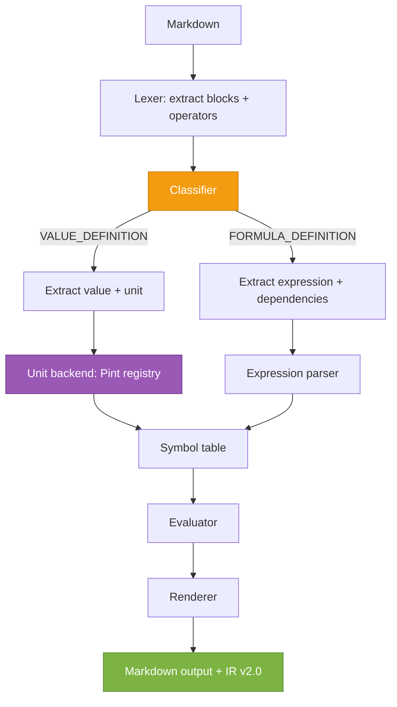

[LiveMathTeX](../README.md) / Pint migration analysis

# LiveMathTeX: Pint Migration (Full System Analysis)

**Branch:** `feature/pint-backend`
**Document purpose:** One place to understand (1) why LiveMathTeX exists, (2) how it works today, (3) where fragility lives, and (4) what a Pint-based unit backend would change—without losing the preprocessor rules and error checks that make the tool reliable.

---

## 1. Why LiveMathTeX exists (problem statement)

LiveMathTeX is a **Markdown → Markdown** preprocessor that embeds **verifiable calculations** into documentation:

- Input is plain text Markdown with LaTeX math blocks
- Output is the same Markdown, but with results injected
- This is intentionally **not** a notebook, not a GUI, not a PDF exporter

Source rationale:
- [README.md](../README.md)
- [BACKGROUND.md](BACKGROUND.md)

---

## 2. Documented architecture vs implemented architecture

### 2.1 Intended pipeline (docs)

From [ARCHITECTURE.md](ARCHITECTURE.md):

### 2.2 What the code actually does today

The real pipeline is implemented in `src/livemathtex/core.py::process_file()`:

- **Parse**: `Lexer.parse()` finds math blocks and captures:
  - operator usage (`:=`, `==`, `=>`, `===`)
  - unit display comments (`<!-- [kW] -->`)
  - value-table comments (`<!-- value:Q [m³/h] :2 -->`)
  - expression-level config overrides (`<!-- digits:6 format:sci -->`)
- **Build IR**: `IRBuilder.build()` extracts custom unit definitions (`===`) into `ir.custom_units`
- **Evaluate**: `Evaluator.evaluate()` runs per calculation
- **Populate IR**: `core._populate_ir_symbols()` copies symbol-table results into IR v2.0 format
- **Render**: `MarkdownRenderer.render()` reconstructs output and preserves comments

Key code entry points:
- `<repository-root>/src/livemathtex/core.py`
- `<repository-root>/src/livemathtex/parser/lexer.py`
- `<repository-root>/src/livemathtex/engine/evaluator.py`
- `<repository-root>/src/livemathtex/engine/units.py`

- `<repository-root>/src/livemathtex/engine/units.py`

### 2.3 Code-Level Bottlenecks (Identified)

Deep analysis of `src/livemathtex` reveals specific fragilities:

1.  **Regex-based Unit Extraction** (`engine/units.py:strip_unit_from_value`):
    -   Relies on regex patterns like `r'^(-?[\d.]+...)\s+([a-zA-Z]...)'`.
    -   Can easily misclassify a variable `x` as a unit if it appears after a number (e.g., `2 x`).
    -   Manual handling of LaTeX formatting (`\text{...}`, `\frac{...}`) is brittle and duplicates logic Pint already solves.

2.  **Manual Conflict Checking** (`engine/evaluator.py:_check_unit_name_conflict`):
    -   Relies on `UNIT_ABBREVIATIONS` list which must be manually maintained.
    -   Runtime checks against `dir(sympy.physics.units)` are dangerous as they include non-unit objects.
    -   **Pint Fix:** Pint exposes `ureg.is_compatible_with(unit)` and a countable registry, making this check 100% deterministic.

3.  **SI Conversion** (`engine/evaluator.py:_convert_to_si`):
    -   Uses `sympy.physics.units.convert_to`, which can be slow and fails on some complex compound units without explicit help.

---

## 3. The preprocessor is the product (not the math backend)

You explicitly called this out, and the current code already reflects the same philosophy:

- The **lexer** is a rule engine: it decides what is a calculation vs display-only LaTeX.
- The **error model** is core UX: errors are produced inline and the system never “crashes the document”.
- The **operator semantics** are a contract.

This means a Pint migration must preserve these invariants.

---

## 4. Operator semantics (current behavior)

Defined in [USAGE.md](USAGE.md) and implemented in `Lexer.extract_calculations()` + `Evaluator.evaluate()`:

- `:=` **definition**
- `==` **evaluation**
- `:= ... ==` **define + evaluate**
- `=>` **symbolic mode** (currently: parse + emit SymPy LaTeX; no advanced symbolic pipeline yet)
- `===` **unit definition**
- `<!-- value:... -->` **value-only display** (for tables)

### 4.1 Safety rule: bare `=`

In any math block that contains one of the livemathtex operators, a plain `=` is treated as an error.

This is implemented in `Lexer.extract_calculations()` (regex check for bare `=`).

---

## 5. How symbols work today (this is crucial)

### 5.1 Two different “names” exist

There are two name layers:

1. **User-facing LaTeX name** (what the document shows)
   - Example: `P_{LED,out}`, `\Delta p`, `g_{acc}`

2. **Internal parser-safe ID** (for robust LaTeX parsing)
   - Example: `v_{0}`, `v_{1}`, ...

This design exists specifically to reduce LaTeX parsing fragility:

- `SymbolTable.NameGenerator` assigns stable IDs like `v_{n}`
- `Evaluator._rewrite_with_internal_ids()` rewrites an expression before feeding it to `latex2sympy`

This is already the project’s “IR-like” bridge between presentation LaTeX and evaluation.

### 5.2 Implication for any Pint migration

If we keep `latex2sympy` as the formula parser, the `v_{n}` mapping remains valuable.

If we remove `latex2sympy` entirely, we still need **some** equivalent mapping, because arbitrary LaTeX identifiers (`P_{headers/MPC}`) are not safe Python identifiers.

---

## 6. Unit handling today (SymPy-based)

### 6.1 Current unit architecture

- Unit parsing helpers live in `engine/units.py`:
  - `strip_unit_from_value()` detects “value + unit” patterns
  - `_parse_unit_string()` converts the unit token to a SymPy unit expression
  - `UnitRegistry` supports custom unit definitions via `===`
  - `format_unit_latex()` renders units back to display form

- Evaluation uses SymPy units for propagation:
  - `Evaluator._compute(..., propagate_units=True)` substitutes variables as `value_with_unit`

### 6.2 Custom unit definitions (`===`)

Implemented by `Evaluator._handle_unit_definition()` → `UnitRegistry.define_unit()`.

This is important for:
- currency units (`€`, `USD`)
- aliases like `dag === day`
- domain libraries (see `examples/unit-library/input.md`)

---

## 7. Existing preprocessor-level error checks (and what must be preserved)

### 7.1 Unit name vs variable name collisions

This is already enforced in the engine:

- `Evaluator._check_unit_name_conflict()` prevents definitions like `$m := ...$` because `m` is “meter”
- The documented best practice is: use subscripts or descriptive names
  - See `examples/simple-units/input.md`

This matches your requirement: **variable names must never be interpretable as units**, otherwise later logic becomes ambiguous.

### 7.2 The stronger requirement you added

You clarified an important strengthening:

- It’s not enough to exclude only “units used in this document”.
- We must exclude **all units the backend could ever recognize**, including prefixed combinations.

Current status:
- The collision check currently focuses on common unit abbreviations + custom-defined units.
- This is directionally correct, but **not complete** if we want to exclude *every* unit token.

This requirement is one of the strongest arguments in favor of Pint, because Pint has a single registry that can enumerate:
- all unit names
- all aliases
- all prefixes

---

## 8. A real fragility in the current evaluator (important for migration scope)

### 8.1 Formula vs “value-with-unit” classification is heuristic

In `Evaluator._compute()`, there is a heuristic that tries to decide if an expression is:

- a measurement-like definition (numbers + unit tokens), or
- a pure formula

The heuristic currently treats “has a decimal” as a strong indicator of “definition with units”.

Why this is fragile:
- Formulas can legally contain decimal constants (e.g. `0.5` in kinetic energy).
- If we misclassify a formula as a “definition with units”, unit tokens may be interpreted differently.

### 8.2 What we want instead

We should make the classification **explicit and structural**, not heuristic:

- `:=` with RHS matching **value-with-unit** patterns → `VALUE_DEFINITION`
- `:=` otherwise → `FORMULA_DEFINITION`

This is preprocessor logic, not math-backend logic.

A Pint migration is a good moment to formalize this rule, because it sits exactly at the boundary between:
- pattern recognition (preprocessor)
- evaluation (backend)

---

## 9. Missing / incomplete parts (docs vs code)

This matters because the migration document must not assume features that don’t exist yet.

### 9.1 Tests

**Status: CRITICAL GAP**
- The `tests/` directory **does not exist**.
- We rely entirely on manual verification of `examples/`.
- **Action Item:** We cannot migrate without a safety net. Creating a regression test suite that runs all `examples/` and compares output is the absolute first step.

### 9.2 Watch mode

Docs and dependencies mention watch mode (`watchdog` is present), but there is **no CLI `watch` command** implemented.

### 9.3 Import system

Docs describe importing symbols from IR JSON and even show an `<!-- livemathtex: import ... -->` directive.

Code status:
- `IRBuilder.load_library()` exists as a helper
- but there is **no directive parsing** and **no CLI flag** wired into `core.py`

---

## 10. Why Pint is being considered

The migration motivation is not “units are impossible with SymPy” — the project already works.

The motivation is:

- **Completeness:** Pint’s unit registry is more complete and more user-friendly for string units.
- **Reserved-name safety:** Pint can enumerate all unit tokens, enabling a strict “no unit-name variables” rule.
- **Less custom parsing:** many of the “unit parsing” paths in `units.py` become thinner.

### 10.1 Ecosystem leverage (fluids, heat transfer, chemicals, thermo)

This is an additional, strategic reason to prefer Pint: there is an existing ecosystem of scientific/engineering packages that already represent quantities using Pint.

From Pint’s own ecosystem overview, examples include:

- **Fluid dynamics**: `fluids` ([Pint ecosystem](https://pint.readthedocs.io/en/stable/ecosystem.html))
- **Heat transfer**: `ht` ([Pint ecosystem](https://pint.readthedocs.io/en/stable/ecosystem.html))
- **Chemistry / properties**: `chemicals` ([Pint ecosystem](https://pint.readthedocs.io/en/stable/ecosystem.html))
- **Thermodynamics**: `thermo` ([Pint ecosystem](https://pint.readthedocs.io/en/stable/ecosystem.html))

Why that matters for LiveMathTeX (longer-term, not necessarily part of the *initial* migration):

- **Reusability**: instead of re-implementing domain formulas, LiveMathTeX could expose a small, curated “domain function set” backed by those libraries.
- **Consistency**: if the same Pint registry is used, dimensional analysis and conversions stay consistent across “core math” and domain-specific calculations.
- **Extensibility**: we could add optional extras (e.g. `livemathtex[fluids]`) without changing the preprocessor semantics.

Constraints (must remain true even if we integrate ecosystem libraries):

- **Sandboxing**: only whitelisted functions are callable from documents.
- **Reproducibility**: document + pinned dependency versions must reproduce results.
- **Preprocessor-first validation**: variable naming rules and “no unit-name variables” remain enforced before evaluation.

### 10.2 User-friendly unit display (derived units + compact prefixes)

This is a practical advantage you highlighted: results should be readable, not always expressed as base SI products.

**What Pint does today:**

- Pint does **not** force everything into base SI by default. A quantity keeps the unit structure it was created with (or computed into).
- Pint also does **not** automatically rename base-unit products into derived units. For example, `kg·m/s²` does not automatically print as `N`.
- However, Pint can convert cleanly to derived units when explicitly requested (e.g. convert to `N`), and it can choose ergonomic SI prefixes (e.g. `5000 N` → `5 kN`) via its “compact” conversion.

**What LiveMathTeX should do (display policy):**

1. If the user requests an explicit display unit (existing `<!-- [unit] -->` feature), convert to that unit.
2. Else, if `simplify_units=true` (already a planned config knob), convert the result to a **canonical derived unit** based on dimensionality:
   - force → `N`
   - pressure → `Pa`
   - energy → `J`
   - power → `W`
   - etc.
3. After that, apply “compact prefix” selection (so `5000 N` becomes `5 kN`, `0.0005 N` becomes `500 µN`).

This keeps documents readable (e.g., showing **N** instead of `kg·m/s²`) while still allowing full control when a document explicitly asks for `[kW]`, `[bar]`, `[m³/h]`, etc.

Important nuance:
- Pint cannot parse raw LaTeX wrappers like `\frac{m}{s}` or `\text{kg}` directly.
- But Pint *can* parse many LaTeX-adjacent strings after minimal preprocessing.

This means the preprocessor still matters, but the unit backend becomes simpler.

---

## 11. Migration options (we should choose deliberately)

### Option A: Stay on SymPy units, fix the real fragility

- Keep current evaluation model
- Formalize explicit statement classification (VALUE_DEFINITION vs FORMULA_DEFINITION)
- Strengthen “reserved unit name” checks by enumerating SymPy units more completely

Pros:
- Minimal surface area change
- Keeps `=>` symbolic story consistent

Cons:
- SymPy unit ecosystem remains the constraint

### Option B (recommended): Hybrid — keep `latex2sympy` as parser, move numeric/unit evaluation to Pint

High-level idea:
- Use `latex2sympy` as a **parser only** (to get an expression tree)
- Evaluate that expression tree using Pint quantities in a controlled evaluator
- Keep `=>` symbolic mode on SymPy (optional), but treat it as a separate pipeline

Pros:
- Biggest win on unit robustness and reserved-name coverage
- Keeps existing LaTeX parsing strategy (including `v_{n}` mapping)

Cons:
- Requires building an evaluation layer that walks a SymPy AST

### Option C: Full rewrite — no `latex2sympy`, custom expression grammar

Pros:
- Removes latex2sympy fork dependency

Cons:
- High risk: we would reimplement a parser and will reintroduce fragility

---

## 12. Target rules (must be encoded in the migration)

### 12.1 Definitions vs formulas

- A **value definition** is a number (or numeric expression) with an optional unit.
- A **formula definition** is a relationship built from variables, constants, and operators.

### 12.2 What is allowed inside a formula

- allowed: variables, pure numbers (including decimals), operators, whitelisted functions
- forbidden: any token that can be interpreted as a unit

Implementation intent:
- if a formula contains something that is a unit token, it must be treated as “undefined variable” (and therefore an error)

### 12.3 Variable naming policy

- A variable name is illegal if it matches **any unit token** from the backend registry.
- This is independent of whether the unit appears in the current document.

This rule is essential to keep the later evaluation logic deterministic.

---

## 13. Proposed target pipeline (conceptual)

Notes:
- The **Classifier** is the key change: remove heuristics from the math backend.
- The **unit backend** becomes a service that can answer:
  - “is this token a unit?”
  - “convert this quantity to target unit”

---

## 14. Migration deliverables (what this document must drive)

1. **Explicit statement classification** (remove heuristic formula/unit detection)
2. **Strict reserved-name validation** using the unit backend’s full registry
3. **Unit backend decision** (SymPy vs Pint vs hybrid)
4. **Regression coverage plan** (examples-as-fixtures + real tests)
5. **Scope boundaries** (what happens to `=>`, matrices, watch mode, import)

---

## 15. Recommended next steps (planning, not coding)

1. Lock the invariants (sections 3–7) as “must not regress”.
2. Decide on Option A vs Option B (recommended).
3. Define the classifier rules precisely (examples-driven).
4. Define the reserved-name policy precisely (backend-driven, full unit set).
5. Plan tests: treat `examples/*/input.md` as acceptance fixtures.

---

## 16. References

- Project goals: [README.md](../README.md), [BACKGROUND.md](BACKGROUND.md)
- Syntax contract: [USAGE.md](USAGE.md)
- Intended architecture: [ARCHITECTURE.md](ARCHITECTURE.md)
- Roadmap: [ROADMAP.md](ROADMAP.md)
- Examples (current “fixtures”): [examples/README.md](../examples/README.md)

Key code:
- `<repository-root>/src/livemathtex/core.py`
- `<repository-root>/src/livemathtex/parser/lexer.py`
- `<repository-root>/src/livemathtex/engine/evaluator.py`
- `<repository-root>/src/livemathtex/engine/units.py`

---

## 17. Detailed Implementation Roadmap

### Phase 1: Test Scaffold (Critical Pre-requisite)
Since `tests/` does not exist, we must create a safety net.
1.  Create `tests/` directory.
2.  Implement a **Snapshot Runner** that:
    -   Reads `examples/*/input.md`.
    -   Runs the current pipeline.
    -   Compares output against `examples/*/output.md`.
3.  Ensure 100% green on current examples before touching code.

### Phase 2: Pint Integration (Parallel)
1.  Add `pint` to dependencies.
2.  Create `engine/pint_backend.py`:
    -   Initialize `pint.UnitRegistry`.
    -   Configure it to be case-sensitive (to distinguish `m` (meter) vs `M` (constant?)).
    -   Implement `is_unit(token)` using Pint's registry to replace manual lists.

### Phase 3: The Swap (Hybrid Approach)
1.  **Refactor `strip_unit_from_value`**:
    -   Instead of Regex Pattern 3 (`value unit`), parse the string.
    -   Query `pint_backend.is_unit(token)`.
    -   If yes → `VALUE_DEFINITION`.
    -   If no → `FORMULA_DEFINITION`.
2.  **Replace `SymbolTable` values**:
    -   Store `pint.Quantity` objects instead of `(float, sympy_unit)` tuples.
3.  **Update `Evaluator`**:
    -   Wrap `latex2sympy` output (SymPy expr) into Pint evaluation where keys are variables.
    -   Use `pint_obj.to_base_units()` for SI conversion.

### Phase 4: Cleanup
1.  Remove `engine/units.py` (custom parsing logic).
2.  Remove `UNIT_ABBREVIATIONS` manual list.
3.  Verify `=>` symbolic mode still works (requires un-wrapping Pint quantities back to SymPy if needed, or keeping them separate).
