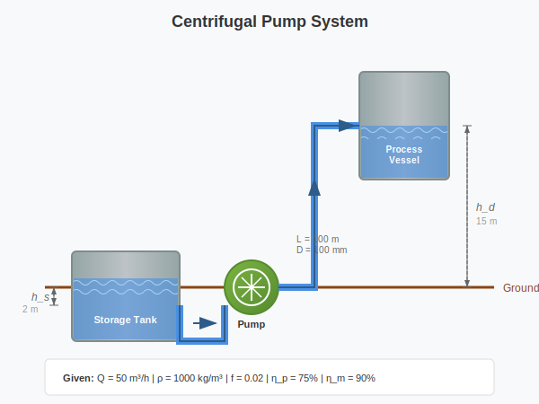

# Pump Sizing Calculation (with Units)

This example demonstrates a complete engineering calculation **with SI units** for sizing a centrifugal pump.

## Problem Statement

Design a pump system to transfer water from a storage tank to an elevated process vessel.

**Given:**
- Flow rate required: 50 m³/h
- Suction head: 2 m (below pump)
- Discharge head: 15 m (above pump)
- Pipe length: 100 m
- Pipe diameter: 100 mm
- Water density: 1000 kg/m³
- Friction factor: 0.02

**Find:** Required pump head, hydraulic power, and motor size.

---

## Input Data

### Flow Requirements

Volume flow rate:
$Q := 50 \frac{m^{3}}{h}$

Display in different units (no manual conversion needed!):
$Q == 50.00 \text{m³/h}$ <!-- [m³/h] -->
$Q == 0.01389 \text{m³/s}$ <!-- [m³/s] -->
$Q == 13.89 \text{L/s}$ <!-- [L/s] -->

### Geometry

Suction head (negative = below pump):
$h_s := -2 m$

Discharge head:
$h_d := 15 m$

Pipe length:
$L_{pipe} := 100 m$

Pipe diameter:
$D_{pipe} := 100 \text{mm}$

### Fluid Properties

Water density:
$\rho := 1000 \frac{kg}{m^{3}}$

Gravitational acceleration:
$g := 9.81 \frac{m}{s^{2}}$

### Friction Parameters

Darcy friction factor (dimensionless):
$f_d := 0.02$

---

## Step 1: Flow Velocity

Cross-sectional area:
$A_{pipe} := \frac{\pi \cdot D_{pipe}^2}{4} == 7.854e-03 \text{m}^{2}$

Flow velocity:
$vel := \frac{Q}{A_{pipe}} == 1.768 \frac{\text{m}}{\text{s}}$

---

## Step 2: Head Losses

### Static Head

Total static head:
$H_{static} := h_d - h_s == 17.00 \text{m}$

### Friction Head Loss

Using Darcy-Weisbach equation:

$$H_f := f_d \cdot \frac{L_{pipe}}{D_{pipe}} \cdot \frac{vel^2}{2 \cdot g} == 3.188 \text{m}$$

### Minor Losses

K-factor for fittings (dimensionless):
$K_{fit} := 5$

$$H_m := K_{fit} \cdot \frac{vel^2}{2 \cdot g} == 0.7969 \text{m}$$

---

## Step 3: Total Dynamic Head (TDH)

$$TDH := H_{static} + H_f + H_m == 20.98 \text{m}$$

---

## Step 4: Hydraulic Power

Hydraulic power:
$$P_{hyd} := \rho \cdot g \cdot Q \cdot TDH == 2.859 \text{kW}$$ <!-- [kW] -->

---

## Step 5: Motor Sizing

Pump efficiency (assumed, dimensionless):
$eta_p := 0.75$

Motor efficiency (assumed, dimensionless):
$eta_m := 0.90$

Required motor power:
$$P_{motor} := \frac{P_{hyd}}{eta_p \cdot eta_m} == 4.236 \text{kW}$$ <!-- [kW] -->

---

## Results Summary

| Parameter | Symbol | Value | Unit |
|-----------|--------|-------|------|
| Flow rate | $Q$ | $50.00$ <!-- value:Q [m³/h] --> | m³/h |
| Flow velocity | $vel$ | $1.8$ <!-- value:vel [m/s] :2 --> | m/s |
| Static head | $H_{static}$ | $20$ <!-- value:H_{static} [m] :1 --> | m |
| Friction loss | $H_f$ | $3.2$ <!-- value:H_f [m] :2 --> | m |
| Total head | $TDH$ | $20$ <!-- value:TDH [m] :1 --> | m |
| Hydraulic power | $P_{hyd}$ | $2.9$ <!-- value:P_{hyd} [kW] :2 --> | kW |
| Motor power | $P_{motor}$ | $4.2$ <!-- value:P_{motor} [kW] :2 --> | kW |

---

## Design Notes

1. **Safety margin**: Add 10-20% to calculated motor power
2. **NPSH**: Check Net Positive Suction Head requirements
3. **Pump curve**: Select pump with operating point on efficient part of curve

---

> *livemathtex: 2026-01-06 22:58:04 | 19 definitions, 11 evaluations, 7 value refs | no errors | 0.60s* <!-- livemathtex-meta -->
